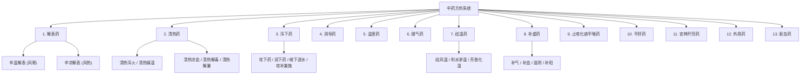

# 🌿 中药方剂学中药分类与方剂系统集成指南

> [!NOTE]
> 本指南基于前辈的 Obsidian 知识库整理，对中药方剂学中 13 个核心类别的中药及其方剂进行了精细化梳理，包含核心功效、分类细分、常用中药、代表方剂，并附带了重点难点中药与方剂的深度辨析。

---

## 🗺️ 中药方剂分类图谱 (Mermaid)

---

## 📂 13 大类中药与方剂详解

### 1. 解表药
* **核心功效**：发散表邪，解除表证（多具辛味，归肺、膀胱经）。
* **源文件链接**：[解表药.md](file:///D:/just_soso/horse%20cow/Veterinary%20Medicine/中药方剂学/解表药.md)

| 子类别 | 核心主治 | 常用中药 | 代表方剂 |
| :--- | :--- | :--- | :--- |
| **辛温解表药** | 风寒表证 | 麻黄、桂枝、细辛 (发汗)；荆芥、防风、紫苏 (祛风)；白芷、辛夷、苍耳子 (通鼻窍)；生姜、葱白 | [[麻黄汤]]、[[桂枝汤]] |
| **辛凉解表药** | 风热表证 | 薄荷、牛蒡子、蝉蜕 (疏风)；桑叶、菊花 (清肝明目)；柴胡、升麻、葛根 (升阳) | [[银翘散]]、[[防风通圣散]] |

---

### 2. 清热药
* **核心功效**：清解里热，药性寒凉，治疗热性里证。
* **源文件链接**：[清热药.md](file:///D:/just_soso/horse%20cow/Veterinary%20Medicine/中药方剂学/清热药.md)

| 子类别 | 药效特点 | 常用中药 | 代表方剂 |
| :--- | :--- | :--- | :--- |
| **清热泻火** | 清气分实热 | 石膏、知母、栀子 | [[白虎汤]] (气分四大证) |
| **清热燥湿** | 清里湿热 | 黄连、黄芩、黄柏、龙胆、苦参 | [[黄连解毒汤]] (主治三焦热盛) |
| **清热凉血** | 清血分实热 | 丹皮、地骨皮、生地、白头翁、白茅根、紫草、玄参、水牛角 | [[清营汤]] (清营凉血)、[[白头翁汤]] (清脏腑热) |
| **清热解毒** | 泻火解毒 | 金银花、连翘、蒲公英、紫花地丁、板蓝根、大青叶、青黛、马勃、射干、山豆根 | [[清瘟败毒散]] (气血两清) |
| **清热解暑** | 祛暑解表 | 香薷、荷叶、青蒿 | [[香薷散]]、[[青蒿鳖甲汤]] (清虚热) |

---

### 3. 泻下药
* **核心功效**：引起腹泻或润肠，促进排便，用于**里实证**。使用前提是“表邪已除，里实已成”。
* **源文件链接**：[泻下药.md](file:///D:/just_soso/horse%20cow/Veterinary%20Medicine/中药方剂学/泻下药.md)

| 子类别 | 主治病机 | 常用中药 | 代表方剂 |
| :--- | :--- | :--- | :--- |
| **攻下药** | 实热积滞，通便泻火 | 大黄、芒硝、巴豆 | [[大承气汤]]、[[小承气汤]]、[[调胃承气汤]] |
| **润下药** | 肠燥津枯便秘 | 火麻仁、郁李仁 (多为富含油脂之种仁) | [[当归苁蓉汤]] |
| **峻下逐水药** | 水肿腹水 (有毒峻猛) | 芫花、甘遂、大戟 (反甘草) | [[十枣汤]] |
| **攻补兼施** | 里实正虚，津枯便秘 | 大黄配麦冬、玄参等 | [[增液承气汤]] |

---

### 4. 消导药
* **核心功效**：消食化积，健脾行气。药性甘温，归脾胃经。对应八法中的**消法**（对比：泻下药对应**下法**，消导药药性渐消缓散，用于食积停滞）。
* **源文件链接**：[消导药.md](file:///D:/just_soso/horse%20cow/Veterinary%20Medicine/中药方剂学/消导药.md)

* **常用中药**：六(神)曲、山楂、麦芽、谷芽、莱菔子、鸡内金（其中神曲、山楂、麦芽合称 **焦三仙**，加槟榔称 **焦四仙**）。
* **代表方剂**：
  * [[曲蘖散]]（曲麦散）：主治料伤，精料或草料停滞。
  * [[保和丸]]：主治伤食（普通积食停滞）。
  * [[木香导滞丸]]：主治湿热食积引起的下痢腹胀（湿热肠炎）。

---

### 5. 温里药
* **核心功效**：祛除里寒，药性多辛热燥，对应八法中的**温法**（寒者热之）。归心、肾、脾三经。
* **源文件链接**：[温里方.md](file:///D:/just_soso/horse%20cow/Veterinary%20Medicine/中药方剂学/温里方.md)

* **常用中药**：附子、肉桂、干姜、小茴香、吴茱萸、高良姜、艾叶、花椒。
* **代表方剂分类**：
  * **温中散寒方**：[[理中汤]]（主治脾胃虚寒证/阳虚）、[[桂心散]]（主治脾胃寒伤/实寒）。
  * **回阳救逆方**：[[四逆汤]]（主治少阴病亡阳症，循环衰竭）。
  * **温经止痛方**：[[茴香散]]（主治寒伤腰胯，经脉受寒）。

---

### 6. 理气药
* **核心功效**：疏理气机，调理气分疾病（气滞、气逆、气郁、气虚）。
* **源文件链接**：[理气方.md](file:///D:/just_soso/horse%20cow/Veterinary%20Medicine/中药方剂学/理气方.md)

| 功能倾向 | 常用中药 | 代表方剂 |
| :--- | :--- | :--- |
| **理气健脾** | 陈皮、砂仁、枳实、枳壳、丁香、大腹皮、莱菔子、厚朴 | [[橘皮散]]（行气和血，暖肠止痛，主治气滞） |
| **疏肝解郁** | 青皮、香附 | - |
| **调理肺气** | 苏子 | - |

---

### 7. 祛湿药
* **核心功效**：去除湿邪，治疗水湿证。对阴虚血亏及气虚者慎用。
* **源文件链接**：[祛湿方药.md](file:///D:/just_soso/horse%20cow/Veterinary%20Medicine/中药方剂学/祛湿方药.md)

| 子类别 | 作用靶点 | 常用中药 | 代表方剂 |
| :--- | :--- | :--- | :--- |
| **祛风湿类** | 主攻经络肌肉，祛风通络 | 羌活、独活、威灵仙、木瓜、桑寄生、秦艽、马钱子、乌梢蛇 | [[独活寄生汤]] (风寒湿痹，肝肾两亏) |
| **利水渗湿类** | 主攻下焦，以尿排湿 | 茯苓、猪苓、泽泻、车前子、金钱草、海金沙、石韦 | [[五苓散]] (温阳化气利水)、[[八正散]] (湿热下注淋证) |
| **芳香化湿类** | 主攻中焦，醒脾行气 | 藿香、苍术 | [[藿香正气散]] (外感风寒内伤湿滞)、[[平胃散]] (寒湿困脾) |

---

### 8. 补虚药
* **核心功效**：补益气血阴阳不足，治疗各种虚证。
* **源文件链接**：[补虚方药.md](file:///D:/just_soso/horse%20cow/Veterinary%20Medicine/中药方剂学/补虚方药.md)

| 子类别 | 滋补倾向 | 常用中药 | 代表方剂 |
| :--- | :--- | :--- | :--- |
| **补气药** | 补中益气，大补元气 | 人参、党参、黄芪、白术 | [[四君子汤]] (益气健脾)、[[参苓白术散]]、[[补中益气汤]] |
| **补血药** | 养血活血 | 当归、白芍、熟地黄、阿胶 | [[四物汤]] (补血要剂) |
| **滋阴药** | 滋补阴液，清降虚火 | 天冬、麦冬、枸杞子、黄精 | [[六味地黄汤]] (滋补肾阴)、[[百合固金汤]] |
| **补阳药** | 助阳温肾，强筋骨 | 巴戟天、肉苁蓉、淫羊藿、杜仲、续断 | - |

---

### 9. 止咳化痰平喘药
* **核心功效**：化痰祛痰，宣肺平喘。咳嗽、气喘常伴有痰，治痰要诀在于**调气**。
* **源文件链接**：[止咳化痰平喘药与方剂.md](file:///D:/just_soso/horse%20cow/Veterinary%20Medicine/中药方剂学/止咳化痰平喘药与方剂.md)

> [!TIP]
> **治痰与脏腑的三角关系**：
> * **脾为生痰之源** (抽水泵故障)：脾失健运，水湿聚集成痰。治痰必配合**健脾燥湿**。
> * **肾为生痰之本** (锅炉气化故障)：肾阳虚衰，水泛为痰。顽固痰饮需**温阳化饮**。
> * **肺为贮痰之器** (受害者)：脾肾内生之痰随气上逆壅塞于肺，引发咳喘。

| 子类别 | 药性机制 | 常用中药 | 代表方剂 |
| :--- | :--- | :--- | :--- |
| **温化寒痰** | 温燥化湿痰 | 半夏、南星、旋覆花、白前 | [[二陈汤]] (燥湿化痰) |
| **清化热痰** | 清热润燥化痰 | 贝母、瓜蒌、天花粉、桔梗、前胡 | - |
| **温性止咳** | 宣肺散寒止咳 | 杏仁、百部、紫菀、款冬花、苏子 | [[止咳散]] (外感咳嗽) |
| **寒性止咳** | 清肺泄热止咳 | 马兜铃、枇杷叶、桑白皮 | [[麻杏甘石汤]] (肺热喘咳) |
| **平喘药** | 泻肺平喘 | 葶苈子、白果、洋金花、麻黄 | - |

---

### 10. 平肝药
* **核心功效**：清肝热，息肝风。主治肝阳上亢、肝风内动、目赤肿痛等。
* **源文件链接**：[平肝药.md](file:///D:/just_soso/horse%20cow/Veterinary%20Medicine/中药方剂学/平肝药.md)
* **常用中药**：
  * **平肝明目**：决明子
  * **平肝熄风**：天麻、钩藤、天竺黄
* **代表方剂**：[[决明散]]（平肝明目，主治肝热目疾）。

---

### 11. 安神开窍药
* **核心功效**：安神定惊，开窍醒神。主治心神不宁、神昏谵语等。
* **源文件链接**：[安神开窍药方.md](file:///D:/just_soso/horse%20cow/Veterinary%20Medicine/中药方剂学/安神开窍药方.md)
* **常用中药**：
  * **安神药**：朱砂、酸枣仁、远志、牛黄
  * **开窍药**：麝香、冰片
* **代表方剂**：[[安宫牛黄丸]]（温病三宝之一，主治热闭神昏）。

---

### 12. 外用药
* **核心功效**：以涂敷、散布、喷洗、熏烟等外用形式，治疗外科疮疡肿毒及皮肤疾病。
* **源文件链接**：[外用方药.md](file:///D:/just_soso/horse%20cow/Veterinary%20Medicine/中药方剂学/外用方药.md)
* **常用中药**：冰片、炉甘石。

---

### 13. 驱虫药
* **核心功效**：驱杀或排出体内寄生虫。
* **源文件链接**：[驱虫方药.md](file:///D:/just_soso/horse%20cow/Veterinary%20Medicine/中药方剂学/驱虫方药.md)
* **常用中药**：使君子、常山。

---

## ⚖️ 核心中药/方剂辨析对照表

为了帮助前辈快速理清容易混淆的药对与方剂，以下整理了深度鉴别表格：

### ⚖️ 药对辨析

#### 1. 人参 vs 党参 (补气)
* **人参 (重症要药)**：独具**大补元气、复脉固脱**之功，用于气虚欲脱危重证。
* **党参 (轻症缓治)**：药力较缓，**无**大补元气与固脱之能，大剂量亦不可替代人参救脱。

#### 2. 人参 vs 黄芪 (脏腑与表里)
* **人参 (长于内补)**：大补元气，安神增智，为**治内伤气虚第一要药**。
* **黄芪 (长于走表)**：补气升阳，温升之力强。独具**固表止汗、托毒生肌、利尿退肿**之功。

#### 3. 黄芪 vs 白术 (升提与燥湿)
* **黄芪 (脾肺双补)**：升阳举陷力强，主治中气下陷、脱肛。益卫固表止汗佳。
* **白术 (专补脾胃)**：健脾燥湿力强，主治脾虚失运、水湿内停。

#### 4. 生地黄 vs 熟地黄 (寒热与清补)
| **鉴别维度** | **生地黄** | **熟地黄** |
| :--- | :--- | :--- |
| **性味归经** | 甘苦，**性寒** | 甘，**微温** |
| **核心功效** | **清热凉血**，养阴生津 | **补血滋阴**，益精填髓 |
| **典型主治** | 温热入营血、血热妄行吐衄、阴虚内热 | 血虚阴亏、精血不足腰膝酸软、消渴 |
| **排他特性** | 清热凉血之要药 | 炮制后药性转温，**绝无清热凉血功效** |

#### 5. 天冬 vs 麦冬 (寒润定位)
| **鉴别维度** | **麦冬** | **天冬** |
| :--- | :--- | :--- |
| **寒润之力** | 较弱 | **强于麦冬** |
| **核心功效** | 养胃生津、润肺清心除烦 | 滋肾阴、清降虚火 |
| **作用部位** | **偏上** (心胃肺) | **偏下** (肺肾) |

#### 6. 杜仲 vs 续断 (强筋骨)
| **鉴别维度** | **杜仲** | **续断** |
| :--- | :--- | :--- |
| **核心侧重** | 以**补肝肾为重**，偏于纯补 | 补肝肾且长于**宣通筋脉** |
| **优势场景** | 肝肾不足之腰膝酸软、胎动不安等纯虚证 | 兼有血脉郁滞之风湿痹痛、骨折伤痛 (补而不滞) |
| **特有功效** | 具**降血压**功效 | 更强调兼顾活血与行滞 |

#### 7. 麝香 vs 冰片 (开窍外用)
| **鉴别维度** | **麝香** | **冰片** |
| :--- | :--- | :--- |
| **药性归属** | 性温，气极香，走窜力极强 | 味苦，性微寒，走窜力较弱 |
| **闭证侧重** | 宜治**寒闭**神昏 (配伍后亦治热闭) | 更宜治**热闭**神昏 |
| **兼优功效** | 活血通经、止痛、催产 | 清热解毒、消肿止痛 |

---

### ⚖️ 承气三方对比 (泻下方剂)

| 方剂 | 药味组成 | 病机侧重 (痞/满/燥/实) | 药力特点 | 临床通俗特征 |
| :--- | :--- | :--- | :--- | :--- |
| **[[大承气汤]]** | 大黄、芒硝、枳实、厚朴 | **痞、满、燥、实** 俱全 | 最为峻猛 | 胀痛剧烈，大便极干结硬块 |
| **[[小承气汤]]** | 大黄、枳实、厚朴 (无芒硝) | **痞、满、燥** 较重 (实不明显) | 较轻缓 | 胀气为主，大便尚未干透结块 |
| **[[调胃承气汤]]** | 大黄、芒硝、甘草 (无枳朴) | **燥、实** 为主 (无痞满胀气) | 最为和缓 | 不腹胀，纯粹用于排除干硬粪块 |

---
*理世导航完毕！前辈，方剂与中药的结构非常清晰，随时可以查阅哦！加油~*
