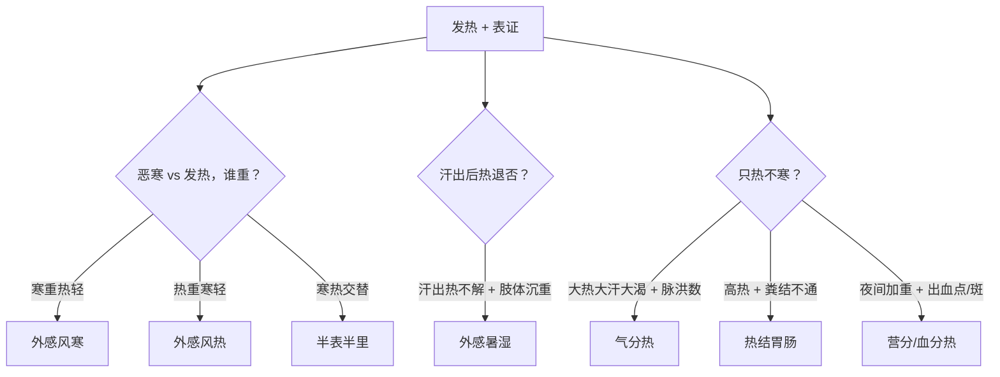
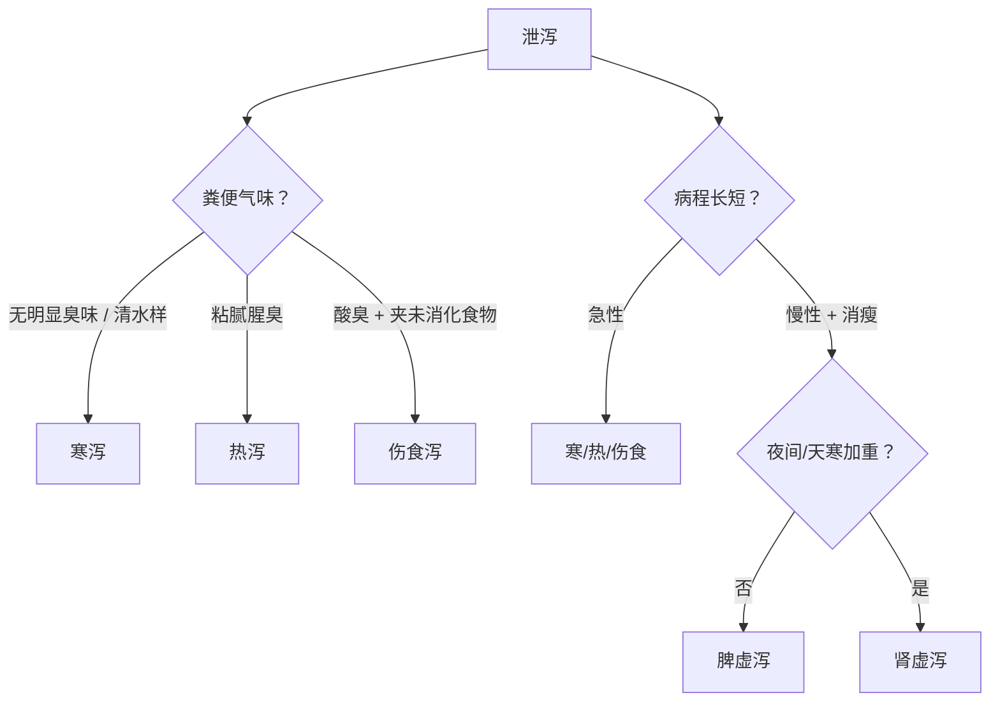

# 🔑 中兽医常见病症·排他性特征鉴别手册

> [!TIP]
> **排他性特征** = 这个证型**独有的**、看到就能直接锁定诊断的"关键词"。考试时先扫这些关键词，一秒定型。

---

## 一、发热类（外感）

### 快速鉴别决策树

### 排他性特征对照表

| 证型 | 🔑 排他性关键词（看到直接锁定） | 与易混证的鉴别点 |
|:---|:---|:---|
| **外感风寒** | **恶寒重发热轻 + 无汗 + 脉浮紧** + 鼻流**清**涕 + 咳声**洪亮** | vs 风热：风寒是「寒＞热、无汗、清涕」；风热是「热＞寒、微汗、黄涕」 |
| **外感风热** | **发热重微恶寒 + 微汗 + 黄/白粘稠脓涕** + 脉浮**数** + 🐄**牛鼻镜干燥、反刍减少** | vs 风寒：涕的性状（清 vs 粘稠）是最直接的鉴别点；牛的鼻镜干燥是风热独有描述 |
| **外感暑湿** | **汗出而身热不解** + **肢体倦怠沉重、运步不灵** + 苔**黄腻** + 脉**濡**数 | vs 风热：暑湿的核心是「出了汗热还不退」+「肢体沉重」，风热无此二特征 |
| **半表半里** | **寒热往来**（恶寒与发热交替出现）+ 脉**弦** | 独有的「交替模式」：寒时精神差/耳鼻凉，热时精神好/耳鼻热——其他证型都是寒或热持续存在 |
| **热在气分** | **但热不寒**（只热不冷）+ **大汗 + 口渴喜饮** + 脉**洪**数 + 苔黄**燥** | vs 营血分：气分是「大汗大渴」，营血分是「斑疹出血」；气分尚未入血 |
| **热结胃肠** | **高热 + 粪球干小难下**（或粪结不通/**稀粪旁流**）+ 脉**沉实有力** | vs 气分热：关键区别在于「粪结不通 + 脉沉实」，气分热粪虽干但不至于结；「稀粪旁流」是肠梗阻的经典表现 |
| **营分热** | **高热夜甚** + **躁动不安/神志昏迷** + **出血点/出血斑** + 舌**红绛** + 脉**细**数 | vs 气分热：营分已入里→夜间加重 + 出血点；气分无出血、脉洪不细 |
| **血分热** | **高热神昏 + 尿血便血** + 皮肤发**斑** + 口色**红绛** + 严重者**抽搐** | vs 营分热：血分有明确的「尿血/便血」大出血 + 抽搐；营分仅出血点/斑 |

> [!IMPORTANT]
> **卫气营血传变层次记忆口诀**：
> - **卫**（表）→ 恶寒发热
> - **气**（里热）→ **但热不寒**、大汗大渴
> - **营**（入里深）→ 夜热、出血**点**、神昏
> - **血**（最深）→ 大**出血**（尿血便血）、抽搐

---

## 二、发热类（内伤）

| 证型 | 🔑 排他性关键词 | 与易混证的鉴别点 |
|:---|:---|:---|
| **阴虚发热** | **低热不退、午后更甚** + **盗汗** + **少苔或无苔** + 脉细数 + 皮肤弹性降低 | vs 气虚发热：阴虚是「午后低热 + 盗汗 + 无苔」；气虚是「劳后发热 + 自汗 + 乏力」 |
| **气虚发热** | **劳役后发热**（运动/劳作后加重）+ **神疲乏力 + 易出汗**（自汗）+ 脉细**弱** | vs 阴虚：气虚的热与「劳累」直接相关，休息好转；阴虚午后自动升温，与劳累无关 |
| **血瘀发热** | **外伤史** 或 **产后恶露不尽** + **局部肿胀疼痛** + 口色红而带**紫** + 脉**弦**数 | 独有的「外伤/产后」病因 + 「紫色」舌脉——其他内伤发热没有紫和瘀 |

> [!NOTE]
> **内伤三热速记**：阴虚 →「午后 + 盗汗」| 气虚 →「劳后 + 自汗」| 血瘀 →「伤后 + 紫舌」

---

## 三、泄泻类

### 快速鉴别决策树

### 排他性特征对照表

| 证型 | 🔑 排他性关键词 | 与易混证的鉴别点 |
|:---|:---|:---|
| **寒泻** | **泻如水/喷射状** + **遇寒泻剧、遇暖泻缓**（寒热敏感性）+ **肠鸣如雷** + 口色**青白** + 尿**清长** + 脉沉**迟** | vs 肾虚泻：寒泻是急性的、有明确寒冷诱因；肾虚泻是慢性久泻 |
| **热泻** | 泻粪**粘腻腥臭** + **尿赤短** + 苔**黄腻** + **口臭** + 脉沉**数** | vs 寒泻：一热一寒，看尿（赤短 vs 清长）、苔（黄腻 vs 薄白）、脉（数 vs 迟）三点即可 |
| **伤食泻** | 粪中夹**未消化食物** + **酸臭/恶臭** + **嗳气吐酸、放臭屁** + **泄吐后痛减** + 🐄**反刍停止** + 苔**厚腻** | 独有的「食物残渣 + 酸臭 + 泄后痛减」三联征；注意马属动物不呕吐 |
| **脾虚泻（虚泻）** | **形体羸瘦、毛焦肷吊** + 粪中**渣粗/完谷不化** + 舌**淡白无苔** + 脉**迟缓** + 后期**四肢浮肿** | vs 肾虚泻：脾虚以「消瘦 + 完谷不化」为主，无明显时间规律；肾虚有「夜间/天寒加重」 |
| **肾虚泻（虚泻）** | **夜间及天寒时泻重**（时间/气候敏感）+ **腰胯无力、卧多立少** + **四肢厥逆** + 口色**如绵**（淡白绵软）+ 脉沉细无力 | 独有的「夜间 + 天寒」加重模式 + 「腰胯无力」肾虚腰症——脾虚没有这两点 |

> [!IMPORTANT]
> **泄泻 vs 痢疾的总鉴别**：
> - **泄泻**：粪稀或水样，**无里急后重**，无明显脓血
> - **痢疾**：粪带**脓血/胶冻**，**里急后重明显**（弓腰努责）

---

## 四、痢疾类

| 证型 | 🔑 排他性关键词 | 与易混证的鉴别点 |
|:---|:---|:---|
| **湿热痢** | **赤白相杂 / 胶冻状** + **湿重白多、热重血多** + 苔**黄腻** + 脉数 + 🐄鼻镜干燥、反刍停止 | vs 疫毒痢：湿热痢偏「赤白胶冻」，起病不如疫毒痢急骤；无高热烦躁 |
| **虚寒痢** | **灰白或泡沫状** + **水谷并下** + **鼻寒耳冷、四肢发凉** + 口色**淡白/灰白** + 苔**白滑** + 脉**迟细** | 独有的「灰白泡沫 + 水谷并下」+ 全身寒象明显——其他两型都是热象或毒象 |
| **疫毒痢** | **发病急骤** + **高热烦躁** + 泻粪**脓血、腥臭难闻** + 苔**干黄** + 脉**洪数/滑数** | vs 湿热痢：疫毒痢是「起病急 + 高热 + 脓血腥臭」三联暴击；湿热痢起病较缓且以胶冻为主 |

> [!NOTE]
> **痢疾三型一句话速记**：
> - 湿热痢 = **「胶冻赤白」**
> - 虚寒痢 = **「灰白泡沫」**
> - 疫毒痢 = **「急骤脓血」**

---

## 🎒 考前终极速查卡

### 高频易混组 TOP 3

| 排名 | 易混组 | 一招分清 |
|:---:|:---|:---|
| 🥇 | **风寒 vs 风热** | 看**涕**：清涕→寒，黄粘涕→热；看**汗**：无汗→寒，微汗→热 |
| 🥈 | **寒泻 vs 肾虚泻** | 看**病程**：急性→寒泻，慢性久泻→肾虚；看**时间**：夜间/天寒加重→肾虚 |
| 🥉 | **营分热 vs 血分热** | 看**出血程度**：出血点/斑→营分；尿血便血（大出血）+抽搐→血分 |

### 方剂-证型速连线

| 方剂 | 锁定证型 |
|:---|:---|
| 麻黄汤 | 外感风寒 |
| 银翘散 | 外感风热 |
| 小柴胡汤 | 半表半里（寒热往来） |
| 白虎汤 | 热在气分（但热不寒、大汗大渴） |
| 大承气汤 / 增液承气汤 | 热结胃肠（粪结不通） |
| 清营汤 | 营分热 |
| 犀角地黄汤 | 血分热 |
| 青蒿鳖甲汤 | 阴虚发热 |
| 补中益气汤 | 气虚发热 / 脾虚泻 |
| 猪苓散 | 寒泻 |
| 郁金散 | 热泻 |
| 保和丸 | 伤食泻 |
| 参苓白术散 | 脾虚泻 |
| 巴戟散 / 四神丸 | 肾虚泻 |
| 通肠芍药汤 | 湿热痢 |
| 白头翁汤 | 疫毒痢 |
| 四神丸 + 参苓白术散 | 虚寒痢 |
