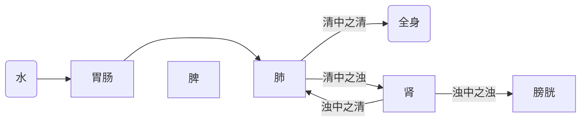

> [!note] 脏腑学说
> - 亦称为“藏象学说”，“藏”指内脏，“象”即象征，脏腑是器官及其功能的总称
> - 五脏以藏为贵，化生和储藏精气，**藏精气而不泄**
> - 六腑以通为用，受盛和传化水谷，**传化浊物，泻而不藏**
> - 奇恒之腑，**形态似腑，功能似脏**，即形态上像六腑一样呈中空管腔，但是功能上像五脏一样储藏精气

## 五脏
### 心
- 五脏中，心具有极高地位，称为**君主之官**
- **系统联系**：舌 - 汗 - 脉 - 面 - 喜 - 夏 - 南 - 火
#### 心主血脉
- **心主血**：心主管血液的运行，有参与血液的形成(脾胃吸收的营养物质在心火作用下化为血液)
- **心主脉**：脉是血液运行的通道，心脏通过搏动来推动血液的运行，这种推动作用又被称为*心气*
#### 心主神(心藏身)
- **神**在广义上可指机体整体生命活动及其外在表现，在狭义上可指精神、意识和思维活动
- 心主神和心主血脉是密不可分的：
	- 心血充足$\to$心神得到滋养
	- 心血不足$\to$心神失养
#### 心与窍液的关系
- 脏腑的变化可以在体表反映出来，心的状况主要通过“舌”和“汗”来观察
##### 心开窍于舌
- 舌头被称为**心之苗**，心脏的功能和病理变化可以通过舌头的状态折射出来

| 心脏状态 | 舌头状态        |
| ---- | ----------- |
| 心血充足 | 舌头柔软红润，运动灵活 |
| 心血不足 | 舌头淡而无光      |
| 心血淤阻 | 舌头青紫        |
| 心经有热 | 舌质深红，口舌生疮   |
##### 心在液为汗
- 中医认为“血汗同源”，汗液由津液化生而来，津液又是血液的重要组成部分
- 出汗过多会损耗心气，导致气短、疲惫、肢冷
- 面对心血虚的动物，慎用发汗的疗法
### 肺
- 五脏中肺的位置最高，又称为“华盖”，肺是协助君主的**相傅之官**
#### 肺主气，司呼吸
- **肺主呼吸之气**：肺是体内外气体交换的场所，吸入清气，吐出浊气
- **肺主一身之气**：肺主宰全身之气的生成和运行
> 一身之气 = 自然界清气 + 先天之精气 + 水谷精微之气

> [!info] 宗气
> - 由水谷精微之气与肺吸入的清气，在元气的作用下生成
> 
> 宗气的作用有：
> 1. 维持肺的呼吸
> 2. 由肺入心，推动血液的运行

#### 肺主宣发和肃降
- **宣发**：向上向外排出浊气，将水谷精微和津液散布到全身
- **肃降**：向下向内吸入精气下纳于肾，将津液和代谢废物向下输送至肾和膀胱排出

> [!info] 水谷精微之气
> 有时也简称为“水谷精微”或“清”，简单来说是由食物转化为来的营养物质，是维持生命活动的能量来源，具有以下特点：
> - 被**脾胃**所制造
> - 化生**气、血、津液**
> - 结合生成宗气滋养全身
#### 肺通调水道
- 肺被称为**水上之源**，通过宣发和肃降来调动体内水液的输布、运行和排出
- 如果肺的宣降功能失常，会导致水液停滞，引发水肿、腹水、胸水等
#### 肺主一身之表，外合皮毛
- 皮毛是机体抵御外邪的屏障，依赖肺气的润泽
- 肺经有病可反映于皮毛，反之皮毛受邪也会内传于肺
#### 肺与窍液的关系
##### 肺开窍于鼻
- 鼻是肺的门户，肺气正常则呼吸顺畅、嗅觉灵敏
- 外邪犯肺则会导致鼻塞流涕
##### 肺在液为涕
- 鼻涕由鼻黏膜分泌
### 脾
- 脾是负责后勤的**谏议之官**，被视为机体的后天之本，气血化生之源
#### 脾主运化
- 脾的基础功能包括运化水谷精微和水湿(生成津液)
#### 脾主升清
- 脾将生成的营养物质向上送到心肺，化生气血
- 同时也可以防止内脏下垂
#### 脾主统血
- 脾统摄、控制血液在血管内的运行防止其溢出血管外
#### 脾主肌肉四肢
- 脾为肌肉与四肢提供营养物质
- 脾气健运，则四肢肌肉丰满有力
#### 脾与窍液的关系
##### 脾开窍于口
- 口是机体输入水谷的第一道入口，而脾对水谷进行运化，因此脾气通于口，脾的健康状况与动物的食欲相关
##### 脾在液为涎
- 涎是口内的分泌物，脾的病变可以通过口水的分泌异常体现
- **脾气虚**：涎液分泌异常增加，涎性质不变
- **脾经热毒**：口唇生疮，涎为黏稠状
### 肝
#### 肝主藏血
- 肝贮藏血液并且调节全身血量
- 机体活动时血液流动于经脉，在安静的时候回流至肝脏
#### 肝主疏泄
- 肝负责全身气机的通畅条达，起到通而不滞、散而不郁的作用
> 	气机是脏腑功能活动的基本形式，包括升降出入四种
- 肝协调[[#脾主运化|脾胃的运化]]，调畅气血运行，调控精神活动，调节水液代谢
- 病理变化：疏泄不及引起肝气郁结；疏泄太过引起肝气上逆
#### 肝主筋，其华在爪
**筋**：是约束肌肉、主司运动的组织，依赖肝血的滋养维持其正常功能
#### 肝与窍液的关系
##### 肝开窍于目
- 肝的经脉与眼睛直接相连，眼睛的功能与肝血的滋养相关
- 肝血不足，机体出现眼目干涩、视物不清、夜盲或月盲；肝经风热，会目痒肿痛
##### 肝在液为泪
- 肝对应的分泌液是**泪**
### 肾
- 被称为**先天之本**，主蛰，封藏之本
- **系统联系**：耳、二阴 - 唾 - 骨 - 发 - 恐 - 冬 - 北 - 水
#### 肾藏精
- **精**是生命活动的物质基础，分为先天之精(来自于父母)和后天之精(通过脾胃化生输送)
- 肾脏掌控着精的产生、贮藏和运输
#### 肾主命门之火
> *古人认为左边为肾，右边为命门*

- 命门之火，亦称元阳、肾阳，是机体生理功能的动力，也是热能的来源
- 肾阳可周转生命活动，主宰后代繁殖，帮助脾胃消化
- 命门火衰(肾阳虚)，会出现形寒肢冷等阳虚症状
#### 肾主水
- 调节机体的水液代谢过程，起到升清降浊的作用
- 肾阳不足会引发水液代谢障碍，出现水肿、腹水、胸水

#### 肾主纳气
- [[#肺主气，司呼吸|肺主呼气]]、肾主纳气
- 肺为气之本，肾为气之根：肺吸清吐浊，发挥[[#肺主宣发和肃降|肃降]]功能，使清气下纳于肾，而肾接纳和固定肺吸入的清气，可以看作肺是风箱的口，肾是风箱的底
- 肾虚导致纳气异常$\to$呼多吸少、动则气喘加剧
#### 肾主骨、生髓、通于脑，其华在发
- 肾精能化生骨髓，骨髓向上汇聚，形成脑
- 毛发的营养来源于血，生机根源来于肾
#### 肾与窍液的关系
##### 肾开窍于二阴
- 前阴主排尿和生殖，后阴主排泄粪便
##### 肾在液为唾
- 区别于[[#脾在液为涎]]，唾为较稠的口水
- 口水从口中不自觉流出，从脾论治；从口中吐出，则多从肾论治�吐出，则多从肾论治