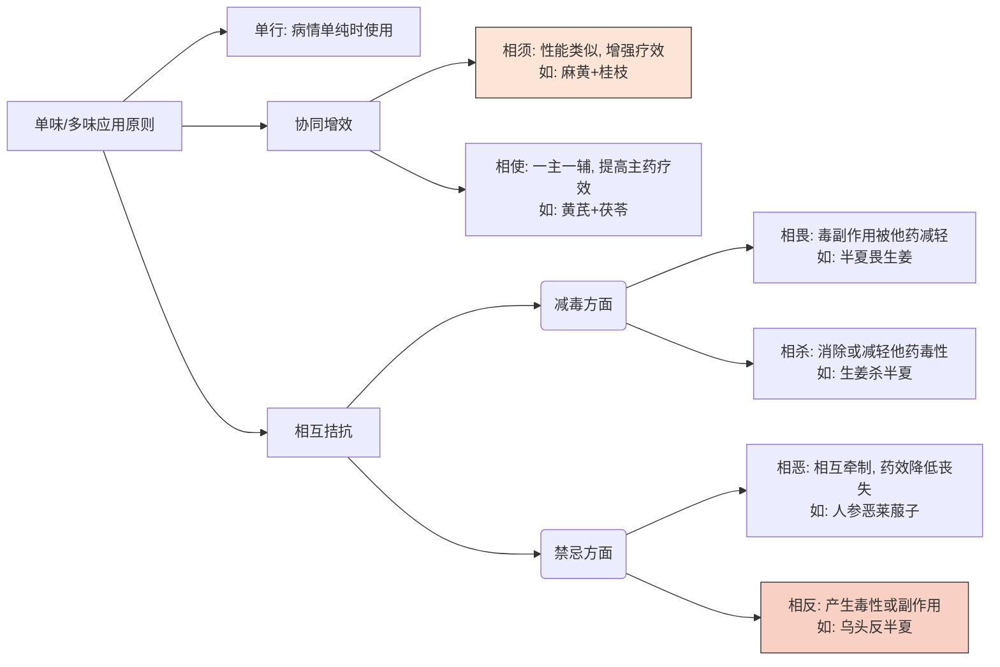

# 中药方剂学总论
## 概述
- **中药**：以中医学理论体系为指导，用于防病治病的药物。强调==道地药材==（如浙八味）及依法炮制。
- **中成药**：疗效确切，制成一定剂型和规格的药品，==可不经医生处方直接销售==。
- **草药**：民间口碑相传，==本草文献多无记载==的天然药物
## 中药性能
- 主要包含四大维度：**性味（四气五味）、升降浮沉、归经、毒性**
### 四气
- **分类**：寒、凉、温、热四种不同的药性。温热与寒凉是性质不同的两类，温与热、寒与凉仅是程度差异。另有**平性**，指寒热之性不明显、药性平和。
- **阴阳属性**：温热属阳，寒凉属阴。
- **临床表现与应用**：
    - **寒凉药**：清热、解毒、凉血、泻火。用于治疗热证。
    - **温热药**：祛寒、温里、助阳、补气。用于治疗寒证。
- **基本用药原则**：==“寒之热之，热之寒之”==
### 五味
反映药物的实际疗效，分为辛、酸、甘、苦、咸五种（加上淡味与涩味）。
- **辛 (散)**：发汗、行气、散结、活血。如麻黄发散表邪，木香行气止痛。
- **酸 (收)**：收敛、固涩。如乌梅收敛止泻。_(注：涩味与酸味往往相兼，作用相似)_。
- **甘 (补、缓、和)**：补益气血、缓急止痛、调和药性。如党参补气，甘草调和诸药。
- **苦 (泻、燥、降)**：清热泻火、清热燥湿、泻热通便。如知母泻火，黄连燥湿。
- **咸 (软、下)**：软坚泻下。如芒硝软坚。
- **淡 (渗)**：渗湿利水。如茯苓、猪苓。_(注：淡味与甘味相近，常甘淡并称)_。

## 中药炮制
## 中药配伍
## 中药禁忌