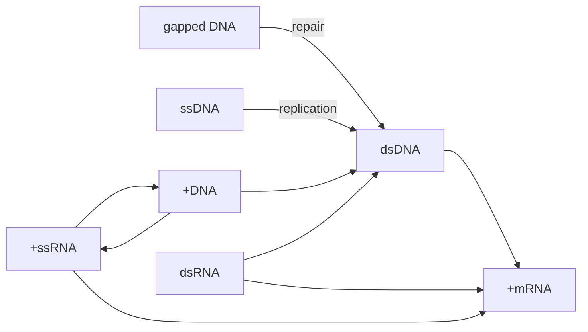

# 病毒的复制
## 病毒
### 病毒的组成
##### 结构概念
###### 病毒粒子
- 作为病毒在细胞外的传播形式，即病毒通过被称为**病毒粒子**的感染性颗粒在细胞间传播
- 结构上包括基因组及其周围的蛋白质外壳
###### 基因组
###### 核衣壳
- 包含芯髓和衣壳
	衣壳的对称方式：螺旋式对称、二十面体对称
###### 囊膜
- 作为病毒的分类的依据：根据有无囊膜分类(**囊膜**来自宿主细胞)，并在此基础上根据囊膜里有无衣壳再进行分类
##### 化学成分
- 蛋白质：
	- 结构蛋白，存在于病毒粒子
	- 非结构蛋白
	- 病毒样颗粒
- 核酸
	单/双链 DNA/RNA 线性/环状 是(否)分节 存在(+)(-)
	+/-的区别，+可以直接翻译，-要形成互补链才嫩翻译
- 脂类
- 糖
- **卫星病毒/辅助病毒** 基因组缺失
	- **感染性核酸**：去除囊膜和衣壳，裸露的DNA仍具有感染性的核酸
### 病毒的复制
- **病毒增殖**：在活细胞内，以病毒基因为模板，在酶的作用下分别合成病毒基因和蛋白质，再重新组装成完整的病毒颗粒
##### 一步生长曲线
- 描述病毒增殖的工具
```functionplot
---
title: 病毒一步生长曲线
xLabel: 时间 (Hours)
yLabel: 病毒滴度 (Log10 PFU/mL)
bounds: [0, 24, 0, 10]
disableZoom: true
grid: true
---
// 这是一个分段模拟：
// x < 4: 模拟吸附和脱壳导致的下降 (4减去一个数值)
// x >= 4: 模拟组装释放后的指数增长
f(x) = (x < 4) ? (4 - 0.5 * x) : (2 + 7 / (1 + exp(-0.8 * (x - 10))))
```
隐蔽期
潜伏期
平台期
确定同步感染，感染比MOI

复制周期
吸附和穿入
静电吸附 特异性受体吸附

非囊膜病毒的受体
衣壳的凹陷结构和螺旋结构
突出的纤维结构
囊膜病毒 利用囊膜糖蛋白与细胞受体结合
辅助受体：某些病毒结合时需要另一个辅助表面蛋白
流感病毒的囊膜糖蛋白HA能与红细胞表面的唾液酸受体结合，发生红细胞凝集作用，称为**血凝作用**
病毒的特异性抗体可以起到血凝抑制作用

穿入途径
直接注入
内吞 网格蛋白和小窝蛋白介导
基因组入核
1.病毒粒子无法自由通过细胞膜，病毒入胞是一个主动运输的过程。
2.病毒蛋白与宿主细胞受体结合是病毒入胞的第一步。
3.细胞受体与病毒的宿主范围及组织嗜性都密切相关
3.一种病毒可以结合多个不同的受体，一种细胞受体也可以被多种病毒所结合。
4.囊膜病毒通过自身的跨膜糖蛋白结合受体，而非囊膜病毒则是通过衣壳蛋白与受体结合。
5.有些病毒脱衣壳过程发生在细胞膜，大部分则在胞内囊泡中脱衣壳。
6.对于同一个病毒而言，入胞机制在不同的细胞中可能是不一样的。
7.病毒颗粒或亚病毒颗粒依赖细胞骨架在细胞内运输。
8.病毒与细胞受体结合不仅是吸附功能，还可以促进病毒入胞。
9.对于入核复制的病毒，病毒复制元件主要通过核孔复合物入核，也有在细胞分裂时，趁核膜破裂时入核。

生物合成
酶：逆转录酶、整合酶
target：合成mRNA
	宿主细胞无法识别mRNA的来源
⭐baltimore system

dsDNA


## 病毒感染细胞后的变化
病原相关分子模式(pathogen-associated molecular patterns)
LPS；区别于宿主形式的核酸形式；代谢产物；鞭毛
模式识别受体(patterns recognize receptor)
### 改变信号通路
蛋白和细胞蛋白的互作
### 改变基因表达
测量基因的表达：
蛋白质、mRNA、修饰
### 重塑细胞代谢
### 重塑核及胞浆结构