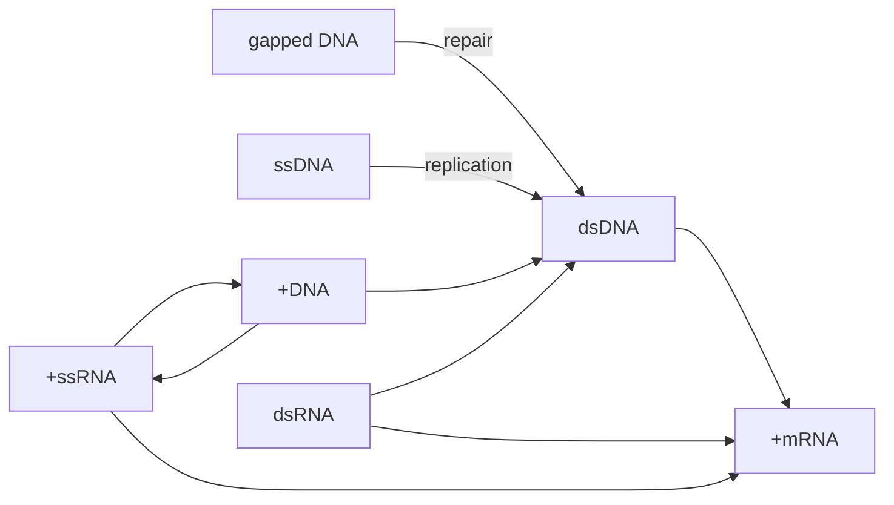

😂居然有自我介绍环节
病毒的定义
- **病毒粒子**：病毒细胞间传递的部分，作为病毒保护性的“外衣”
- 基因组
- 核衣壳
- 浆膜
病毒的分类
根据有无囊膜分类(**囊膜**来自宿主细胞)
	根据囊膜里有无衣壳再进行分类
衣壳的对称方式：螺旋式对称、二十面体对称
病毒的化学组成
蛋白质
- 结构蛋白，存在于病毒粒子
- 非结构蛋白
- 病毒样颗粒
核酸
单/双链 DNA/RNA 线性/环状 是(否)分节 存在(+)(-)
	+/-的区别，+可以直接翻译，-要形成互补链才嫩翻译
脂类
糖
**卫星病毒/辅助病毒** 基因组缺失
**感染性核酸**：去除囊膜和衣壳，裸露的DNA仍具有感染性的核酸

病毒的复制
- **病毒增殖**：在活细胞内，以病毒基因为模板，在酶的作用下
⭐一步生长曲线
隐蔽期
潜伏期
平台期
确定同步感染，感染比MOI

复制周期
吸附和穿入
静电吸附 特异性受体吸附

非囊膜病毒的受体
衣壳的凹陷结构和螺旋结构
突出的纤维结构
囊膜病毒 利用囊膜糖蛋白与细胞受体结合
辅助受体：某些病毒结合时需要另一个辅助表面蛋白
流感病毒的囊膜糖蛋白HA能与红细胞表面的唾液酸受体结合，发生红细胞凝集作用，称为**血凝作用**
病毒的特异性抗体可以起到血凝抑制作用

穿入途径
直接注入
内吞 网格蛋白和小窝蛋白介导
基因组入核
1.病毒粒子无法自由通过细胞膜，病毒入胞是一个主动运输的过程。
2.病毒蛋白与宿主细胞受体结合是病毒入胞的第一步。
3.细胞受体与病毒的宿主范围及组织嗜性都密切相关
3.一种病毒可以结合多个不同的受体，一种细胞受体也可以被多种病毒所结合。
4.囊膜病毒通过自身的跨膜糖蛋白结合受体，而非囊膜病毒则是通过衣壳蛋白与受体结合。
5.有些病毒脱衣壳过程发生在细胞膜，大部分则在胞内囊泡中脱衣壳。
6.对于同一个病毒而言，入胞机制在不同的细胞中可能是不一样的。
7.病毒颗粒或亚病毒颗粒依赖细胞骨架在细胞内运输。
8.病毒与细胞受体结合不仅是吸附功能，还可以促进病毒入胞。
9.对于入核复制的病毒，病毒复制元件主要通过核孔复合物入核，也有在细胞分裂时，趁核膜破裂时入核。

生物合成
酶：逆转录酶、整合酶
target：合成mRNA
	宿主细胞无法识别mRNA的来源
⭐baltimore system

dsDNA
