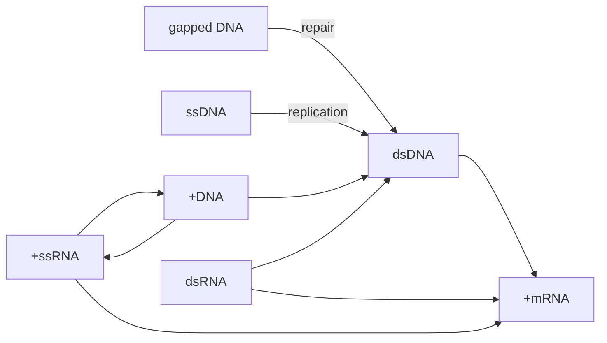

# 病毒的复制
## 病毒
### 病毒的组成
##### 结构概念
###### 病毒粒子
- 作为病毒在细胞外的传播形式，即病毒通过被称为**病毒粒子**的感染性颗粒在细胞间传播
- 结构上包括基因组及其周围的蛋白质外壳
###### 基因组
###### 核衣壳
- 包含芯髓和衣壳
	衣壳的对称方式：螺旋式对称、二十面体对称
###### 囊膜
- 作为病毒的分类的依据：根据有无囊膜分类(**囊膜**来自宿主细胞)，并在此基础上根据囊膜里有无衣壳再进行分类
##### 化学成分
- 蛋白质：
	- 结构蛋白，存在于病毒粒子
	- 非结构蛋白
	- 病毒样颗粒
- 核酸
	单/双链 DNA/RNA 线性/环状 是(否)分节 存在(+)(-)
	+/-的区别，+可以直接翻译，-要形成互补链才嫩翻译
- 脂类
- 糖
- **卫星病毒/辅助病毒**(基因组缺失)
	- **感染性核酸**：去除囊膜和衣壳，裸露的DNA仍具有感染性的核酸
### 病毒的复制
- **病毒增殖**：在活细胞内，以病毒基因为模板，在酶的作用下分别合成病毒基因和蛋白质，再重新组装成完整的病毒颗粒
##### 一步生长曲线
- 描述病毒增殖的工具
- 曲线不同分段：
	隐蔽期：病毒粒子传入宿主后解体
	潜伏期：病毒释放出新的病毒粒子前所需的时间
	平台期
> [!attention] 一步生长曲线绘制的前提
> 确定宿主的同步感染，利用感染比MOI来量化说明

#### 复制周期
##### 吸附
- 宿主细胞膜表面吸附途径：静电吸附(非特异性)+特异性受体吸附
> 宿主表面存在受体，称为**病毒的细胞受体**，多为糖蛋白

###### 辅助受体
- 有些病毒结合细胞受体后，需要再结合一个细胞表面蛋白才能入侵细胞
###### 非囊膜病毒
- 衣壳的凹陷结构和螺旋结构
- 突出的纤维结构
- 衣壳蛋白与神经节苷受体
###### 囊膜病毒
- 利用囊膜糖蛋白与细胞受体结合
- **血凝作用**：流感病毒的囊膜糖蛋白HA能与红细胞表面的唾液酸受体结合，发生红细胞凝集作用
> 病毒的特异性抗体可以起到血凝抑制作用
##### 穿入
直接注入
内吞 网格蛋白和小窝蛋白介导
基因组入核，依赖核孔复合物和核定位信号

<strong>病毒吸附、穿入和脱壳总结</strong>

1.病毒粒子无法自由通过细胞膜，病毒入胞是一个主动运输的过程。 
2.病毒蛋白与宿主细胞受体结合是病毒入胞的第一步。 
3.细胞受体与病毒的宿主范围及组织嗜性都密切相关。一种病毒可以结合多个不同的受体，一种细胞受体也可以被多种病毒所结合。 
4.囊膜病毒通过自身的跨膜糖蛋白结合受体，而非囊膜病毒则是通过衣壳蛋白与受体结合。 
5.有些病毒脱衣壳过程发生在细胞膜，大部分则在胞内囊泡中脱衣壳。 
6.对于同一个病毒而言，入胞机制在不同的细胞中可能是不一样的。 
7.病毒颗粒或亚病毒颗粒依赖细胞骨架在细胞内运输。 
8.病毒与细胞受体结合不仅是吸附功能，还可以促进病毒入胞。 
9.对于入核复制的病毒，病毒复制元件主要通过核孔复合物入核，也有在细胞分裂时，趁核膜破裂时入核。

##### 生物合成
酶：逆转录酶、整合酶
target：合成mRNA
	宿主细胞无法识别mRNA的来源
⭐**baltimore system**

###### dsDNA
- 路径：$dsDNA \rightarrow mRNA$
- 代表：疱疹病毒、腺病毒、天花病毒(痘病毒)
> 线性DNA复制会面临末端变短的问题，人类DNA采用的是端粒
- 机制：
	1. 环化：多瘤病毒
	2. 蛋白引物：腺病毒，在DNA前端加个蛋白质挂钩
	3. 形成复杂 的“连体”结构：疱疹病毒
- 大多数dsDNA作为遗传物质的病毒需要进入宿主细胞核进行复制和转录，而天花病毒自带了复制和转录所需要的酶
###### ssDNA
- 路径：$ssDNA \rightarrow dsDNA(replicative \ form, RF) \rightarrow mRNA$
- 代表：细小病毒、圆环病毒
- 机制：面对线性DNA复制的问题，在两端形成回文序列进行自我折叠，即特殊的*发卡结构*，复制后进行滚环复制形成子代DNA
- 由于单链承载的遗传信息有限，所以感染目标是分裂旺盛的细胞，我们可以称之为**S期依赖**
###### dsDNA