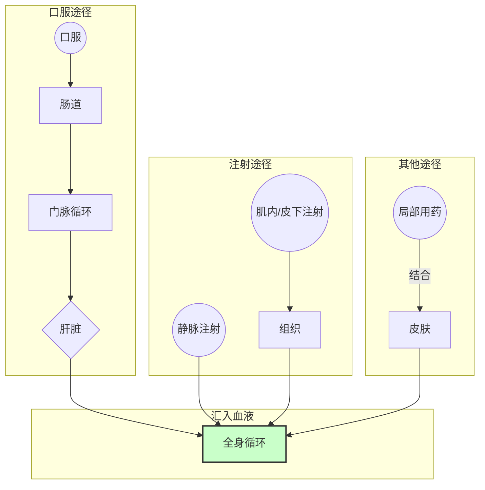
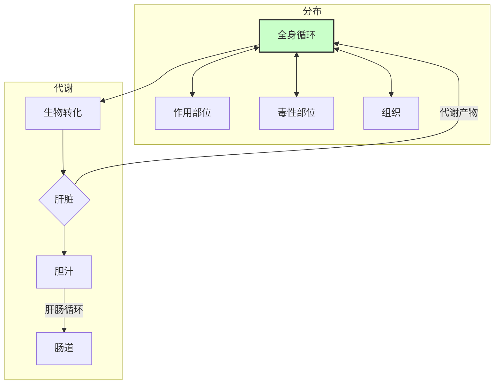
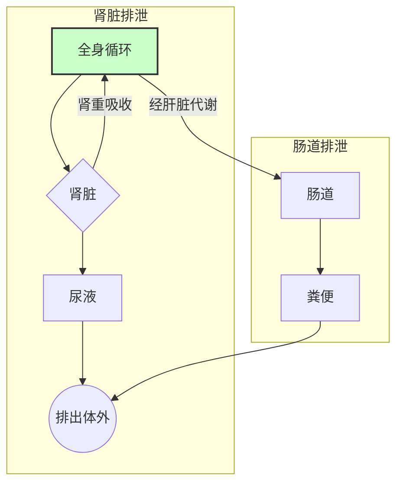

# 药物作用的基本原理（药效动力学）
- 药物对机体的作用
## 一、药物作用的双重性

1. **治疗作用**
    - **对因治疗**：针对病因进行治疗
    - **对症治疗**：缓解症状的治疗
    - 定义：药物作用于机体后，可能产生多种药理作用。其中符合用药目的、对防治疾病有利的作用即为治疗作用。
2. **不良反应**
    与用量无关，对机体造成损害的
    - **副作用**（*side effect*）：药物在==常用治疗剂量==产生的与治疗无关或危害不大的不良反应
    - **毒性作用**：因用量过大或用药时间长引起，可分为急性毒性、慢性毒性
    - **变态反应**：本质是免疫反应，又称过敏反应
    - **继发性反应**：药物服用后产生的不良后果
    - **后遗效应**：停药后血药浓度下降至阈值以下时引发的药理效应

---
## 二、药效动力学与药代动力学

1. **药效动力学**（药物对机体的作用）
    - 研究药物对机体的作用机制及效果
    - 包括治疗作用和不良反应
2. **药代动力学**（机体对药物的作用）
    - 研究药物在体内的吸收、分布、代谢和排泄过程
    - 影响药物作用强度及持续时间

---
## 三、影响药物作用的因素

1. **药物作用的选择性**
    - 表现为不同器官、组织对药物的敏感性差异
    - 原因：
        - 药物对不同组织的亲和力不同
        - 不同组织的代谢能力不同
        - 受体分布的不均一
2. **药物的基本作用**
    - **药物作用**：药物小分子对机体细胞的初始作用
        - 分类：
            - **局部作用**：吸收进入血液前起作用
            - **吸收作用（全身作用）**：通过吸收后影响全身
            - **作用发生顺序**：
                - 原发作用：直接作用
                - 继发作用：间接作用
    - **药理效应**：药物作用的结果，引起机体生理、生化功能的改变
        - 分类：
            - 兴奋药：增强功能
            - 抑制药：抑制功能

---
## 四、构效关系和量效关系
## 构效关系

**含义**：药理作用的特异性取决于特定的化学结构
## 量效关系

1. **量效曲线**
    - 以效应强度为纵坐标，剂量为横坐标建立的曲线
    - 横轴位置反映药物作用强度，表示达到某一效应所需的最小剂量
2. **量反应与质反应**
    - **量反应**：药理效应用数字或量分级表示（如血压下降数值）
    - **质反应**：药理效应以有或无、阴性或阳性表示（如是否出现呕吐）
3. **相关概念**
    - **无效量**：剂量过小，不产生效应
    - **最小有效量（阈剂量）**：引起药物效应的最小剂量
    - **ED50**：半数有效量，半数个体有效的剂量
    - **Emax**：最大效应，对应的量称为极量
    - **最小中毒量**：出现中毒的最小剂量
    - **致死量**：引起死亡的剂量
4. **治疗指数与安全范围**
	**治疗指数**：药物LD50和ED50的比值，越大越安全
	**安全范围**：LD5和ED95的比值，评价药物的安全性

---
# 五、药物作用机制
## 1. 受体机制

- **配体**：与受体有选择性结合能力的生物活性物质，包括内源性的递质、激素、活性肽等，和外源性的药物、毒物等
- **受体**：可选择性结合生物活性物质的生物大分子，存在**结合部位**和**效应部位**
	- 受体的性质：
		- 饱和性
		- 特异性
		- 可逆性
	- 受体的分布及类型
	- **受体调节**：受体的数量和活性是随生理状态动态调节的，调节的方式有两种：
		- 脱敏：在使用激动剂期间或之后，细胞或组织对激动剂的敏感性或反应性下降。受体内移是受体减少的一种方式
		- 增敏：脱敏作用相反的一种现象，又称向上调节
	- 受体作用的假说
## 2. 非受体机制
1. 对酶的作用
2. 影响离子通道
3. 对核酸的作用
4. 影响神经递质或体内其他生物活性物质
5. 参与或干扰细胞代谢
6. 影响免疫系统
7. 机体理化条件的改变
---
# 药代动力学
- 指的是机体对药物的作用
## 一、药物的跨膜转运
基本的转运方式参考组织胚胎学中的相关知识点
## 二、药物的体内过程
其中[[兽医药理学/总论#（二）分布|分布]]、[[兽医药理学/总论#（三）生物转化|生物转化]]、[[兽医药理学/总论#（四）代谢|代谢]]称为机体对药物的处置（*disposition*），而把[[兽医药理学/总论#（三）生物转化|生物转化]]、[[兽医药理学/总论#（四）代谢|代谢]]称为消除。
### （一）吸收

**给药途径**：
- 内服给药
	主要吸收部位是小肠，影响速率的因素：
	- 排空率，影响药物进入小肠的速度
	- pH：影响药物的解离度，即$$\frac{解离浓度}{非解离浓度}=10^{pH-pK_a}$$
	- 胃肠内容物的充盈度，食物会稀释药物浓度
	- 药物相互作用，如药物与金属离子结合形成螯合物失活
	- 首过效应（first pass effect），也成为首过消除（first pass elimination）内服吸收后进入肝脏后进行的**首次代谢**，从而使得全身循环的药量减少的现象
- 注射给药：主要有静脉注射、肌内注射和皮下注射
	快速静脉注射
	静脉输注
- 呼吸道给药
- 皮肤给药
### （二）分布

### （三）生物转化
### （四）代谢
