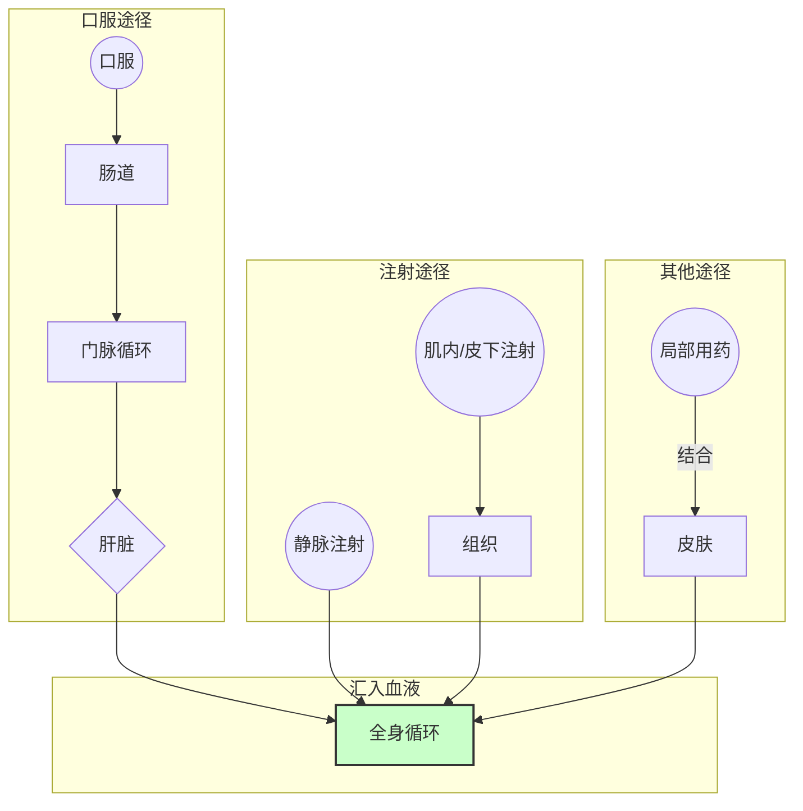
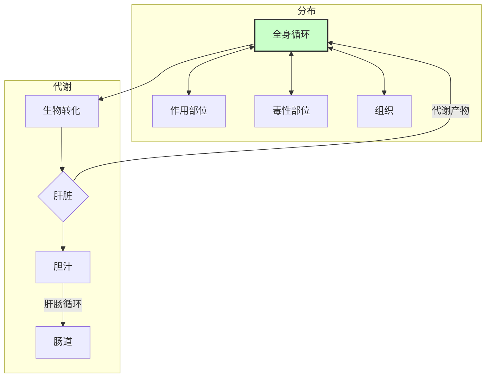
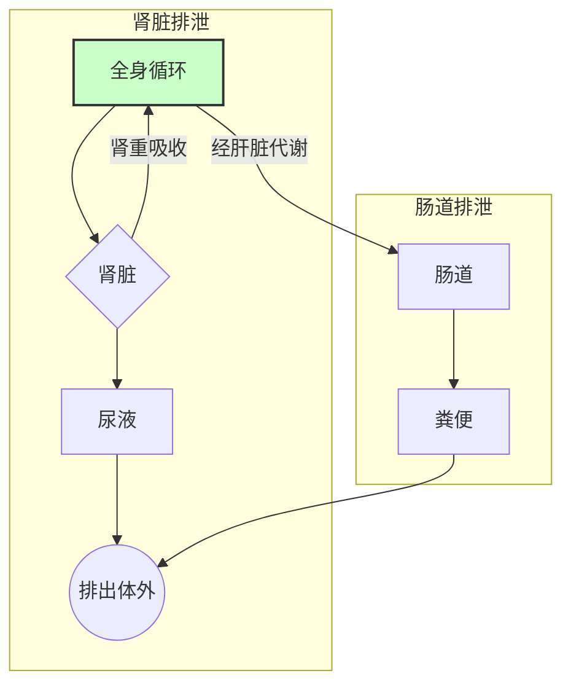

# 药物作用的基本原理（药效动力学）
- 药物对机体的作用
## 一、药物作用的双重性

1. **治疗作用**
    - **对因治疗**：针对病因进行治疗
    - **对症治疗**：缓解症状的治疗
    - 定义：药物作用于机体后，可能产生多种药理作用。其中符合用药目的、对防治疾病有利的作用即为治疗作用。
2. **不良反应**
    与用量无关，对机体造成损害的
    - **副作用**（*side effect*）：药物在==常用治疗剂量==产生的与治疗无关或危害不大的不良反应
    - **毒性作用**：因用量过大或用药时间长引起，可分为急性毒性、慢性毒性，总结为“三致“，致癌，致畸，致突变
    - **变态反应**：本质是免疫反应，又称过敏反应，药物不同，效应相同
    - **继发性反应**：药物服用后产生治疗作用的不良后果
    - **后遗效应**：停药后血药浓度下降至阈值以下时引发的药理效应

---
## 二、药效动力学与药代动力学

1. **药效动力学**（药物对机体的作用）
    - 研究药物对机体的作用机制及效果
    - 包括治疗作用和不良反应
2. **药代动力学**（机体对药物的作用）
    - 研究药物在体内的吸收、分布、代谢和排泄过程
    - 影响药物作用强度及持续时间

---
## 三、影响药物作用的因素

1. **药物作用的选择性**
    - 表现为不同器官、组织对药物的敏感性差异
    - 原因：
        - 药物对不同组织的亲和力不同
        - 不同组织的代谢能力不同
        - 受体分布的不均一
2. **药物的基本作用**
    - **药物作用**：药物小分子对机体细胞的初始作用
        - 分类：
            - **局部作用**：吸收进入血液前起作用
            - **吸收作用（全身作用）**：通过吸收后影响全身
            - **作用发生顺序**：
                - 原发作用：直接作用
                - 继发作用：间接作用
    - **药理效应**：药物作用的结果，引起机体生理、生化功能的改变
        - 分类：
            - 兴奋药：增强功能
            - 抑制药：抑制功能

---
## 四、构效关系和量效关系
## 构效关系

**含义**：药理作用的特异性取决于特定的化学结构
## 量效关系

1. **量效曲线**
    - 以效应强度为纵坐标，剂量为横坐标建立的曲线
    - 横轴位置反映药物作用强度，表示达到某一效应所需的最小剂量，需要剂量越小，强度越大
    - 质反应利用频数分布和累计频数图来反映量效关系
2. **量反应与质反应**
    - **量反应**：药理效应用数字或量分级表示（如血压下降数值）
    - **质反应**：药理效应以有或无、阴性或阳性表示（如是否出现呕吐）
3. **相关概念**
    - **无效量**：剂量过小，不产生效应
    - **最小有效量（阈剂量）**：引起药物效应的最小剂量
    - **ED50**：半数有效量，半数个体有效的剂量
    - **Emax**：最大效应，对应的量称为极量
    - **最小中毒量**：出现中毒的最小剂量
    - **致死量**：引起死亡的剂量
4. **治疗指数与安全范围**
	**治疗指数**：药物LD50和ED50的比值，越大越安全
	**安全范围**：LD5和ED95的比值，评价药物的安全性
	**治疗窗**：介于最小效应浓度和最小中毒浓度之间

---
# 五、药物作用机制
## 1. 受体机制

- **配体**：与受体有选择性结合能力的生物活性物质，包括内源性的递质、激素、活性肽等，和外源性的药物、毒物等
- **受体**：可选择性结合生物活性物质的生物大分子，存在**结合部位**和**效应部位**
	- 受体的性质：
		- 饱和性
		- 特异性
		- 可逆性
		- 高敏感性
	- 受体的分布及类型
	- **受体调节**：受体的数量和活性是随生理状态动态调节的，调节的方式有两种：
		- 脱敏：在使用激动剂期间或之后，细胞或组织对激动剂的敏感性或反应性下降。受体内移是受体减少的一种方式
		- 增敏：脱敏作用相反的一种现象，又称向上调节
	- 受体作用的假说
		受体结合学说：药物与受体产生效应必须具有亲和力（表现结合的能力）和内在活性（效能，诱导效应的能力），由此可以得到两种拮抗效果的药物：
		- 竞争性拮抗药：不改变量效曲线的形状，可逆性
		- 非竞争性拮抗药：不改变量效曲线的位置
		速率学说：结合速率与分解速率
- **第二信使**：细胞内的小分子，水溶性为主，接受并传递受体配体结合的信号
## 2. 非受体机制
1. 对酶的作用
2. 影响离子通道
3. 对核酸的作用
4. 影响神经递质或体内其他生物活性物质
5. 参与或干扰细胞代谢
6. 影响免疫系统
7. 机体理化条件的改变
---
# 药代动力学
- 指的是机体对药物的作用
## 一、药物的跨膜转运
基本的转运方式参考组织胚胎学中的相关知识点
被动转运
**离子障**：非离子型药物可以自由穿透细胞膜，离子型药物被限制在膜的一侧
主动转运
## 二、药物的体内过程
其中[[兽医药理学/总论#（二）分布|分布]]、[[兽医药理学/总论#（三）生物转化|生物转化]]、[[兽医药理学/总论#（四）代谢|代谢]]称为机体对药物的处置（*disposition*），而把[[兽医药理学/总论#（三）生物转化|生物转化]]、[[兽医药理学/总论#（四）代谢|代谢]]称为消除。
### （一）吸收

**给药途径**：
- 内服给药
	主要吸收部位是小肠，影响速率的因素：
	- 排空率，影响药物进入小肠的速度
	- pH：影响药物的解离度，即：$$\frac{解离浓度}{非解离浓度}=10^{pH-pK_a}$$
	- 胃肠内容物的充盈度，食物会稀释药物浓度
	- 药物相互作用，如药物与金属离子结合形成螯合物失活
	- 首过效应（first pass effect），也成为首过消除（first pass elimination）内服吸收后进入肝脏后进行的**首次代谢**，从而使得全身循环的药量减少的现象
- 注射给药：主要有静脉注射、肌内注射和皮下注射
	静脉注射给药：直接将药物注入血管，血药浓度上升最快
	肌肉注射和皮下注射：通过被动扩散+滤过，吸收快而完全，水溶性药物可滤过，吸收速率取决于血管分布状态
		缓释剂型可以减缓吸收速率，延长药物作用时间
- 呼吸道给药
	气体和挥发性药物直接进入肺泡，吸收迅速（吸收面积大，血液流速快）
- 皮肤给药
	浇淋剂是皮肤吸收的一种剂型
### （二）分布

- **影响药物分布的因素**
	- 药物的理化性质
	- 血液和组织间的浓度梯度
	- 组织血流量大小和组织大小、毛血管通透性、药物对组织的亲和力
	- 转运蛋白含量

- **分布的类型**
	- 血浆蛋白结合
		可逆性
		可饱和性
		结合后的不易穿过毛细血管壁
		非特异性和竞争性：存在两种对血红蛋白均有较高亲和力的药物时处罚
	- 组织屏障
		**血脑屏障**：毛细血管壁与神经胶质细胞形成，物质以被动滤过的方式通过，通过的药物脂溶性要求高。当身体出现炎症时，血脑屏障通透性增大。
		**胎盘屏障**：通透性与一般毛细血管没有明显区别，但血液交换量小，大多数药物可进入胎儿，达到平衡时间长
### （三）生物转化
又可以称为代谢（metabolism），主要部位在肝脏，也包括胃肠、肺、皮肤、肾
- 两个步骤：
	- Ⅰ期反应
		氧化、还原和水解
	- Ⅱ期反应
		结合反应，第一步产生的极性代谢物或未经代谢的原形药物能与内源性物质结合的过程，会产生极性更强、水溶性更强、更利于从尿液或胆汁排泄的代谢产物，药理性质消失，又称为解毒作用
- 生物转化的酶
	参与生物转化的酶主要是**肝微粒体**的药物代谢酶系，简称药酶
	其中重要的是细胞色素P-450混合功能氧化酶系，又称单加氧酶
	- 酶的诱导：有些药物能兴奋肝微粒体酶系，能促进合成增加或活性增强
	- 酶的抑制：与酶的诱导相反，如有机磷杀虫剂
### （四）代谢

药物的代谢产物或原形通过各种途径排出体外的过程。
- **主要过程**
	- 肾脏排泄
		极性高的代谢产物或原形药排泄的主要途径，三种主要方式：
		- 肾小球滤过：游离或非结合型药物滤过 M < 6 6000
		- 肾小球分泌：近曲小管主动转运排泄，非特异性的，会出现竞争性抑制
		- 肾小管重吸收：被动扩散，脂溶性或非解离的弱有机电解质
			如，有机酸在碱性尿液环境中，解离多，重吸收少，排泄快
	- 胆汁排泄
		对于分子量大且有极性基团的药物
		**肝肠循环**：胆汁排泄进入小肠的药物会被重吸收进入门静脉，延缓药物的消除
	- 其他途径
		- 乳腺排泄等

---
## 三、药代谢动力学的基本描述概念
### 1. 药时曲线
血药浓度关于时间的曲线，见下图
![[Pasted image 20251001163226.png]]
### 2. 房室模型
将机体概念化成一个系统，根据药物转运和分布的动力学特点分成若干房室，具有相同或相似的速率过程的部位（药物浓度与时间成函数关系），该部位可以视为一个房室
### 3. 主要参数
- 消除半衰期
	指的是体内药物浓度或量下降至原来一半所需的时间，又称半衰期，常用$t_{1/2β}$或$t_{1/2K_c}$ 表示
	半衰期是制定给药间隔时间的重要依据，也是预测多次给药时药物达到稳态浓度和停药后从体内消除时间的主要参数
		等量等间隔给药，血药浓度上升，经5.5个半衰期达到稳定浓度，此时消除药量与进入药量相等，血药浓度在平均浓度上下波动
	**证明**：
		机体内大多数药物遵循一级速率方程，即$\frac{dx}{dt}=-kx$
		两边积分，可得$\int\frac{dx}{x} dx=\int-kdt$ → $ln(x)=-kt+C(取C=ln(x_0)，x_0为初始浓度或量)$
		转换一下最后可以得到，$x(t)=x_0*e^{-kt}$
		当$t=t_{1/2}$时，可以得到$t_{1/2}*k=ln2$
		经过n次间隔为τ的给药后，机体药物浓度与初始浓度间满足  $\frac{c}{c_0}=1-e^{-knτ}$
		令$N=nτ$，代入后可以得到 $\frac{c}{c_0}=1-2^{-N}$
		当$N=5.5$时，此时$\frac{c}{c_0}\approx97.79\%$，此时认为达到稳定浓度
- 药时曲线下面积（AUC）
	理论上，$AUC=\int_{0}^{∞}c(t)dt$，表示全身循环的药物总量
	计算公式：
		$AUC=\frac{X_0}{KV}(静脉注射)$
		$AUC=\frac{FX}{KV}(非血管给药)$
		F为生物利用度，X为给药量，V为表观分布容积，K为一室模型的消除速率常数，二室中改用$\beta$
- 表观分布容积（Vd）
	是药物在体内达到动态平衡时，体内药量与血浆药物浓度的比值，即$Vd=\frac{X}{c}=\frac{X_0}{K·AUC}$
- 体清除率（$CI_{B}$）
	单位时间内机体通过各种消除作用（生物转化、排泄）消除药物的血浆容积，单位为$ml·min^{-1}·kg^{-1}$