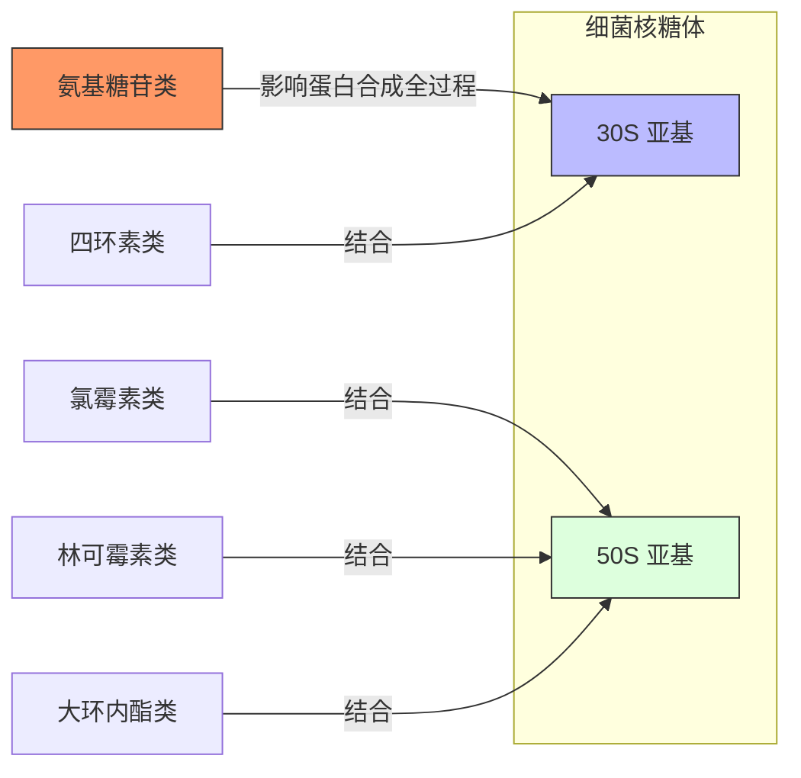

<h1>抗微生物药理</h1>

## concepts
###### 抗微生物药物
- 对细菌、支原体、真菌、病毒等具有==选择性抑制或杀灭==作用，用于防治微生物所致感染性疾病的药物
###### 化学治疗
简称“化疗”
- 对微生物感染性疾病、寄生虫病、恶性肿瘤等进行药物治疗
###### 化学治疗学
- 研究化疗药物、病原体和机体之间的相互作用及其规律的科学，又称“化疗三角”
###### 化疗药物
- **抗生素**：微生物在生长繁殖过程中抑制或杀灭其他微生物的化学物质
- **半合成抗生素**：在微生物合成的基础上进行人工的结构改造
- **抗菌药**：人工合成为主
###### 抗菌谱
- 抑制或杀灭病原微生物的范围，分为广谱和窄谱：
	- 广谱：除能抑制细菌之外，也能抑制支原体、立克次体和衣原体等，如四环素类、苯尼考、氟喹诺酮类等，许多半合成抗生素和人工合成抗菌药具有广谱抗菌作用
	- 窄谱：仅作用于革兰阳性细菌或革兰阴性细菌的药物称为窄谱抗菌药，例如青霉素、链霉素、红霉素等
###### 抗菌活性
- 抑制或杀灭病原微生物的能力，可以通过下列指标进行评定：
	- 最小抑菌浓度(MIC, minimal inhibitory concentration)
	- 最小杀菌浓度(MBC, minimal bactericidal concentration)
###### 抑菌药
- 仅能抑制细菌的生长繁殖，而无杀灭的作用
###### 杀菌剂
- 既能抑制细菌的生长繁殖，又嫩杀灭细菌的药物
###### 化疗指数
是评价化疗药安全性的指标$$CI=\frac{LD_{50}}{ED_{50}}$$
###### 抗菌药后效应
- 即post-antibiotic effect, PAE，指的是药物浓度降低至最低药效浓度后，对微生物的抑制作用仍持续一定时间
###### 耐药性
- 细菌发生变异，指病原对药物的耐性
> 区别于**耐受性**，指的是机体对药物的耐性；名词描述的主体不同
## 抗菌药作用机制
### 抑制细菌细胞壁合成
- $Gram^+$细胞壁的主要成分是粘肽(肽聚糖)
药物可以从多步流程进行破坏：
- 磷霉素、万古霉素：胞浆内粘肽前体核苷的合成
- 杆菌肽：抑制多糖链的形成
- [[抗微生物药#$ beta$-内酰胺类抗生素|β-内酰胺类]]：主要抑制粘肽的交联
### 增加细菌细胞膜通透性
细胞膜的组成包括类脂质和蛋白质
- 多肽类(粘菌素) ：有表面活性剂的作用，可以损伤细胞膜
- 多烯类抗真菌药：与真菌胞膜的固醇结合增加通透性 
- 咪唑类抗真菌药：抑制胞浆膜麦角固醇的合成
### 影响菌体蛋白合成

### 抑制核酸的合成
- $Gram^-$：抑制DNA解旋酶，氟喹诺酮类
- $Gram^{+}$：抑制拓扑异构酶
	利福平、氯霉素会导致作用氟喹诺酮类的作用
### 抑制叶酸代谢
- **核心**：通过相似结构来抑制1C单位的提供
- 磺胺药：阻断二氢叶酸合成酶
- TMP/乙胺嘧啶：阻断二氢叶酸还原酶
## 耐药性
- 固有耐药：由基因决定，随染色体传递，代代具有
- 获得性耐药：代谢途径改变获得不被抗菌药物杀死的抵抗力
	来源：基因突变，可移动因子(plasmid)
### 产生机制
##### 获得灭活酶
- 产生水解酶：β-内酰胺酶
- 产生失活酶：钝化酶
##### 改变靶位结构
- 改变靶蛋白的结构
- 增加靶蛋白数量
- 生成耐药靶蛋白
##### 改变细胞膜通透性
使得影响胞内的药物不容易进入
##### 改变代谢途径
如针对磺胺类的药物
##### 主动外排作用
### 对策
- 细菌感染才用
- 用量足、疗程适当
- 慢性病联合用药，避免二重感染
	⭐**二重感染**：使用广谱抗生素（尤其是内服）长期治疗原有感染的过程中，由于体内敏感菌被杀灭，导致不敏感的微生物大量繁殖而引起的新感染
### 抗菌药物分类及使用
1. 繁殖期杀菌药
2. 静止期杀菌药
3. 快速抑菌药
4. 慢速抑菌药

| 效果  | 搭配  |
| --- | --- |
|协同 | 1+2 |
|拮抗 | 1+3 |
|相加 | 3+2 |
|无关或相加 | 1+4 |

