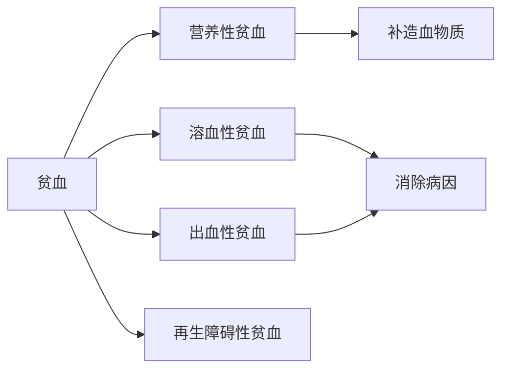

<center><h1>血液循环药理</h1></center>

## 作用于心脏的药物
### 心脏结构和血液循环的调节
##### 交感神经系统
- $\beta$受体：会使心肌的收缩力增强、心率提高、血管平滑肌舒张
- $\alpha$受体：皮肤、血管平滑肌的收缩 
##### 副交感神经系统
- M受体：$M_2$降心率，$M_3$扩内皮
### 治疗**充血性心力衰竭**的药物
###### 充血性心力衰竭(CHF)
- 定义：心脏病发展到一定程度，即使充分发挥代偿能力仍然不能泵出足够血液以适应机体所需而产生的综合征
#### 发病机制
发病初期，启动代偿机制(心肌再生，反射性兴奋交感神经，激活肾素-血管紧张素-醛固酮系统)。过分代偿引起心肌前负荷增加，心室舒张期缩短，充盈不足，心输出量降低
- 针对药物：强心药、抗RAA药物、血管扩张药、利尿药
##### 症状表现
[[第一章 细胞和组织的适应与损伤#细胞肿胀|组织水肿]]、肺循环受阻、运动能力限制
#### 强心药
##### 强心苷类
- 原理：抑制膜结合的$Na^{+}-K^{+}-ATP$酶活性，提高胞内$Na^{+}$。因为$Ca^{2+}$与$Na^{2+}$是偶联在一起的，促进$Ca^{2+}$的内流交换
>[!note] ❗注意安全剂量和有效剂量。用量不当引起易中毒，抑制过高会引起钠钾失衡，心率不调
- 药理作用：
	1. 加强心肌收缩性，正性肌力作用：只增加衰竭心脏输出量；减慢心率和房室传导；增加正常耗氧量，降低衰竭心脏耗氧量
	2. 正常促进缩血管，增加阻力；心衰患者心输出量增加反射性引起血管扩张
	3. 利尿：同时会抑制肾小管上皮的$Na^{+}-K^{+}-ATP$酶，减少对$Na^{+}$重吸收，同时心输出量的增加引起肾血流量增加
- 不良反应
	- 胃肠道反应
	- 神经系统
	- 心脏毒性：引起心率失常
###### 洋地黄毒苷
慢效，口服给药
适用于慢性心功能不全
⭐存在肝肠循环$\rightarrow$持续时间久
###### 地高辛
中效，口服给药
###### 毒毛花苷K
快效，静脉给药，适用于急性心力衰竭
##### 磷酸二酯酶抑制剂
- 原理：磷酸二酯酶(PDE)将cAMP降解为5'AMP，抑制该分解过程从而提高cAMP浓度，激活下游通路，如PKA激活$Ca^{2+}$通道，增加胞内$Ca^{2+}$从而增加心肌收缩性，同时cAMP也能引起血管扩张
- 药理作用：正性肌力+扩张血管，增加心输出量
###### 米力农
不良反应轻，用于静脉注射治疗急性心衰
###### 氨力农
##### 血管扩张药类
- 原理：可以减少[[#充血性心力衰竭(CHF)|CHF]]时内分泌引起的水钠潴留和血管收缩，并降低心室的前后负荷，需配合利尿药
> [!note] 血管扩张药能够改善血流动力学指标但不能防止CHF发生，作为治疗CHF的辅助药物

###### 肼屈嗪
扩张小动脉，降低外周阻力，用于犬二尖瓣不全引起的超负荷CHF
#### 抗肾素-血管紧张素-醛固酮(RAA)药物
RAA system是机体内调节血流量、电解质平衡和动脉血压的系统
主要部分是**肾素**和**血管紧张素转移酶**
###### 血管紧张素转化酶抑制剂
改善心力衰竭，作为利尿药和[[#地高辛]]治疗的辅助药物
- 不良反应
	- 低血压
	- 高血钾
	- 肾衰发生
## 促凝血药和抗凝血药
### 凝血过程
机体内处于凝血和抗凝的动态平衡过程
### 促凝血药物
##### 促凝血因子生成药
###### 维生素K
- 天然的$K_1, K_2$，脂溶，配合胆汁吸收
- 人工合成的$K_3, K_4$，水溶，直接吸收
- 作用机理：作为羧化酶的辅酶，参与肝脏合成凝血因子的活化
- 应用：用于维生素K缺乏引起的出血
	1. 维生素K合成、吸收和利用障碍：肠道菌群缺乏、胆汁缺乏
	2. 抗凝血药物中毒：拮抗剂双香豆类中毒，水杨酸过量出血
##### 促血小板生成药
###### 酚磺乙胺
```smiles

```

又名止血敏
- 作用机理：增加血小板数量，增加其聚集和黏附能力；增强毛细血管抵抗力及降低通透性
##### 抗纤维蛋白溶解药
###### 氨甲苯酸&氨甲环酸
- 作用机理：竞争性抑制纤溶酶原激活因子从而抑制纤维蛋白的溶解，大量时直接抑制纤溶酶
- 应用于纤溶亢进性溶血(纤溶酶原因子较多的器官)
##### 缩血管药
###### 安特诺新(安络血)
- 肾上腺素氧化衍生物，无拟肾上腺素作用
- 促毛细血管收缩，降低其通透性
- 主要应用于毛细血管通透性升高引起的出血
### 抗凝血药
##### 影响凝血酶和凝血因子形成的药物
###### 肝素
- 作用机理：
	- 抑制凝血因子和凝血酶：激活抗凝血酶Ⅲ进行灭活
	- 抑制血小板聚集：与血管内皮结合，传递负电荷
作用强、快，体内外具有效果，==已存在血栓无作用==
- 口服不吸收，故以静脉注射给药
## 抗贫血药
### 贫血类型

##### 铁制剂
- 药理作用：Fe是构成血红蛋白、肌红蛋白、过氧化酶、细胞色素c的必需元素
- 以$Fe^{2+}$形式在十二指肠被吸收
注意配伍禁忌