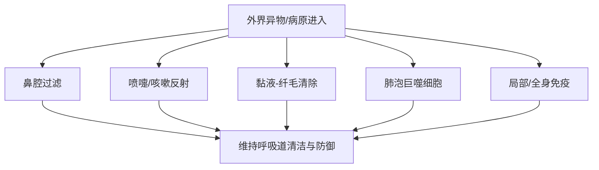
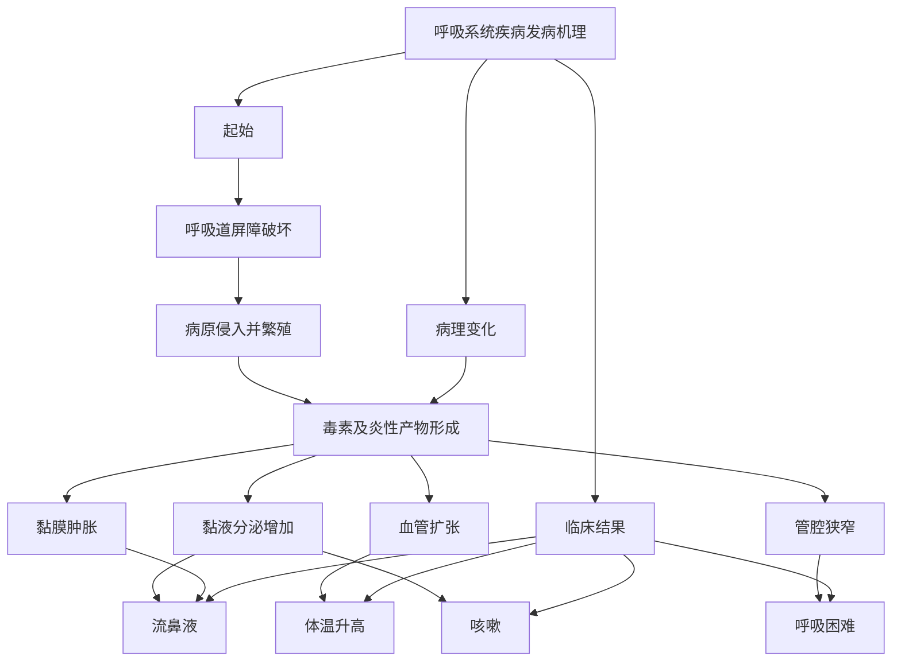

# 呼吸系统的临床检查
## 呼吸系统基础
##### 呼吸系统结构
呼吸系统可以分为**上呼吸道**和**下呼吸道**：
	上呼吸道：鼻、喉、气管
	下呼吸道：支气管、肺
##### 呼吸系统功能
- 通气：完成吸气与呼气，维持肺泡通气  
- 气体交换：完成氧气摄取和二氧化碳排出  
- 气道传导：保证空气经上、下呼吸道顺利到达肺部  
- 防御与清除：通过过滤、纤毛运动、咳嗽反射、吞噬和免疫等机制清除异物和病原  
- 其他功能：发声、嗅觉
## 防御机制
_理解呼吸道的防御机制帮助理解疾病是如何突破防线_
呼吸系统主要的防御机制是一个层级的结构：

##### 上呼吸道防线
是“物理+免疫”的双重屏障，主要包括有：
- 鼻腔过滤作用
- 喷嚏反射
- 鼻局部抗体(主要是分泌型的[[抗体#IgA|IgA]])
##### 喉与气道的反射性防御
主要包括：
- 咳嗽反射(进入后排出)
- 喉反射(入口处排出)
该防御的特点是发现病原/异物后及时排出
##### 支气管黏液-纤毛清除
- 纤毛运动
- 黏液：包括四个连续的清除作用，即阻留、黏附、包埋、固定
##### 肺泡吞噬
当微小颗粒、病原体突破前几层屏障，进入肺泡区域后，肺泡巨噬细胞会承担“最后一道局部吞噬防线”的角色。 
即使病原已经进入肺深部，机体仍有局部细胞级防御机制去吞噬和清除。
##### 免疫防线
- 局部免疫：在呼吸道局部黏膜区域，存在直接针对入侵病原的免疫反应
- 全身免疫：当局部防御不足，或病原/毒素进一步扩散时，就会牵动全身免疫应答
## 呼吸系统发病机理
可概括为：

- 核心记忆点：$屏障破坏→病原入侵→炎症反应→症状出现\text{屏障破坏} \rightarrow \text{病原入侵} \rightarrow \text{炎症反应} \rightarrow \text{症状出现}屏障破坏→病原入侵→炎症反应→症状出现$
## 呼吸运动的检查
##### 呼吸数检查
- 是单位时间内动物完成呼吸的次数
- 呼吸数会随温度、湿度、海拔、年龄、品种、营养、运动等多种因素的影响
- 呼吸数的判断需要考虑**当前呼吸频率是否偏离该动物的正常范围**，即要注意区分生理性变化和病理性变化
##### 呼吸类型检查
- 呼吸类型观察胸廓和腹壁起伏动作的协调性和强度
- 对于多数动物来说采用的是胸腹式呼吸，犬多属于**胸式呼吸**
当呼吸类型的改变提示相应区域的病变：
- 胸式呼吸占主导时，提示病变多在腹部，可能原因：膈肌损伤、腹腔器官体积增大
- 腹式呼吸占主导时，提示病变多在胸部，可能原因：**渗出性胸膜炎**(典型特征)、胸部肋骨骨折、大叶性肺炎等
##### 呼吸节律检擦
- 正常呼吸的“呼”与“吸”具有一定的节律和深度，亦称**节律性呼吸**
- 病变会引起节律性的改变
