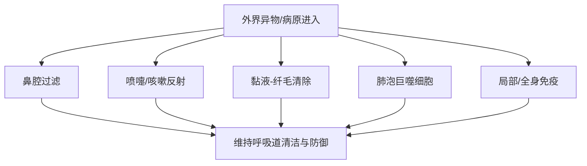

# 呼吸系统的临床检查
## 呼吸系统基础
##### 呼吸系统结构
呼吸系统可以分为**上呼吸道**和**下呼吸道**：
	上呼吸道：鼻、喉、气管
	下呼吸道：支气管、肺
##### 呼吸系统功能
- 通气：完成吸气与呼气，维持肺泡通气  
- 气体交换：完成氧气摄取和二氧化碳排出  
- 气道传导：保证空气经上、下呼吸道顺利到达肺部  
- 防御与清除：通过过滤、纤毛运动、咳嗽反射、吞噬和免疫等机制清除异物和病原  
- 其他功能：发声、嗅觉
## 防御机制
_理解呼吸道的防御机制帮助理解疾病是如何突破防线_
呼吸系统主要的防御机制是一个层级的结构：

##### 上呼吸道防线
是“物理+免疫”的双重屏障，主要包括有：
- 鼻腔过滤作用
- 喷嚏反射
- 鼻局部抗体(主要是分泌型的[[抗体#IgA|IgA]])
##### 喉与气道的反射性防御
主要包括：
- 咳嗽反射(进入后排出)
- 喉反射(入口处排出)
该防御的特点是发现病原/异物后及时排出
##### 支气管黏液-纤毛清除
- 纤毛运动
- 黏液：包括四个连续的清除作用，即阻留、黏附、包埋、固定