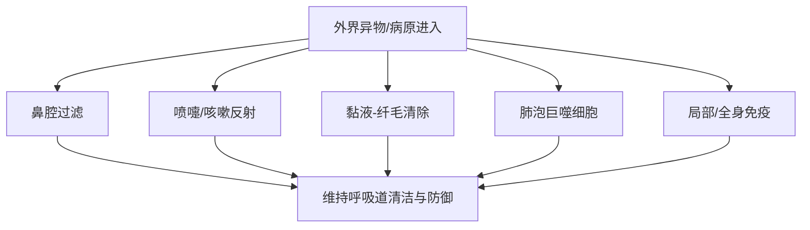
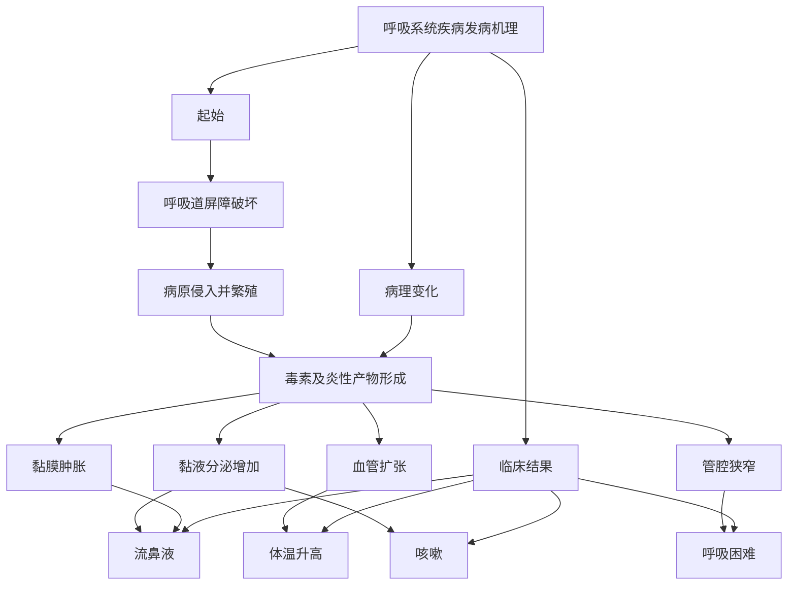
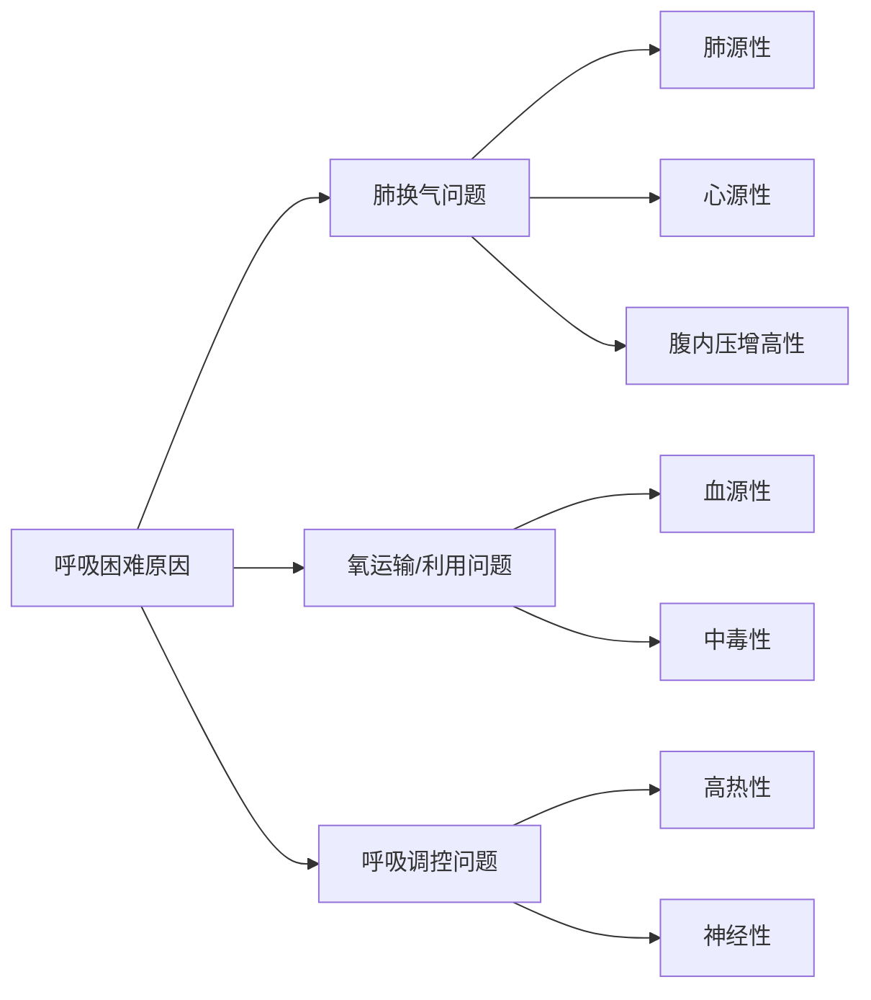

# 呼吸系统的临床检查
## 呼吸系统基础
##### 呼吸系统结构
呼吸系统可以分为**上呼吸道**和**下呼吸道**：
	上呼吸道：鼻、喉、气管
	下呼吸道：支气管、肺
##### 呼吸系统功能
- 通气：完成吸气与呼气，维持肺泡通气  
- 气体交换：完成氧气摄取和二氧化碳排出  
- 气道传导：保证空气经上、下呼吸道顺利到达肺部  
- 防御与清除：通过过滤、纤毛运动、咳嗽反射、吞噬和免疫等机制清除异物和病原  
- 其他功能：发声、嗅觉
## 防御机制
_理解呼吸道的防御机制帮助理解疾病是如何突破防线_
呼吸系统主要的防御机制是一个层级的结构：

##### 上呼吸道防线
是“物理+免疫”的双重屏障，主要包括有：
- 鼻腔过滤作用
- 喷嚏反射
- 鼻局部抗体(主要是分泌型的[[抗体#IgA|IgA]])
##### 喉与气道的反射性防御
主要包括：
- 咳嗽反射(进入后排出)
- 喉反射(入口处排出)
该防御的特点是发现病原/异物后及时排出
##### 支气管黏液-纤毛清除
- 纤毛运动
- 黏液：包括四个连续的清除作用，即阻留、黏附、包埋、固定
##### 肺泡吞噬
当微小颗粒、病原体突破前几层屏障，进入肺泡区域后，肺泡巨噬细胞会承担“最后一道局部吞噬防线”的角色。 
即使病原已经进入肺深部，机体仍有局部细胞级防御机制去吞噬和清除。
##### 免疫防线
- 局部免疫：在呼吸道局部黏膜区域，存在直接针对入侵病原的免疫反应
- 全身免疫：当局部防御不足，或病原/毒素进一步扩散时，就会牵动全身免疫应答
## 呼吸系统发病机理
可概括为：

- 核心记忆点：$$屏障破坏→病原入侵→炎症反应→症状出现\text{屏障破坏} \rightarrow \text{病原入侵} \rightarrow \text{炎症反应} \rightarrow \text{症状出现}屏障破坏→病原入侵→炎症反应→症状出现$$
## 呼吸运动的检查
##### 呼吸数检查
- 是单位时间内动物完成呼吸的次数
- 呼吸数会随温度、湿度、海拔、年龄、品种、营养、运动等多种因素的影响
- 呼吸数的判断需要考虑**当前呼吸频率是否偏离该动物的正常范围**，即要注意区分生理性变化和病理性变化
##### 呼吸类型检查
- 呼吸类型观察胸廓和腹壁起伏动作的协调性和强度
- 对于多数动物来说采用的是胸腹式呼吸，犬多属于**胸式呼吸**
当呼吸类型的改变提示相应区域的病变：
- 胸式呼吸占主导时，提示病变多在腹部，可能原因：膈肌损伤、腹腔器官体积增大
- 腹式呼吸占主导时，提示病变多在胸部，可能原因：**渗出性胸膜炎**(典型特征)、胸部肋骨骨折、大叶性肺炎等
##### 呼吸节律检查
- 正常呼吸的“呼”与“吸”具有一定的节律和深度，亦称**节律性呼吸**
- 病变会引起节律性的改变
主要类别有：
1. 吸气延长：上呼吸道狭窄，如喉头水肿、鼻腔/咽喉肿瘤、异物堵塞
2. 呼气延长：下呼吸道/肺内排气障碍，如肺气肿、细支气管狭窄、肺弹性下降
3. 呼吸节律不齐：机体自身呼吸节律调节受阻，如中枢神经系统调节障碍(脑相关的炎症)、代谢紊乱

| 名称      | 英文            | 别名   | 核心特征                     |
| ------- | ------------- | ---- | ------------------------ |
| 陈—施二氏呼吸 | Cheyne–Stokes | 潮式呼吸 | 由浅慢到深快，再由深快到浅慢，并有暂停，周期重复 |
| 毕奥特氏呼吸  | Biot’s        | 间歇呼吸 | 呼吸几次后突然暂停，再恢复，不规则        |
| 库斯毛尔氏呼吸 | Kussmaul’s    | 深长呼吸 | 深大而长，常见于严重代谢性酸中毒         |

## 呼吸困难
- 是一种病理性呼吸障碍
- 伴随有呼吸强度的改变、呼吸次数的增减、呼吸节律的异常和呼吸方式的改变
- 高度的呼吸困难称为气喘；高度呼吸困难使呼吸运动停止称为窒息
##### 类别
参考[[#呼吸节律检查]]中的主要类别可以分为：

| 类型      | 主要表现     | 主要病变部位/机制             | 常见疾病                            |
| ------- | -------- | --------------------- | ------------------------------- |
| 吸气性呼吸困难 | 吸气困难     | 上呼吸道狭窄，空气进入受阻         | 鼻腔狭窄、咽喉炎症或水肿、猪传染性萎缩性鼻炎、鸡传染性喉气管炎 |
| 呼气性呼吸困难 | 呼气困难     | 肺组织弹性减弱、细支气管狭窄，空气排出受阻 | 肺气肿、胸膜肺炎、细支气管炎                  |
| 混合性呼吸困难 | 吸气和呼气都困难 | 病变较重，通气整体受损           | 临床最常见，常伴呼吸次数增加                  |

##### 原因

##### 肺源性
- 由肺脏本身疾病引起的呼吸困难。肺源性最常见，本质是 **肺通气障碍** 和/或 **肺换气障碍**。
可以拆成三层理解：
1. 通气障碍：空气进出肺泡受阻，导致肺泡通气量下降。常见于气道炎症、分泌物堵塞、支气管狭窄、肺组织弹性下降
2. 换气障碍：即使空气进到了肺泡，**氧和二氧化碳也不能顺利跨过肺泡-毛细血管膜交换**。常见于肺泡的各项病变，如渗出、肺泡壁增厚
3. 肺顺应性下降或弹性异常
##### 心源性呼吸困难
- 由心脏疾病引起的呼吸困难。如心包炎、心肌炎、心力衰竭
- 本质不是“肺先病”，而是心脏泵血功能不全→肺循环受累→肺换气受限
- **左心功能不全 → 肺循环淤血**；**右心功能不全 → 体循环淤血**
##### 血源性
- 主要由于 **红细胞减少** 或 **血红蛋白异常** 所致。如各种贫血：失血性贫血、营养性贫血、寄生虫性贫血、传染性贫血
##### 中毒性
可以分成**内源中毒性**和**外源中毒性**：
###### 内源中毒性
- 由机体内部代谢紊乱产生的毒性产物或酸中毒所致，如[[第八章 酸碱平衡紊乱#代谢性酸中毒|代谢性酸中毒]]引起的库斯毛尔样呼吸
- 尿毒症：酸性代谢产物蓄积
- 酮血病：酮体增多
- 严重胃肠炎：可导致乳酸增多、碳酸氢根丢失
###### 外源中毒性
- 由外界毒物进入机体后造成组织缺氧或呼吸中枢/酶系统损害所致。

## 2）核心发病机制

### ① 血红蛋白失去携氧能力

某些毒物可改变血红蛋白，使其不能正常携氧。  
例如：

- 亚硝酸盐中毒可形成高铁血红蛋白

结果：

- 血中“有血红蛋白但不会运氧”
- 组织缺氧
- 继发呼吸困难

---

### ② 细胞不能利用氧

某些毒物并不是让氧进不去，而是让细胞“不会用氧”。  
例如：

- 氢氰酸抑制细胞色素氧化酶系统

结果：

- 组织氧化过程受阻
- 出现 **组织性缺氧**
- 呼吸中枢被强烈刺激

---

### ③ 神经肌肉系统受损

某些毒物还能影响呼吸肌或神经传导。  
例如：

- 有机磷中毒可引起支气管分泌增多、支气管痉挛、呼吸肌麻痹

结果：

- 通气障碍进一步加重

---

## 3）临床常见

- 亚硝酸盐中毒（暗红色）
- 氢氰酸中毒（鲜红色，杏仁味气体）
- 有机磷农药中毒

---

## 4）一句话机制总结

> **外源中毒性呼吸困难 = 毒物使血不能运氧、组织不能用氧，或直接损伤呼吸神经肌肉系统。**

---

## 五、高热性呼吸困难

## 1）定义

高热性疾病中，由于代谢亢进、体温升高及毒素作用刺激呼吸中枢而引起的呼吸困难。

## 2）核心发病机制

### ① 代谢率升高

发热时机体代谢加快，组织耗氧量上升，二氧化碳生成增多。

结果：

- 呼吸中枢被刺激
- 呼吸加快

---

### ② 血温升高直接刺激呼吸中枢

高温本身可增强呼吸中枢兴奋性。

结果：

- 通气增加
- 呼吸频率上升

---

### ③ 毒素血症共同作用

严重感染时，循环中的毒素也会刺激中枢和外周感受器，进一步加重呼吸困难。

---

## 3）临床常见

- 猪瘟
- 猪丹毒
- 口蹄疫
- 鸡新城疫等

---

## 4）一句话机制总结

> **高热性呼吸困难 = 高热和毒素使代谢需求增高、呼吸中枢兴奋，从而出现呼吸加快和呼吸困难。**

---

## 六、腹内压增高性呼吸困难

## 1）定义

由于 **腹内压升高**，直接压迫膈肌并影响腹壁运动，从而导致呼吸困难。

## 2）核心发病机制

### ① 膈肌被向前/向上顶压

腹腔内容物增大后，膈肌活动范围明显受限。

结果：

- 吸气时胸腔不能充分扩大
- 肺扩张受限
- 吸气量下降

---

### ② 腹壁运动受限制

正常呼吸尤其腹式呼吸依赖腹壁和膈肌协调运动。  
腹内压高时，腹壁活动受限，呼吸做功明显增加。

---

### ③ 严重时迅速窒息

如急性胃扩张、瘤胃臌气、肠臌气等，腹压可在短时间急剧升高，严重压迫膈肌和后腔静脉。

结果：

- 通气受阻
- 静脉回流受限
- 缺氧迅速加重
- 可在短时间内窒息死亡

---

## 3）临床常见

- 瘤胃臌气
- 瘤胃积食
- 胃扩张
- 肠臌气
- 肠变位
- 腹腔积液等

课件还特别提到：

- **妊娠后期** 子宫压迫膈肌，加上胎儿耗氧增加，也可引起母畜呼吸困难

---

## 4）一句话机制总结

> **腹内压增高性呼吸困难 = 腹压升高限制膈肌下降和肺扩张，属于机械性通气障碍。**

---

## 七、神经性呼吸困难

## 1）定义

由于 **中枢神经系统器质性或机能性障碍** 所致。

## 2）核心发病机制

神经性呼吸困难的本质是：

> **呼吸的“指挥系统”出了问题。**

---

### ① 呼吸中枢受损或受刺激

延髓、脑桥等呼吸中枢负责控制呼吸频率、节律和深度。  
当这些部位发生病变时，可出现：

- 呼吸频率异常
- 节律异常
- 呼吸暂停
- 病理性呼吸

---

### ② 颅内压增高或占位效应

脑膜炎、脑肿瘤、脑包虫等可导致：

- 中枢受压
- 调节功能紊乱

结果：

- 呼吸节律不齐
- 潮式呼吸
- 间歇呼吸
- 终末期呼吸异常

---

### ③ 疼痛与反射性影响

某些剧痛性疾病也会通过神经反射改变呼吸频率和深度，造成呼吸困难样表现。

---

## 3）临床常见

- 脑膜炎
- 脑占位性病变（脑肿瘤、脑包虫）
- 某些传染病（如破伤风）
- 剧痛性疾病等

---

## 4）一句话机制总结

> **神经性呼吸困难 = 呼吸中枢或神经调节异常，导致呼吸频率、节律、深度失常。**

---

# 八、把 7 类原因真正串起来

你可以把它们归成 3 个总逻辑层面：

## 第一类：肺通气/换气本身出问题

- 肺源性
- 腹内压增高性
- 部分心源性

共同点：  
**肺不能正常扩张，或肺泡不能正常换气。**

---

## 第二类：氧运输或氧利用出问题

- 血源性
- 中毒性

共同点：  
**不一定是肺坏了，而是氧运送/利用链条坏了。**

---

## 第三类：呼吸调控系统出问题

- 神经性
- 高热性
- 中毒性中的一部分

共同点：  
**呼吸中枢被刺激或抑制，呼吸模式异常。**