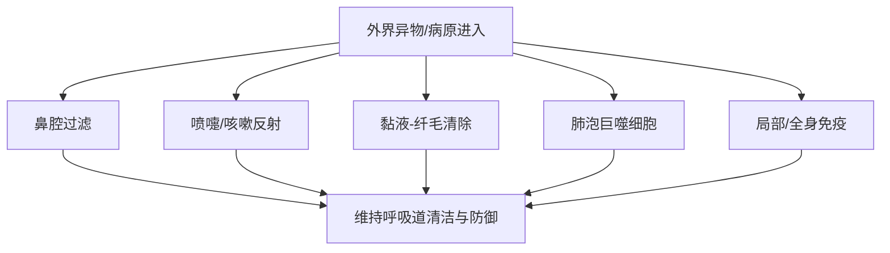
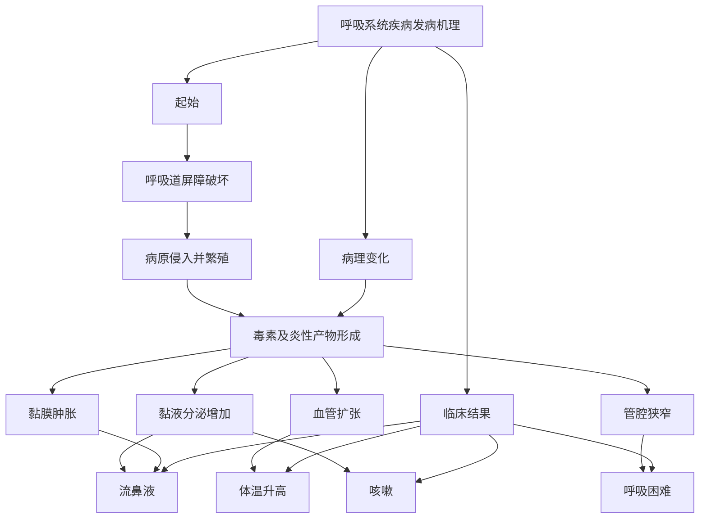
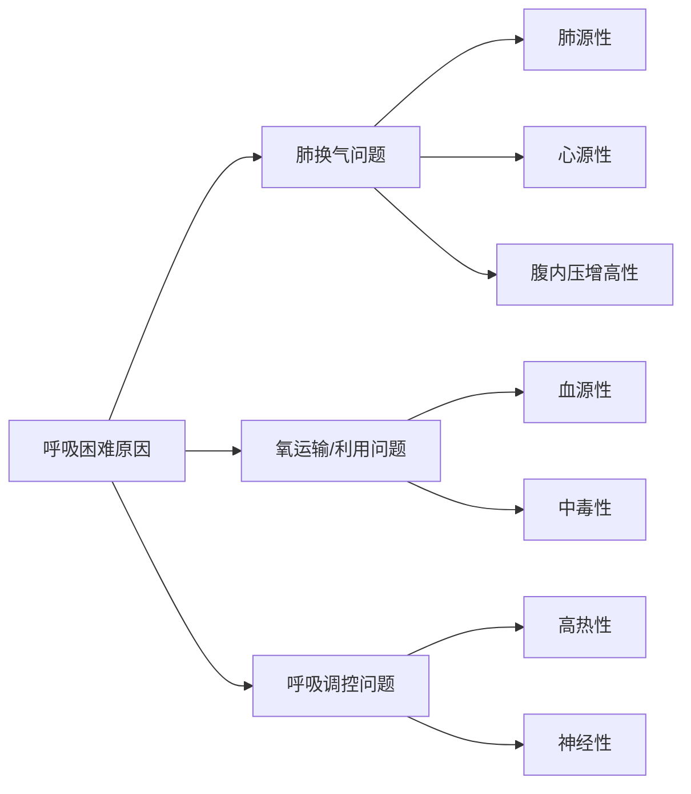

# 呼吸系统的临床检查
## 呼吸系统基础
##### 呼吸系统结构
呼吸系统可以分为**上呼吸道**和**下呼吸道**：
	上呼吸道：鼻、喉、气管
	下呼吸道：支气管、肺
##### 呼吸系统功能
- 通气：完成吸气与呼气，维持肺泡通气  
- 气体交换：完成氧气摄取和二氧化碳排出  
- 气道传导：保证空气经上、下呼吸道顺利到达肺部  
- 防御与清除：通过过滤、纤毛运动、咳嗽反射、吞噬和免疫等机制清除异物和病原  
- 其他功能：发声、嗅觉
## 防御机制
_理解呼吸道的防御机制帮助理解疾病是如何突破防线_
呼吸系统主要的防御机制是一个层级的结构：

##### 上呼吸道防线
是“物理+免疫”的双重屏障，主要包括有：
- 鼻腔过滤作用
- 喷嚏反射
- 鼻局部抗体(主要是分泌型的[[抗体#IgA|IgA]])
##### 喉与气道的反射性防御
主要包括：
- 咳嗽反射(进入后排出)
- 喉反射(入口处排出)
该防御的特点是发现病原/异物后及时排出
##### 支气管黏液-纤毛清除
- 纤毛运动
- 黏液：包括四个连续的清除作用，即阻留、黏附、包埋、固定
##### 肺泡吞噬
当微小颗粒、病原体突破前几层屏障，进入肺泡区域后，肺泡巨噬细胞会承担“最后一道局部吞噬防线”的角色。 
即使病原已经进入肺深部，机体仍有局部细胞级防御机制去吞噬和清除。
##### 免疫防线
- 局部免疫：在呼吸道局部黏膜区域，存在直接针对入侵病原的免疫反应
- 全身免疫：当局部防御不足，或病原/毒素进一步扩散时，就会牵动全身免疫应答
## 呼吸系统发病机理
可概括为：

- 核心记忆点：$$屏障破坏→病原入侵→炎症反应→症状出现\text{屏障破坏} \rightarrow \text{病原入侵} \rightarrow \text{炎症反应} \rightarrow \text{症状出现}屏障破坏→病原入侵→炎症反应→症状出现$$
## 呼吸运动的检查
##### 呼吸数检查
- 是单位时间内动物完成呼吸的次数
- 呼吸数会随温度、湿度、海拔、年龄、品种、营养、运动等多种因素的影响
- 呼吸数的判断需要考虑**当前呼吸频率是否偏离该动物的正常范围**，即要注意区分生理性变化和病理性变化
##### 呼吸类型检查
- 呼吸类型观察胸廓和腹壁起伏动作的协调性和强度
- 对于多数动物来说采用的是胸腹式呼吸，犬多属于**胸式呼吸**
当呼吸类型的改变提示相应区域的病变：
- 胸式呼吸占主导时，提示病变多在腹部，可能原因：膈肌损伤、腹腔器官体积增大
- 腹式呼吸占主导时，提示病变多在胸部，可能原因：**渗出性胸膜炎**(典型特征)、胸部肋骨骨折、大叶性肺炎等
##### 呼吸节律检查
- 正常呼吸的“呼”与“吸”具有一定的节律和深度，亦称**节律性呼吸**
- 病变会引起节律性的改变
主要类别有：
1. 吸气延长：上呼吸道狭窄，如喉头水肿、鼻腔/咽喉肿瘤、异物堵塞
2. 呼气延长：下呼吸道/肺内排气障碍，如肺气肿、细支气管狭窄、肺弹性下降
3. 呼吸节律不齐：机体自身呼吸节律调节受阻，如中枢神经系统调节障碍(脑相关的炎症)、代谢紊乱

| 名称      | 英文            | 别名   | 核心特征                     |
| ------- | ------------- | ---- | ------------------------ |
| 陈—施二氏呼吸 | Cheyne–Stokes | 潮式呼吸 | 由浅慢到深快，再由深快到浅慢，并有暂停，周期重复 |
| 毕奥特氏呼吸  | Biot’s        | 间歇呼吸 | 呼吸几次后突然暂停，再恢复，不规则        |
| 库斯毛尔氏呼吸 | Kussmaul’s    | 深长呼吸 | 深大而长，常见于严重代谢性酸中毒         |

## 呼吸困难
- 是一种病理性呼吸障碍
- 伴随有呼吸强度的改变、呼吸次数的增减、呼吸节律的异常和呼吸方式的改变
- 高度的呼吸困难称为气喘；高度呼吸困难使呼吸运动停止称为窒息
##### 类别
参考[[#呼吸节律检查]]中的主要类别可以分为：

| 类型      | 主要表现     | 主要病变部位/机制             | 常见疾病                            |
| ------- | -------- | --------------------- | ------------------------------- |
| 吸气性呼吸困难 | 吸气困难     | 上呼吸道狭窄，空气进入受阻         | 鼻腔狭窄、咽喉炎症或水肿、猪传染性萎缩性鼻炎、鸡传染性喉气管炎 |
| 呼气性呼吸困难 | 呼气困难     | 肺组织弹性减弱、细支气管狭窄，空气排出受阻 | 肺气肿、胸膜肺炎、细支气管炎                  |
| 混合性呼吸困难 | 吸气和呼气都困难 | 病变较重，通气整体受损           | 临床最常见，常伴呼吸次数增加                  |

##### 原因

##### 肺源性
- 由肺脏本身疾病引起的呼吸困难。肺源性最常见，本质是 **肺通气障碍** 和/或 **肺换气障碍**。
可以拆成三层理解：
1. 通气障碍：空气进出肺泡受阻，导致肺泡通气量下降。常见于气道炎症、分泌物堵塞、支气管狭窄、肺组织弹性下降
2. 换气障碍：即使空气进到了肺泡，**氧和二氧化碳也不能顺利跨过肺泡-毛细血管膜交换**。常见于肺泡的各项病变，如渗出、肺泡壁增厚
3. 肺顺应性下降或弹性异常
##### 心源性呼吸困难
- 由心脏疾病引起的呼吸困难。如心包炎、心肌炎、心力衰竭
- 本质不是“肺先病”，而是心脏泵血功能不全→肺循环受累→肺换气受限
- **左心功能不全 → 肺循环淤血**；**右心功能不全 → 体循环淤血**
##### 腹内压增高性
- 由于**腹内压升高**，直接压迫膈肌(被限制运动)并影响腹壁运动，从而导致呼吸困难
- 尤其注意**妊娠后期**子宫压迫膈肌，加上胎儿耗氧增加，也可引起母畜呼吸困难
##### 血源性
- 主要由于**红细胞减少**或**血红蛋白异常**所致。如各种贫血：失血性贫血、营养性贫血、寄生虫性贫血、传染性贫血
##### 中毒性
可以分成**内源中毒性**和**外源中毒性**：
###### 内源中毒性
- 由机体内部代谢紊乱产生的毒性产物或酸中毒所致，如[[第八章 酸碱平衡紊乱#代谢性酸中毒|代谢性酸中毒]]引起的库斯毛尔样呼吸
- 尿毒症：酸性代谢产物蓄积
- 酮血病：酮体增多
- 严重胃肠炎：可导致乳酸增多、碳酸氢根丢失
###### 外源中毒性
- 由外界毒物进入机体后造成组织缺氧或呼吸中枢/酶系统损害所致。
- 如亚硝酸盐、氢氰酸、有机磷中毒
##### 高热性
- 高热性疾病中，由于代谢亢进、体温升高及毒素作用刺激呼吸中枢而引起呼吸困难
- 见于猪瘟、猪丹毒、口蹄疫、鸡新城疫
##### 神经性呼吸困难
- 由于**中枢神经系统器质性或机能性障碍**所致
- 如脑膜炎、脑的占位性病变
## 呼吸的对称性检查
- 对于健康动物，呼吸时两侧胸壁和腹壁的起伏运动一致，称为**对称性呼吸**，而当患有某些病征时，一致性被打破，出现**不对称性呼吸**
- 不对称性呼吸常出现一侧的呼吸运动减弱，引起另一侧代偿性增强
- 双侧胸部疾病时，呼吸运动可呈“双侧普遍减弱”；但由于两侧病变轻重常不完全相同，所以较重一侧的胸廓活动会更差，但这种差异可能较小，容易被整体减弱所掩盖，因此需要仔细比较
## 呼吸道分泌物与咳嗽检查
### 呼出气体检查
从呼出气体的强度、气味、温度三方面入手：
- 气体强度：逻辑上与[[#呼吸的对称性检查]]相同，但注意解剖定位上不同，具体表现为正常时两侧相等；单侧病变时患侧减弱；双侧病变时两侧均减弱，但重侧更明显
- 气体气味：正常无异味，出现臭味表明有化脓、腐败、坏疽的病理变化，注意区分异味来源是鼻腔还是口腔
- 气体温度：温度升高$\to$各种性热病；温度降低$\to$内脏破裂、失血、脑病、重病终末期
### 鼻液检查
鼻液检查从以下几个角度：
- 单侧性或双侧性：
	- 单侧性：提示单侧的鼻腔炎症、异物、鼻窦炎
	- 双侧性：提示病变范围更广，如上呼吸道感染
	单侧性鼻液更提示局灶、偏侧的病变；双侧性鼻液更提示病变范围较广，或两侧鼻腔同时受累。
- 鼻液量：主要是判断鼻分泌物增多的程度及其分布特点，量多常提示鼻黏膜刺激、广泛性病变或炎症较明显，但必须结合鼻液性质和单、双侧情况综合分析。
- 鼻液性状(联系炎症类别进行记忆)：
	1. 浆液性：为[[第四章 炎症#浆液性炎|浆液性炎症]]的特征，提示处于呼吸道黏膜急性炎症、感冒、犬瘟热的初期
	2. 黏液性：为[[第四章 炎症#卡他性炎|卡他性炎症]]的特征，提示处于呼吸道黏膜急性炎症的中期或恢复期
	3. 脓性：为[[第四章 炎症#化脓性炎|化脓性炎症]]的特征，此时鼻液呈黄色或黄绿色，粘稠不透明，表面含有大量脓细胞，提示呼吸道或肺脏的化脓性炎症
	4. 腐败性：鼻液呈褐色，有恶臭味，可能伴有组织碎片，为腐败性炎症的特征，出现提示坏疽性肺炎或腐败性支气管炎
	5. 血性：鼻液伴有血液，具体子类性状见下表
	6. 混有饲料残渣：提示吞咽障碍、呕吐、食道阻塞、胃扩张

| 血性鼻液亚型               | 性状特点                  | 临床上常见于                                       |
| -------------------- | --------------------- | -------------------------------------------- |
| 多量**鲜血**或大量**凝血块**   | 鼻液中可见较多鲜红血液，或直接有较大凝血块 | **呼吸道创伤性出血**                                 |
| 淡红色或鲜红色，且混有多量**小泡沫** | 血液较稀，颜色偏淡红或鲜红，并伴明显泡沫  | **肺脏充血、出血、水肿等**                              |
| 混有血液，形成血性鼻液          | 鼻液内掺有血液，但不一定是纯鲜血外流    | **某些传染病**，如**牛炭疽、马鼻疽、血斑病**等                  |
| **铁锈色**              | 鼻液呈铁锈样棕红色             | **大叶性肺炎、传染性胸膜肺炎等**；其中铁锈色鼻液是**大叶性肺炎肝变期的重要特征** |

### 咳嗽检查
- 咳嗽是机体的一种反射性保护措施，目的是为了排出呼吸道内的异物和分泌物，控制咳嗽的神经中枢位于延脑
咳嗽的检查从频率、强度、性质、疼痛及时间角度出发：
1. 频率
	- 单咳：提示支气管炎、感冒、肺结核等
	- 频咳：提示支气管炎、肺炎、喉炎等
	- 发作性咳嗽：突然爆发的强度较大的咳嗽
2. 强度
	- 强咳：提示喉炎、气管炎、支气管炎
	- 弱咳：肺组织的弹性降低/减弱，提示细支气管炎、胸膜炎，胸膜粘连也会出现
3. 性质
	- 干咳
	- 湿咳
4. 疼痛：咳嗽伴有疼痛
5. 出现时间：慢性上呼吸道时，后半夜或早晨咳嗽较为明显
## 胸部检查
### 视诊
着重注意胸廓形状的变化：
- 健康动物的胸廓两侧对称
- 发育不良、佝偻病、软骨症胸廓狭窄或扁平
- 单侧气胸或胸膜炎出现两侧胸廓不对称
注意胸壁有无外伤、肿胀及其他病变。
### 触诊
在胸膜炎、肋骨骨折、局部炎症、外伤、肿胀时，触诊患部呈现敏感反应
### 叩诊
- 叩诊位置的确定依靠三条水平线：**肩关节水平线、髋关节水平线、坐骨结节水平线**

|动物|上界|前界|后下界|形态/补充|
|---|---|---|---|---|
|**牛**|距背中线一掌，约 **10–12 cm**，相当于**背最长肌下缘**|自**肩胛后角**沿**肘肌线**所划的 **S 形曲线**，终止于**第4肋间（肘头）**|自倒数第2肋（即**第12肋**）根部开始，向前下方形成弧线；经 **I线（髋结节水平线）** 与 **第11肋**交点，经 **III线（肩关节水平线）** 与 **第8肋**交点，最后止于**第4肋间**|呈**不规则三角形**；瘦牛在肩前**第1–3肋间**尚有狭窄的肩前叩诊区；左侧第9肋以后因**瘤胃**影响，肺叩诊音不易判别|
|**马**|距背中线一掌|自**肩胛后角**开始，沿**肘肌线作一垂线**，终止于**第5肋间**|自倒数第2肋（即**第17肋**）根部开始，向前下方行走；经 **I线（髋结节水平线）** 与 **第16肋**交点，经 **II线（坐骨结节水平线）** 与 **第14肋**交点，经 **III线（肩关节水平线）** 与 **第10肋**交点，最后止于**第5肋间**|形如**直角三角形**|
|**猪**|基本与**马相同**|基本与**马相同**|由 **I线与第11肋**交点开始，向前下方经 **II线与第9肋**交点、**III线与第7肋**交点所连成的弧形线，最后终止于**第4肋间**|可按“**上界、前界同马；后下界较前移**”记忆|
|**犬**|距背中线约 **2–3指宽**，为与脊柱平行的直线|自**肩胛后角**并沿其后缘所引的一条弧线，下终止于**第6肋间下部**|自**第12肋**与上界交点开始，向前下方经 **I线与第11肋**交点、**II线与第10肋**交点、**III线与第8肋**交点所连成的弧形线，最后终止于**第6肋间下部**并与前界相交|为一个**不正三角形**|
肺部的叩诊根据病理性变化主要有两种：
- 叩诊区扩大：肺脏后界的后移，是由于肺脏体积的增大，见于肺泡气肿、气胸
- 叩诊区减小：肺脏的前界后移(如心脏的肥大、心包炎、心包积液)或是后界前移(肝脏等腹腔器官膨大或腹腔本身积液)
正常肺部的叩诊音应为*清音*(亮且长，气体含量丰富)，而周边区域则会表现*半浊音*(弱且短)，发生病理性变化会影响叩诊音发生变化：
##### (半)浊音
浊音出现提示肺泡内气体含量的减少，即胸壁与肺之间的实质成分提高，常见原因可以分为两类：
- 肺本身实质提高：见于炎症、渗出、水肿、出血，核心是肺泡被炎性渗出物、血液等占据
- 肺与胸壁间产生“间隔物”：见于胸腔积液和胸壁增厚，削弱了声波的传播
浊音的出现又有以下具体类型：

| 浊音类型       | 形态特点     | 主要病理基础       | 常见疾病           |
| ---------- | -------- | ------------ | -------------- |
| 水平浊音       | 上界呈水平线   | 胸腔内有自由液体     | 渗出性胸膜炎、胸水、血胸   |
| 大片浊音区      | 大范围连续浊音  | 大片肺组织实变、含气减少 | 大叶性肺炎、融合性小叶性肺炎 |
| 局灶性/点片状浊音区 | 小片、散在、局限 | 局部小灶性肺实变     | 小叶性肺炎          |

##### 鼓音
形成机制存在有：
1. 肺组织弹性减弱或消失
2. 肺泡内气体与液体并存
3. 肺或胸腔内出现异常含气腔隙
鼓音出现提示含气量的增加或存在异常气腔，见于肺气肿、肺充血、气胸
##### 过清音
是鼓音和清音之间的过渡地带，亦称空盒音
##### 破壶音
与支气管相通的大空洞内，空气经狭窄通道迅速出入，产生特殊共鸣
##### 金属音
巨大而壁较光滑的空洞，或高压含气腔体产生共鸣
见于肺脓肿、肺坏疽、肺结核所致大空洞；张力较高的气胸、心包积气
##### 区别
- **鼓音**：胸腔内或肺实质内的较大含气腔都可出现  
- **金属音**：多见于胸腔内积气（如气胸），也可见于规则、光滑的大肺空洞  
- **破壶音**：多见于肺实质内与支气管相通的不规则空洞
### 听诊
听诊区域与叩诊区类似，听诊顺序按照$中\frac{1}{3}\to 上\frac{1}{3}\to 下\frac{1}{3}$的顺序检查两侧
##### 生理性呼吸音
###### 肺泡呼吸音
- 产生原因：
	1. 毛细支气管与肺泡入口之间气体产生的摩擦
	2. 空气在肺泡内形成涡旋撞击肺泡
	3. 肺泡收缩和舒张过程产生
- 特点：吸气清楚，呼气短而弱
###### 支气管呼吸音
- 来自于喉、气管、大支气管等较为粗的呼吸道，正常会被肺脏过滤掉
- 特点：
	- 吸气和呼气都明显
	- **呼气音往往更明显、更长**
	- 吸气和呼气之间可有短暂停顿
###### 混合型呼吸音
- 支气管肺泡呼吸音是支气管呼吸音和肺泡呼吸音两者同时存在的一种呼吸音
- 通常在吸气时以肺泡呼吸音为主，呼气时以支气管呼吸音为主，类似于"夫、赫”的声音。
##### 病理性呼吸音
###### 肺泡呼吸音增强
分为两种类型：
- 局部性增强：局部区域的功能减弱引起周围的代偿增强，呼吸音加强，见于肺炎、肺结核、渗出性胸膜炎
- 普遍性增强：**呼吸中枢兴奋**，见于呼吸道的炎症、腹内压的提升
###### 肺泡呼吸音减弱
常有以下几种原因：
1. 肺实质性浸润性病变：渗出物挤占肺泡空间
2. 肺泡壁弹性减弱：肺泡壁出现充血、水肿或过度扩张
3. 呼吸运动减弱：如呼吸道受阻，中枢被抑制，胸膜粘连
4. 呼吸音传导障碍：胸腔积液，胸壁增厚等让声波的传导被削弱
###### 病理性支气管音
除马属动物外，在肺门以外区域出现支气管呼吸音为病理现象
> 正常肺组织含气对支气管呼吸音传导性较弱，当在肺外周出现支气管呼吸音时，提示肺组织的转变：“**含气的海绵**”$\to$“**较致密的实心组织**”

- 见于各种肺炎、胸膜肺炎、肺结核、牛肺疫、猪肺疫等引起肺实变的疾病，叩诊时伴有[[#(半)浊音]]
- 区别于粗厉的肺泡呼吸音
###### 啰音
- 呼吸道内聚集了分泌物或粘膜肿胀
- 干啰音：较为黏稠的分泌物
- 湿啰音：较为稀薄的分泌物，又称水泡破裂音，吸气末期较为明显，具体可以再分为大、中、小三种
###### 捻发音
###### 胸膜摩擦音
###### 胸腔击水音