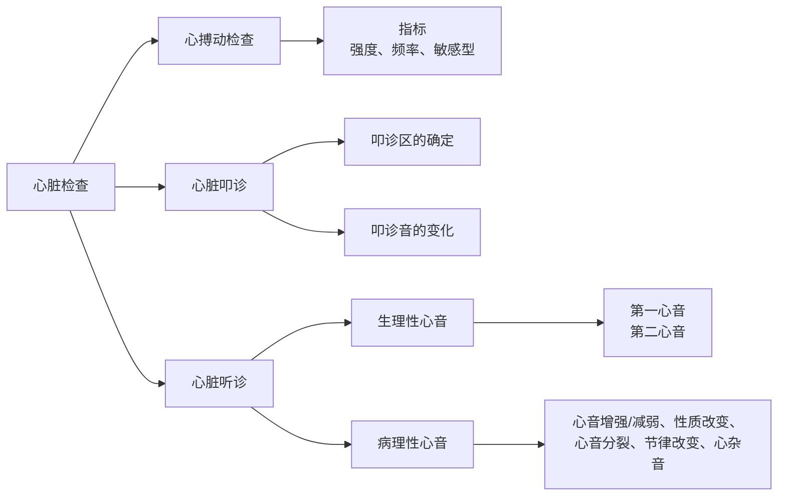

# 心脏的检查
心脏的检查流程有如下结构：

进行心脏的诊断，首先要确定心脏的位置：
- 胸腔的下$\frac{1}{3}$处
- 位于第三肋到第六肋之间
- 胸腔正中线的左侧
- 基底部向右前，尖部向左后

## 心搏动检查
**心搏动**：心室收缩撞击左侧胸壁形成的碰撞音，与第一心音、脉搏同时出现
### 频率
常见动物的心搏动频率
- 🐕：70-120 bpm
- 🐖：60-80 bpm
- 🐎：26-42 bpm
- 🐏：70-80 bpm
### 强度

### 敏感型

