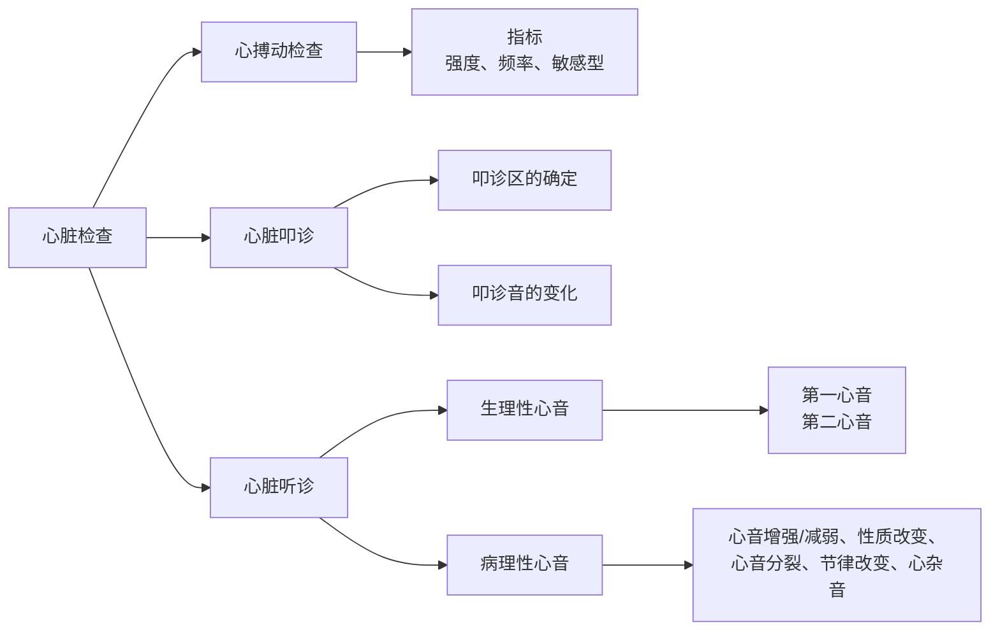

# 心脏的检查
心脏的检查流程有如下结构：

进行心脏的诊断，首先要确定心脏的位置：
- 胸腔的下$\frac{1}{3}$处
- 位于第三肋到第六肋之间
- 胸腔正中线的左侧
- 基底部向右前，尖部向左后

## 心搏动检查
**心搏动**：心室收缩撞击左侧胸壁形成的碰撞音，与第一心音、脉搏同时出现
### 频率
常见动物的心搏动频率
- 🐕：70-120 bpm
- 🐖：60-80 bpm
- 🐎：26-42 bpm
- 🐏：70-80 bpm
### 强度
病理性变化有三种：
1. 增强：心室收缩力增强，见于热性病、贫血、心脏疾病代偿
> **心悸**：心搏动过强引起体壁的震动
2. 减弱：心脏机能减弱或远离胸壁，见于心力衰竭、胸壁增厚(水肿、纤维素性胸膜炎)、胸壁心脏介质性质改变
3. 移位：心脏受周围脏器或肿瘤及其渗出液压迫产生位移
### 敏感性
提高见于心包炎、胸膜炎

## 心脏叩诊
### 叩诊区确定
- 绝对浊音区：心脏靠近胸壁的部分，与胸壁直接接触
- 相对浊音区：心脏的主体，被肺脏包裹
### 叩诊音变化
1. 浊音区增大：见于心肥大、心扩张、心包炎
2. 浊音区减小：见于肺气肿
3. 叩诊音呈[[呼吸系统临床检查#鼓音|鼓音]]或[[呼吸系统临床检查#金属音|金属音]]：见于牛创伤性心包炎
4. 叩诊带痛：见于胸膜炎、心包炎

## 心脏听诊

