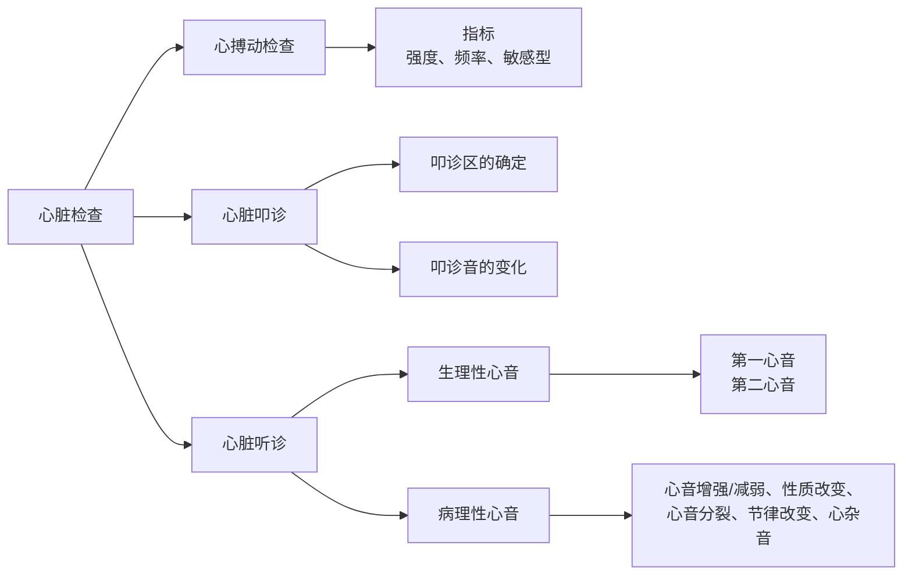

# 心脏的检查
心脏的检查流程有如下结构：

进行心脏的诊断，首先要确定心脏的位置：
- 胸腔的下$\frac{1}{3}$处
- 位于第三肋到第六肋之间
- 胸腔正中线的左侧
- 基底部向右前，尖部向左后

## 心搏动检查
**心搏动**：心室收缩撞击左侧胸壁形成的碰撞音，与第一心音、脉搏同时出现
### 频率
常见动物的心搏动频率
- 🐕：70-120 bpm
- 🐖：60-80 bpm
- 🐎：26-42 bpm
- 🐏：70-80 bpm
### 强度
病理性变化有三种：
1. 增强：心室收缩力增强，见于热性病、贫血、心脏疾病代偿
> **心悸**：心搏动过强引起体壁的震动
2. 减弱：心脏机能减弱或远离胸壁，见于心力衰竭、胸壁增厚(水肿、纤维素性胸膜炎)、胸壁心脏介质性质改变
3. 移位：心脏受周围脏器或肿瘤及其渗出液压迫产生位移
### 敏感性
提高见于心包炎、胸膜炎

## 心脏叩诊
### 叩诊区确定
- 绝对浊音区：心脏靠近胸壁的部分，与胸壁直接接触
- 相对浊音区：心脏的主体，被肺脏包裹
### 叩诊音变化
1. 浊音区增大：见于心肥大、心扩张、心包炎
2. 浊音区减小：见于肺气肿
3. 叩诊音呈[[呼吸系统临床检查#鼓音|鼓音]]或[[呼吸系统临床检查#金属音|金属音]]：见于牛创伤性心包炎
4. 叩诊带痛：见于胸膜炎、心包炎

## 心脏听诊
### 正常心音
- 第一心音：
	- 缩期心音
	- 心室肌收缩、二/三尖瓣关闭、半月瓣开放
- 第二心音：
	- 舒期心音
	- 心室肌弛缓、二/三尖瓣开放、半月瓣关闭

| 比较维度 | 第一心音（S1） | 第二心音（S2） |
|---|---|---|
| 产生时期 | 心室收缩开始（收缩期） | 心室舒张开始（舒张期） |
| 形成机制 | 房室瓣关闭+ 心室肌张力变化 + 血流振动 | 主动脉瓣和肺动脉瓣关闭 |
| 持续时间 | 较长 | 较短 |
| 音调 | 较低 | 较高、较清脆 |
| 强度特点 | 较钝厚 | 较清亮 |
| 尾音 | 有较长尾音 | 无明显尾音 |
| 与心搏动关系 | 与心尖搏动同时出现 | 不与心尖搏动同步 |
| 与动脉脉搏关系 | 与动脉脉搏几乎同时 | 晚于动脉脉搏出现 |
| 两心音间隔 | S1→S2 间隔短 | S2→下一次 S1 间隔长 |

##### 心音听取位点
心音听取位点 = 各瓣膜音或相关血流音在胸壁上的最佳传导/最佳听诊区域
如：马的第一心音的二尖瓣听取位点在左侧第**5**肋间，胸廓下$\frac{1}{3}$的中央水平线上
### 病理变化
#### 心音增强
1. 第一心音增强：心脏收缩力增强+心室充盈度小
	- 心肌收缩增强：房室瓣关闭更突然，振动幅度更大
	- 心室充盈不足：见于大失血/水、休克，房室瓣的开放程度更大
	- 血液稀薄、流速快
2. 第二心音增强：循环压增高
	- 主动脉瓣：主动脉压高，见于左心肥大、肾炎、系统性高血压
	- 肺动脉瓣：肺动脉压高，见于肺充血、肺炎、二尖瓣闭锁不全
3. 两者均增强：心脏整体搏动增强
	- 交感兴奋/循环加快：热性病初期、剧痛、兴奋、[[血液循环系统药理#强心药|强心药的使用]]
	- 高动力循环：贫血/心脏病代偿
	- 肺组织萎缩
#### 心音减弱
1. S1减弱：心肌收缩无力+房室瓣关闭振动减弱
	见于心扩张、心肌变性
2. S2减弱：动脉压低+半月瓣关闭受限
	见于主(肺)动脉瓣的闭锁不全、狭窄
3. 两者均减弱：整体性的减弱
	- 心肌收缩力减弱：心脏自身功能受限，如心功能不全、心肌变性/梗死
	- 心音传导介质改变：液体/渗出物/组织增厚削弱了心音的传导，见于渗出性心包炎、渗出性胸膜炎、心包积水
	- 胸壁/肺对声音的阻挡$\uparrow$：胸壁增厚、肺气肿、胸膜/心包粘连
#### 心音性质变化
- 心音浑浊：心音低浊、含混不清，S1和S2之间界限难以区分
	见于心肌变性、心肌炎、心内膜炎
- 金属样心音：类比于[[呼吸系统临床检查#金属音|金属音]]，心脏临近肺脏出现空洞或破伤风
#### 心音分裂
- **定义**：正常心音由于某些病理原因而分裂成两个相连的心音，分裂出的心音间隔称为**心音重复**
心音分裂有三种常见情况：
1. 第一心音分裂
2. 第二心音分裂
3. 奔马律
#### 心音律动周期改变

