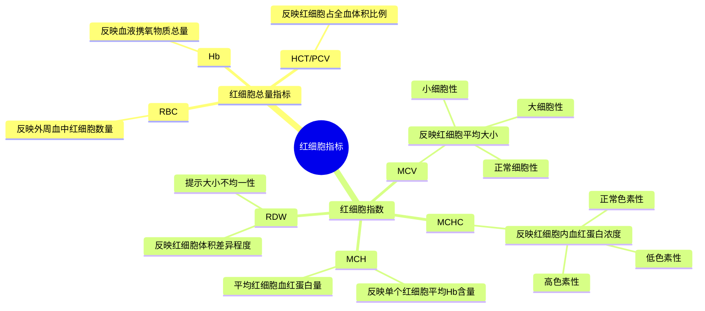

# 红细胞指标
## 造血
- 正常动物的主要造血场所是**骨髓**
- 除骨髓外的造血过程称为**髓外造血**，常见部位是肝、脾，也可见于淋巴结等部位，通常是次要途径，在代偿性或特定组织背景下出现

> [!note] 髓外造血不一定提示存在病理过程
> - 对于胎儿，髓外造血是正常生理发育过程
> - 对于成年个体，提示存在某种生理应激或病理因素的驱动，要追查病因，出现明显多提示造血压力或骨髓功能异常

### 造血过程调控
- 促红细胞生成素(EPO)：肾脏产生(胎儿由肝脏产生)，主要由[[第六章 缺氧|缺氧]]途径激活
- 刺激：雄激素，甲状腺激素，生长激素
- 抑制：雌激素
### 造血周期
- 犬：120 day
- 猫：70 day
## 红细胞指标
- 红细胞具体指标分类如下：

### 红细胞总量指标

### 红细胞指数