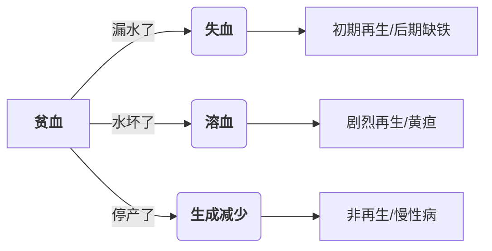
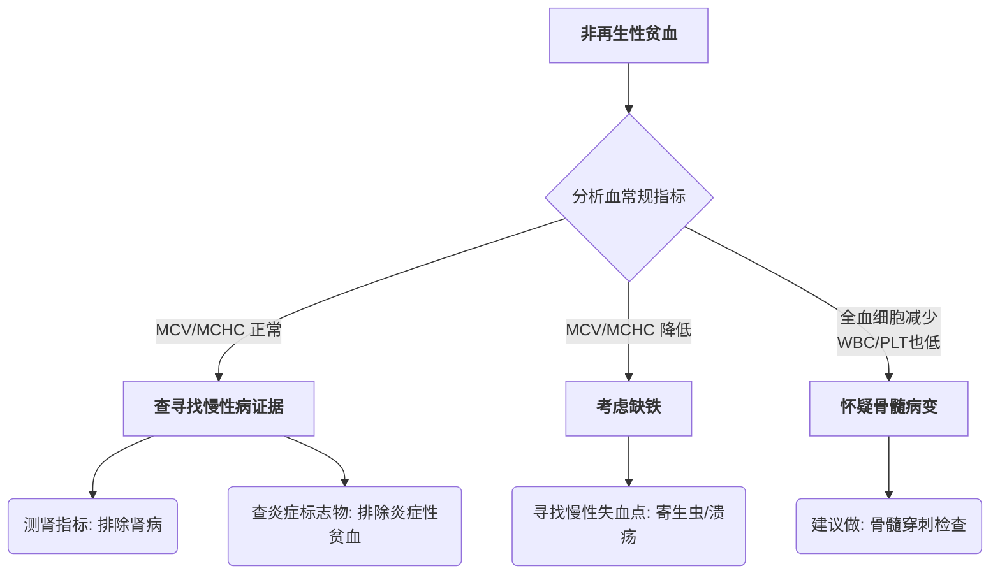

# 血常规
## 造血
##### 基本场所
- 骨髓
- 髓外造血(肝脏、脾脏)：一般由病理过程导致
##### 过程调控
- <font color="#ff0000">促红细胞生成素</font>(EPO)：肾脏产生(胎儿：肝脏)，主要由[[第六章 缺氧|缺氧]]途径激活
- 刺激：雄激素，甲状腺激素，生长激素
- 抑制：雌激素，
##### 细胞更换周期
- 犬：120 day
- 猫：70 day
## 红细胞指标
> **指标推断的思维链**
> ```mermaid
> graph LR
> 	A[评估RBC]-->B[观察RBC占比<br>HCT/PCV]
> 	B-->|HCT/PCV偏低| C[观察MCV]
> 	B-->|HCT/PCV偏高| C
> ```

主要来看，红细胞的评估指标包括有：
- 血细胞比容(HCT)：通过自动化血常规机器利用*激光or抗阻法*得到，即$HCT=MCV \times the \ numer \ of  \ RBC$
- 红细胞压积(PCV)：高速离心后人工测量的占比，除了确定红细胞的占比外，还可以在红细胞层上逐层观察到白细胞、血清
- 血红蛋白(Hgb)：和HCT的测量类似
- 血细胞计数(RBC count)：和HCT的测量类似
- 红细胞指标：红细胞整体的统计学特征参数，如MCV、MCHC、MCH
##### 平均红细胞体积(MCV)
- 反映出平均红细胞的体积
- 由机器测出，让血细胞经过单通道引起物理信号的改变(如电脉冲)来建立映射关系确定体积
- 如果没有机器测量，我们可以通过公式计算得出：$$MCV=\frac{HCT(\%) \times10}{[RBC]}$$
根据测得的MCV值，可以将结果分为：
###### 正常红细胞性
- $MCV$正常
###### 大红细胞性
- $MCV \uparrow$
红细胞平均体积的增大可以归纳为三个方面的原因：
1. 生理/病理原因引起的红细胞再生
	- 红细胞再生引起的网织红细胞，**网织红细胞**是骨髓产生的未成熟红细胞，细胞器未完全丢失，体积比成熟红细胞增大
	- 大红细胞血症：区别是本身的红细胞体积大还是再生后的网织红细胞体积增大
2. 技术性/错误性干扰
	- 红细胞凝集：某些免疫介导性疾病中，抗体会使得红细胞粘连在一起
	- 体积较大的血小板被判定为红细胞
	- [[第七章 水和电解质代谢紊乱#高渗性脱水|高钠血症]]引起红细胞肿胀
3. 品种与物种差异
	灰狗、贵宾犬的红细胞体积天然比较大
###### 小红细胞性
- $MCV \downarrow$
红细胞平均体积减小可以归纳三个方面的原因：
1. 营养与原料代谢(最常见的病理原因)
	- 缺铁阻碍血红蛋白的合成，使得前体红细胞为了维持胞体内的血红蛋白浓度而“多次分裂”，最终导致红细胞体积减小
	- 肝脏疾病，如门静脉体循环分流会导致铁代谢异常或脂质代谢障碍
	- 炎性疾病状态下，机体会产生“铁调素”来限制红细胞利用铁
2. 体液平衡与技术误差
	- [[第七章 水和电解质代谢紊乱#水中毒|低钠血症]]引起细胞皱缩
	- 过量的EDTA会导致红细胞脱水
3. 品种特异性(正常的异常)
	- 幼年动物刚出生处于向成熟红细胞的过渡期
	- 秋田犬、柴犬的MCV天生较小，可通过HCT判断正常
##### 平均红细胞血红蛋白浓度(MCHC)
- 反应出细胞内的血红蛋白浓度，可通过红细胞颜色来判断
- 可通过公式计算：$$MCHC = \frac{Hb \times 100}{HCT}$$
根据测得的MCHC值，可以将结果分为：
###### 正常色素性
- MCHC正常
- 红细胞颜色呈现标准的中心浅染、外周深红
- 说明血红蛋白的合成速度跟上了红细胞的生长速度
###### 高色素性
- 溶血：溶血时，Hb会释放到血浆里，完整红细胞数减少，导致测算得到的MCHC偏高
- 红细胞形态改变：
    1. 球形红细胞：常见于免疫介导性溶血性贫血（IMHA）。这种红细胞失去了正常的双凹圆盘状，缩成了一个紧实的球形
    2. 海因茨小体：这是红细胞内的血红蛋白被氧化变性形成的“疙瘩”。这些小体不仅占地方，还会干扰机器对血红蛋白浓度的吸光度判定，导致测量结果虚高
- 脂血：很多血液分析仪是用*光电比色法*来测血红蛋白浓度的。混浊的脂肪颗粒会散射光线，使得结果判断为存在很多血红蛋白。
###### 低色素性
- 缺铁：血红蛋白的原料是Fe，铁耗竭导致血红蛋白合成降低
- 网织红细胞增多：新生的红细胞血红蛋白合成水平较低
##### 细胞平均血红蛋白(MCH)
- 反应红细胞内平均血红蛋白的量
- 计算公式：$MCHC=\frac{MCH}{MCV} \times 100$
- MCH反映出的是Hb的绝对量，而我们关注的是血红蛋白是否充分挤占红细胞，所以MCHC的临床价值>MCH
##### 红细胞分布宽度(RDW)
- 反映出红细胞大小的差异性，可理解为红细胞大小的*方差*
主要有以下原因导致RDW增大：
1. 网织红细胞增多
2. 小红细胞增多
3. 大红细胞增多
##### 红细胞多染性
- 体现红细胞在血红蛋白填充进度和成熟度上的分布差异
- **网织红细胞**在瑞氏染色下呈现出多染性，因为存在核糖体RNA，染色呈<font color="#0070c0">蓝色</font>，区别于Hb的<font color="#ff0000">红色</font>
- 网织红细胞水平上升表现出是再生性的
###### 网织红细胞的评估
- 网织红细胞的占比(RP)：会受到红细胞总数的影响，如果红细胞总数减少，会导致RP假性放大
- 校正后网织红细胞的占比(CRP)：根据公式$$CRP = RP \times \frac{患者HCT}{物种平均HCT}$$进行标准化。调整后的CRP高于参考区间才可以判断贫血类型
- 网织红细胞绝对浓度：利用公式$=RP \times [RBC] /\mu L$进行计算，该指标不会受到红细胞总数的影响
## 贫血
- 指的是参与循环的红细胞数量减少，在[[#红细胞指标]]上表现为红细胞数量、血红蛋白含量、红细胞压积均$\downarrow$
- 正常动物体内存在一套机制来应对贫血：
	贫血 $\rightarrow$ 血液携氧能力下降 $\rightarrow$ 缺氧 $\rightarrow$ 刺激肾脏释放**促红细胞生成素（EPO）** $\rightarrow$ 骨髓加速生产并提早释放红细胞
- 失血、溶血、再生减少都会造成贫血：

- 根据上述贫血的可以将贫血分为再生性贫血(失血、溶血)和非再生性贫血(再生障碍)
##### 失血性贫血
根据失血的速度和持续时间可以分为：

| **特征**    | **急性失血**         | **慢性失血**        |
| --------- | ---------------- | --------------- |
| **主要诱因**  | 创伤、内脏破裂          | 寄生虫、溃疡、肿瘤       |
| **再生能力**  | **强**（3-5天后显著）   | **先再生，后不再生**    |
| **红细胞形态** | 通常是大细胞性          | **小细胞、低色素**（缺铁） |
| **总蛋白**   | **降低**（血清蛋白一起流失） | 可能正常或降低         |
##### 溶血性贫血
- 根据溶血发生的场所可以分为血管内溶血(血红蛋白尿)和血管外溶血(脾脏肿大、黄疸)
- 病因可以分为三类：
	1. 免疫介导性（IMHA）
		- **机制：** 免疫系统错误地在红细胞表面挂上了“死亡标签”（抗体）。
		- **标志性形态：** **球形细胞**。这是因为巨噬细胞没能一口吞掉红细胞，而是“啃”掉了一块膜，剩下的红细胞为了维持张力变成了球状。
		- **辅助诊断：** 库姆斯试验或玻片凝集试验。
	2.  氧化损伤——“中毒”
		- **机制：** 毒素攻击血红蛋白，导致其变性凝固。
		- **凶手：** 洋葱、大蒜、扑热息痛（对乙酰氨基酚）、锌中毒。
		- **标志性形态：** **海因茨小体**和**偏心细胞**。
	3.  感染与寄生虫入侵
	- **机制：** 病原体直接破坏红细胞膜或在细胞内繁殖。
	- **代表：** 巴贝斯虫、血液支原体。

| **比较项目**     | **失血性贫血**    | **溶血性贫血**      |
| ------------ | ------------ | -------------- |
| **总蛋白 (TP)** | **降低**（一起流失） | **正常**（还在循环里）  |
| **黄疸/胆红素**   | 无            | **有**（细胞被拆了）   |
| **铁储备**      | 会耗尽（变非再生）    | **丰富**（铁在体内回收） |
| **网织红细胞**    | 增多           | **显著增多**（通常更猛） |
##### 非再生性贫血
- **定义**：贫血发生时，骨髓未能产生足够的红细胞来代偿流失。
- **判定标准**：网织红细胞数量**不增加**。
- **形态学特征**：通常表现为**正常体积、正常色素性**，即红细胞的大小和颜色看起来都是正常的，只是数量太少。
###### 三大分类与机制
1. 骨髓外因素(指令或原料缺失)：这是临床上最常见的类型，骨髓本身没坏，但没有接收到信号或原料缺乏:
	- **慢性炎症性贫血 (AID/ACD)**
	    - **原理**：身体在炎症状态下，为了不让病原体利用铁，会将铁锁在巨噬细胞中（铁隔离）。
	    - **特点**：轻度到中度贫血，铁利用障碍。
	- **慢性肾病 (CKD)**
	    - **原理**：肾脏受损导致**促红细胞生成素 (EPO)** 分泌不足，骨髓失去了“开工”指令。
	    - **特点**：常见于老年猫、犬。
	- **内分泌疾病**
	    - **原理**：如甲状腺功能减退。甲状腺素水平下降会导致代谢率降低，进而降低组织需氧量，使 EPO 产生减少。
2. 骨髓内因素(生产线损坏)，骨髓造血微环境或造血干细胞直接受到破坏。
	- **骨髓抑制**
	    - **诱因**：药物（雌激素中毒、化疗药）、化学毒素、某些病毒（如猫白血病 FeLV）。
	- **骨髓取代**
	    - **原理**：骨髓腔被肿瘤细胞（如白血病）或纤维组织占据，挤占了正常造血空间。
3. 营养缺乏（原料枯竭）
	- **缺铁性贫血 (后期)**
	    - **原理**：由于长期慢性失血导致体内铁储备耗尽。
	    - **特殊形态**：这是非再生性贫血中唯一的例外，表现为**小细胞、低色素性**（MCV↓, MCHC↓）。
###### 诊断逻辑图



## 血浓缩
- 表征为红细胞增多，但区别是真性还是假性
##### 相对性红细胞增多
- 红细胞总量正常，由于血浆量减少或分布改变导致。
###### 脱水
- **机制**：呕吐、腹泻、饮水不足等导致血浆（水分）流失。
- **指标特征**：
    - **HCT / PCV ↑**
    - **总蛋白 (TP) ↑** （这是判定脱水的核心证据）
- **判断逻辑**：若 HCT 升高且伴随 TP 升高，临床首先考虑脱水。
###### 脾脏收缩
- **机制**：应激、兴奋、剧烈运动导致肾上腺素激增，脾脏收缩将储存的浓缩红细胞排入循环。
- **物种差异**：**马**最为显著（马的脾脏巨大），其次是兴奋的犬。
- **指标特征**：一过性升高，安静后恢复；TP 通常正常。
##### 绝对性红细胞增多
- 红细胞的总质量（总量）确实增加了。又可以具体分为：
###### 继发性绝对性增多
- 由红细胞生成素（EPO）增加引起：
	- **代偿性**：由于**慢性缺氧**（如高海拔、慢性肺病、右向左分流的心脏病）刺激肾脏产生更多 EPO。
	- **非代偿性**：身体不缺氧，但由于**分泌 EPO 的肿瘤**（如肾癌）导致。
###### 原发性绝对性增多
- **真性红细胞增多症**：
    - **本质**：骨髓增生性疾病。
    - **机制**：骨髓自主疯狂造血，不依赖 EPO（此时体内 EPO 水平通常很低）。
## 白细胞指标
##### 白细胞及其相关指标

| **指标名称**     | **英文缩写**      | **主要生理功能 / 临床意义简述**                        |
| ------------ | ------------- | ------------------------------------------ |
| **白细胞计数**    | **WBC**       | 循环血液中白细胞的总数，反映机体**免疫/炎症**的总体状态。            |
| **中性粒细胞**    | **NEU / Seg** | **主力军**。负责吞噬细菌、参与急性炎症反应。                   |
| **杆状核中性粒细胞** | **Band**      | **未成熟**的中性粒细胞。增多代表骨髓正在紧急“派兵”（左移）。          |
| **淋巴细胞**     | **LYM**       | 负责**体液与细胞免疫**。增多常见于应激或慢性感染；减少见于内源性糖皮质激素增加。 |
| **单核细胞**     | **MONO**      | 负责**清理战场**。进入组织变为巨噬细胞，处理慢性炎症或坏死组织。         |
| **嗜酸性粒细胞**   | **EOS**       | 与**过敏反应**和**寄生虫感染**密切相关。                   |
| **嗜碱性粒细胞**   | **BASO**      | 数量极少。含有组胺，常与嗜酸性粒细胞协同参与超敏反应。                |
##### 白细胞动力学
理解白细胞指标前，必须明白它们在体内的四个“池” ，这解释了为什么数值会发生波动：
- **骨髓储存池**：后方仓库，储备成熟的中性粒细胞。
- **循环池**：血常规抽到的部分，正在血液中自由流动的细胞。
- **边缘池**：贴在小血管壁上的细胞（抽血抽不到）。
- **组织池**：真正的战场，白细胞离开血管进入组织执行任务。
##### 中性粒细胞的形态学变化
在炎症发生时，观察细胞形态比单纯看数值更重要：
###### 左移( “新兵上场”)
当组织需求量极大时，骨髓被迫释放未成熟的中性粒细胞（**杆状核 Band**）。
- **再生性左移**：白细胞总数升高，成熟细胞 > 杆状核。说明骨髓供货充足，战况稳定。
- **退行性左移**：白细胞总数正常或降低，**杆状核 > 成熟细胞**。说明战场消耗巨大，骨髓工厂濒临瘫痪，**预后不良**。
###### 毒性变化(“发育受损”)
由于细胞在骨髓里赶工导致发育异常。
- **特征**：Döhle 小体、胞浆嗜碱性（变蓝）、空泡化。
- **意义**：代表**严重感染、败血症或毒血症**。
##### 三大白细胞图谱
这是临床“看图破案”的核心，教你根据组合判断动物状态：
1. 兴奋白细胞相
	- **驱动力**：**肾上腺素**（恐惧、打斗）。
	- **机制**：血流加速，把贴在血管壁上（边缘池）的细胞冲进了循环池。
	- **特征**：
	    - **淋巴细胞显著升高**（核心特征）。
	    - 中性粒细胞轻微升高（无左移）。
	- **物种**：多见于健康的**猫**和**马**。
 2. 应激白细胞相
	- **驱动力**：**糖皮质激素**（长期压力、疼痛、皮质醇增多症）。
	- **特征口诀**：**“中单高，淋酸低”**。
	    - **中性粒细胞 ↑**（边缘池释放）。
	    - **单核细胞 ↑**。
	    - **淋巴细胞 ↓**（核心指标，激素导致淋巴细胞归巢）。
	    - **嗜酸性粒细胞 ↓**。
3. 炎症白细胞相 
	- **驱动力**：真实的病原体感染或组织坏死。
	- **核心指标**：**左移** 和 **毒性变化**。
	- **分类**：
	    - **急性炎症**：中性粒显著升高 + 显著左移。
	    - **慢性炎症**：中性粒可能正常，但**单核细胞显著升高**（负责清理战场）。
##### 临床诊断思维总结

|**模式类型**|**中性粒 (Neu)**|**淋巴 (Lym)**|**单核 (Mono)**|**核心判定点**|
|---|---|---|---|---|
|**兴奋**|升高|**显著升高**|正常|一过性，见于猫/马|
|**应激**|升高|**降低**|升高|无左移，压力导致|
|**炎症**|不定|不定|升高|**必须有左移/毒性变化**|
## 血小板指标
##### 血小板指标
血小板是止血的第一道防线（形成血小板血栓）。
- **血小板计数 (PLT)**：循环血液中血小板的总数。
    - **减少**：见于消耗过多（DIC、出血）、破坏增加（免疫介导）或生成减少。
    - **增多**：见于应激、慢性炎症或缺铁。
- **平均血小板体积 (MPV)**：反映血小板的大小。
    - **MPV ↑**：通常代表骨髓正在产生新的、更大的血小板，暗示**再生性**反应。
- **血小板分布宽度 (PDW)**：反映血小板大小的差异程度。
##### 止血的两个阶段

老师通常会通过这两个阶段来定位出血的原因：
#### A. 一期止血（Primary Hemostasis）
- **参与者**：血管壁、血小板。
- **临床症状**：**表面出血**。如皮肤瘀点、瘀斑、黏膜出血（鼻血、血尿）。
- **检测指标**：
    
    - **PLT 计数**：看数量够不够。
        
    - **BMBT (颊黏膜出血时间)**：看功能好不好（即使数量够，功能不行也会出血）。
        

#### B. 二期止血（Secondary Hemostasis）

- **参与者**：凝血因子（内源、外源及共同途径）。
    
- **临床症状**：**深部出血**。如关节积血、胸腹腔积血、巨大的血肿。
    
- **检测指标**：
    
    - **PT (凝血酶原时间)**：主要监测**外源性**途径（因子 VII）。
        
    - **APTT (活化部分凝血活酶时间)**：主要监测**内源性**途径。
        
    - **ACT (活化凝血时间)**：快速筛查内源性及共同途径。
        


---

## 3. 弥散性血管内凝血 (DIC) —— “终极噩梦”

这是 PDF 中可能会提到的危重症：

- **本质**：凝血系统过度激活，导致凝血因子和血小板被**耗竭**。
    
- **化验单特征**：
    
    1. PLT 显著下降。
        
    2. PT 和 APTT 均延长。
        
    3. **FDPs (纤维蛋白降解产物) ↑** 或 **D-Dimer (D-二聚体) ↑**。