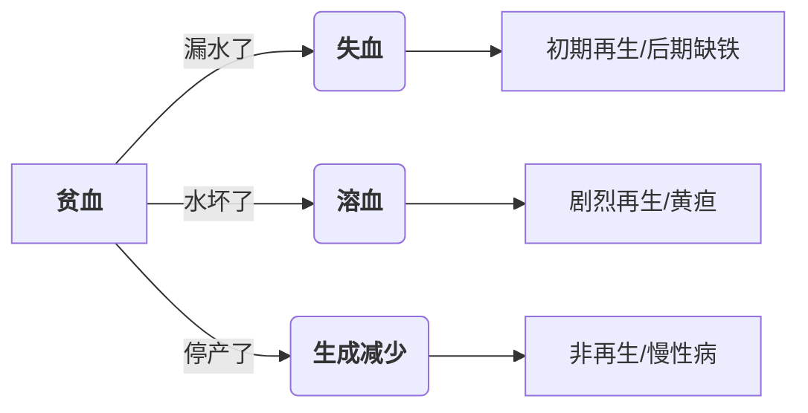
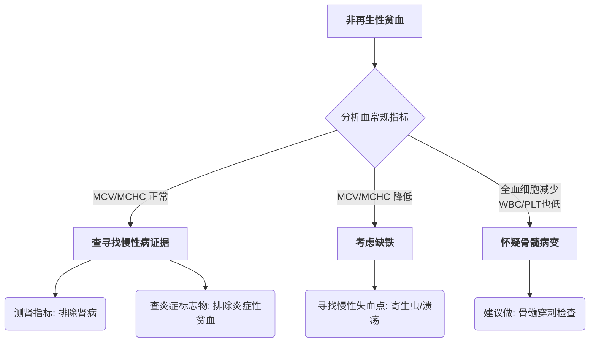
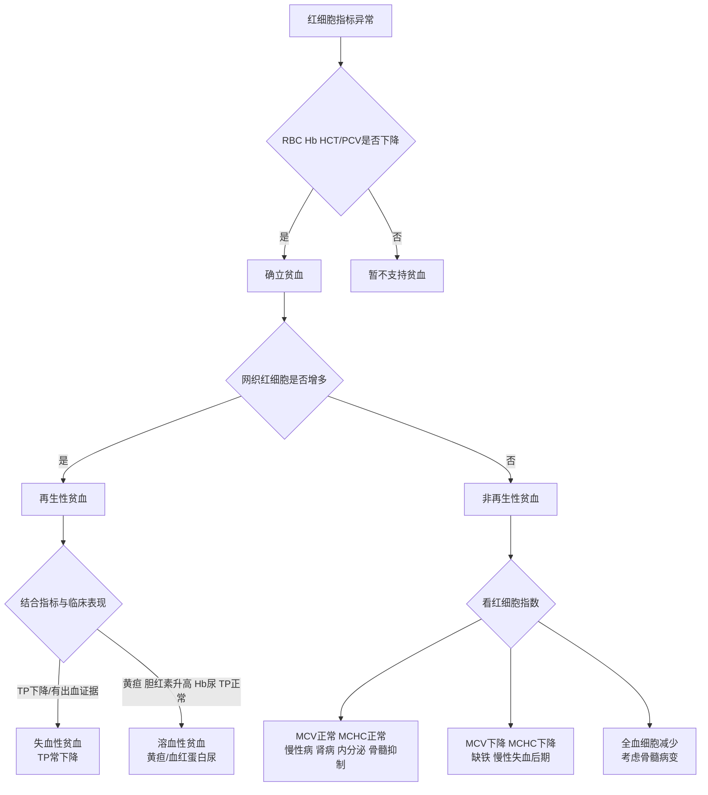

# 贫血
- 指的是参与循环的红细胞数量减少，在[[#红细胞指标]]上表现为RBC、Hg、HCT/PCV均$\downarrow$，即载氧能力大大下降
- 其中HCT/PCV常作为首要指标进行判断
- 确定贫血后，再观察[[红细胞指标解读#网织红细胞|网织红细胞]]、[[红细胞指标#平均红细胞体积(MCV)|MCV]]、[[红细胞指标#平均红细胞血红蛋白浓度(MCHC)|MCHC]]、[[红细胞指标#红细胞分布宽度(RDW)|RDW]]
> [!info] 生理反应 
> 正常动物体内存在一套机制来应对贫血：贫血$\rightarrow$血液携氧能力下降$\rightarrow$缺氧$\rightarrow$刺激肾脏释放**促红细胞生成素(EPO)**$\rightarrow$骨髓加速生产并提早释放红细胞

#### 贫血病因
- 失血、溶血、再生减少都会造成贫血：

- 根据骨髓是否存在再生反应可以将贫血分为再生性贫血(失血、溶血)和非再生性贫血(再生障碍)，通过网织红细胞来提示
### 失血性贫血
根据失血的速度和持续时间可以分为：

| **特征**    | **急性失血**         | **慢性失血**        |
| --------- | ---------------- | --------------- |
| **主要诱因**  | 创伤、内脏破裂          | 寄生虫、溃疡、肿瘤       |
| **再生能力**  | **强**（3-5天后显著）   | **先再生，后不再生**    |
| **红细胞形态** | 通常是大细胞性          | **小细胞、低色素**（缺铁） |
| **总蛋白**   | **降低**（血清蛋白一起流失） | 可能正常或降低         |
### 溶血性贫血
- 根据溶血发生的场所可以分为血管内溶血(血红蛋白尿)和血管外溶血(脾脏肿大、黄疸)
- 病因可以分为三类：
###### 免疫介导性（IMHA）
- **机制：** 免疫系统错误地在红细胞表面挂上了“死亡标签”（抗体）
- **标志性形态：** **球形细胞**。这是因为巨噬细胞没能一口吞掉红细胞，而是“啃”掉了一块膜，剩下的红细胞为了维持张力变成了球状
- **辅助诊断：** 库姆斯试验或玻片凝集试验
###### 氧化损伤("中毒")
- **机制：** 毒素攻击血红蛋白，导致其变性凝固
- **凶手：** 洋葱、大蒜、扑热息痛（对乙酰氨基酚）、锌中毒
- **标志性形态：** **海因茨小体**和**偏心细胞**
###### 感染与寄生虫入侵
- **机制：** 病原体直接破坏红细胞膜或在细胞内繁殖
- **代表：** 巴贝斯虫、血液支原体

| **比较项目**     | **失血性贫血**    | **溶血性贫血**      |
| ------------ | ------------ | -------------- |
| **总蛋白 (TP)** | **降低**（一起流失） | **正常**（还在循环里）  |
| **黄疸/胆红素**   | 无            | **有**（细胞被拆了）   |
| **铁储备**      | 会耗尽（变非再生）    | **丰富**（铁在体内回收） |
| **网织红细胞**    | 增多           | **显著增多**（通常更猛） |
### 非再生性贫血
- **定义**：贫血发生时，骨髓未能产生足够的红细胞来代偿流失
- **判定标准**：[[红细胞指标解读#网织红细胞|网织红细胞]]数量**不增加**
- **形态学特征**：通常表现为**正常体积、正常色素性**，即红细胞的大小和颜色看起来都是正常的，只是数量太少
##### 分类与机制
1. 骨髓外因素(指令或原料缺失)：这是临床上最常见的类型，骨髓本身没坏，但没有接收到信号或原料缺乏:
	- **慢性炎症性贫血 (AID/ACD)**
	    - **原理**：身体在炎症状态下，为了不让病原体利用铁，会将铁锁在巨噬细胞中（铁隔离）。
	    - **特点**：轻度到中度贫血，铁利用障碍。
	- **慢性肾病 (CKD)**
	    - **原理**：肾脏受损导致**促红细胞生成素 (EPO)** 分泌不足，骨髓失去了“开工”指令。
	    - **特点**：常见于老年猫、犬。
	- **内分泌疾病**
	    - **原理**：如甲状腺功能减退。甲状腺素水平下降会导致代谢率降低，进而降低组织需氧量，使 EPO 产生减少。
2. 骨髓内因素(生产线损坏)，骨髓造血微环境或造血干细胞直接受到破坏。
	- **骨髓抑制**
	    - **诱因**：药物（雌激素中毒、化疗药）、化学毒素、某些病毒（如猫白血病 FeLV）。
	- **骨髓取代**
	    - **原理**：骨髓腔被肿瘤细胞（如白血病）或纤维组织占据，挤占了正常造血空间。
3. 营养缺乏（原料枯竭）
	- **缺铁性贫血 (后期)**
	    - **原理**：由于长期慢性失血导致体内铁储备耗尽。
	    - **特殊形态**：这是非再生性贫血中唯一的例外，表现为**小细胞、低色素性**（MCV↓, MCHC↓）。
##### 诊断逻辑图

### 总体流程诊断
