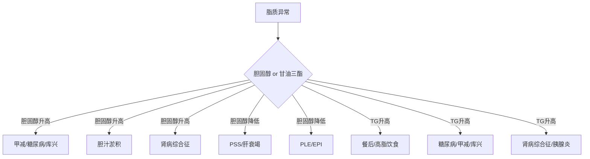

# 脂质代谢评估

## 基础认识
血浆脂质主要包括：
- 胆固醇
- 胆固醇酯
- 甘油三酯
- 磷脂
- 非酯化脂肪酸
在血生化里，最常用、最有判读价值的脂质指标主要是：
- **胆固醇**
- **甘油三酯**
## 胆固醇
- 胆固醇主要由**肝脏生成**
- 因此其异常常与肝胆系统、内分泌系统、肾脏疾病、能量代谢状态有关
### 高胆固醇血症
##### 常见原因
1. **内分泌疾病**
    - 甲状腺功能减退
    - 糖尿病
    - 肾上腺功能亢进
2. **餐后高脂血症**：一般为轻度
3. **急性胰腺炎**
4. **胆汁淤积（阻塞性）**
5. **肾病综合征**
6. **家族性高胆固醇血症**
    - 如喜乐蒂犬、不列颠犬、罗威纳犬、杜宾犬
7. **过度负能量平衡**
##### 判读逻辑
高胆固醇血症主要从以下几条线索理解：
1. 肝胆排泄异常
	- 胆汁淤积时，胆固醇排泄受影响
	- 所以**胆固醇升高可支持胆汁淤积**
2. 内分泌紊乱：特别是甲减、糖尿病、库兴
3. 蛋白丢失性肾病/肾病综合征
4. 能量代谢异常：过度负能量平衡时也可升高
### 低胆固醇血症
##### 常见原因
1. **吸收减少**
    - 蛋白丢失性肠病（PLE）
    - 胰外分泌功能不全（EPI）
2. **生成减少**
    - 门脉短路（PSS）
    - 肝衰竭
3. **肾上腺功能减退**
4. **遗传缺陷**
    - 如荷斯坦牛犊载脂蛋白生成缺陷
5. **代谢改变**
    - 炎症
    - 肿瘤（如多发性骨髓瘤、组织细胞肉瘤）
##### 判读逻辑
低胆固醇血症重点考虑三类问题：
1. 肝脏生成能力下降：门脉短路、肝衰竭
2. 肠道吸收不良
3. 内分泌异常：阿狄森氏病
> 在整体判读中，如果同时见到  
> **低胆固醇 + 低白蛋白 + 低 BUN + 低血糖**，  
> 要优先联想到**肝功能不全或门脉短路**。

## 甘油三酯
### 高甘油三酯血症

#### 常见原因

##### A. 生成增加

- 餐后高脂血症
    
- 马高脂血症
    
- 过度负能量平衡
    

##### B. 脂质分解减少

- 甲状腺功能减退
    
- 肾病综合征
    

##### C. 其他

- 急性胰腺炎
    
- 糖尿病
    
- 高脂饮食
    
- 肾上腺功能亢进
    
- 糖皮质激素药物摄入
    
- 脂肪肝
    
- 小型雪纳瑞犬特发性高脂血症
    

---

### 3.2 判读逻辑

高甘油三酯血症主要从以下角度考虑：

#### 1）是否为餐后影响

- 先排除采血前进食因素
    

#### 2）是否为内分泌问题

- 甲减
    
- 糖尿病
    
- 库兴
    

#### 3）是否为肾病综合征

- 是 TG 升高的重要鉴别诊断
    

#### 4）是否为胰腺炎或高脂血症相关疾病

- 尤其在犬中很常见
    

#### 5）是否存在品种特异性

- 如小型雪纳瑞犬
    

---

## 4. 脂质代谢部分速记框架

### 4.1 胆固醇

- **高**：甲减、糖尿病、库兴、胆汁淤积、肾病综合征、胰腺炎
    
- **低**：PSS、肝衰竭、PLE、EPI、阿狄森
    

### 4.2 甘油三酯

- **高**：餐后、糖尿病、甲减、库兴、肾病综合征、胰腺炎、高脂饮食
    

---

### 4.3 脂质代谢思维导图

