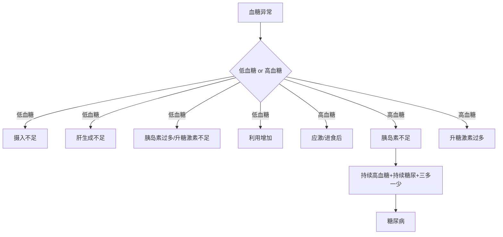

## 血糖与蛋白质指标解读

> 适用于《兽医诊断学》血生化部分的复习与病例判读。  
> 主线：**先判断异常方向，再追溯机制，再联系常见鉴别诊断。**

---

## 一、血糖指标解读

### 1. 基础认识

#### 1.1 正常范围

- 血糖正常水平：**70–120 mg/dL**
    

#### 1.2 生理意义

- 葡萄糖是机体重要能量底物
    
- 对脑组织尤为重要
    
- 血糖水平在体内受到严格调控
    

#### 1.3 葡萄糖来源

1. **肠道吸收**（外源性）
    
2. **肝糖原分解**（内源性）
    
3. **糖异生**（内源性）
    

---

### 2. 血糖调控激素

#### 2.1 升高血糖的激素

- 胰高血糖素
    
- 儿茶酚胺（如肾上腺素）
    
- 皮质醇
    
- 生长激素
    

#### 2.2 降低血糖的激素

- 胰岛素
    

#### 2.3 理解要点

血糖稳态本质上取决于两类力量的平衡：

- **升糖力量**：促进糖异生、肝糖原分解、减少外周摄糖
    
- **降糖力量**：促进葡萄糖进入细胞并利用
    

---

## 二、低血糖（Hypoglycemia）

### 1. 定义

- **血糖 < 70 mg/dL**
    

### 2. 基本机制

低血糖可由以下几类机制引起：

1. **摄入/吸收不足**
    
2. **肝脏生成不足**
    
3. **内分泌调控异常**
    
4. **葡萄糖利用增加**
    
5. **其他特殊原因或假象**
    

---

### 3. 病因分类

#### 3.1 摄入或吸收减少

- 严重营养不良
    
- 严重饥饿
    
- 严重肠道疾病（少见）
    

#### 3.2 肝脏生成葡萄糖减少

- 门脉短路（PSS）
    
- 肝衰竭（急性/慢性）
    
- 糖原贮积病
    

> 这里要联想到：**肝脏是维持血糖稳态的核心器官**。  
> 所以低血糖可作为肝功能下降的间接指标之一。

#### 3.3 内分泌紊乱

- 生糖激素减少
    
    - 肾上腺功能减退（阿狄森氏病）
        
- 胰岛素过多
    
    - 医源性
        
    - 胰岛素瘤
        

#### 3.4 葡萄糖利用增加

- 败血症
    
- 极度运动（如猎犬）
    
- 副肿瘤综合征
    
- 某些肿瘤
    

#### 3.5 其他

- 幼年动物低血糖
    
- 木糖醇中毒
    
- 伪像（artifact）
    

---

### 4. 临床表现

#### 4.1 神经低糖症（Neuroglycopenia）

由于脑组织缺乏葡萄糖，常见：

- 共济失调
    
- 癫痫
    
- 昏迷
    
- 行为改变
    
- 嗜睡
    
- 虚弱
    

#### 4.2 交感-肾上腺刺激

由于反调节激素释放增加，常见：

- 肌肉震颤
    
- 紧张
    
- 不安
    
- 饥饿感
    

---

### 5. 临床判读要点

#### 5.1 急性低血糖

- 临床症状通常较重
    
- 常见于：
    
    - 过量给予胰岛素
        
    - 败血症
        

#### 5.2 慢性低血糖

- 症状可较轻微
    
- 常见于：
    
    - 胰岛素瘤
        

#### 5.3 诊断思路

1. 结合病史
    
2. 结合体格检查
    
3. **重复测血糖，排除伪像**
    

---

## 三、高血糖（Hyperglycemia）

### 1. 生理性高血糖

- 进食后 **2–4 小时** 出现轻微高血糖可为正常现象
    

### 2. 病理性高血糖的常见原因

1. 药物
    
2. 胰岛素减少
    
3. 生糖激素增多
    
4. 内分泌系统疾病
    

### 3. 应激性高血糖

#### 3.1 机制

- 儿茶酚胺、皮质醇过多所致
    

#### 3.2 特点

- 可能超过肾阈值，出现糖尿
    
- 犬：约 **190 mg/dL**
    
- 猫：约 **290 mg/dL**
    

### 4. 相关疾病联想

- 胰高血糖素分泌瘤
    
- 嗜铬细胞瘤
    
- 库兴氏综合征
    
- 肢端肥大症
    
- 间情期相关糖尿病
    
- 甲状腺功能亢进
    

---

## 四、糖尿病（Diabetes mellitus）

### 1. 核心病理生理

胰岛素不足导致：

1. 组织对葡萄糖利用下降
    
2. 肝糖原分解、糖异生增加
    
3. 血中葡萄糖积累，出现高血糖
    
4. 超过肾阈后出现糖尿
    
5. 糖尿引起渗透性利尿，出现多尿
    
6. 为防脱水而代偿性多饮
    
7. 葡萄糖不能进入饱中枢，出现多食
    
8. 组织细胞“挨饿”，出现体重减轻
    

### 2. 典型临床表现

- 多饮
    
- 多尿
    
- 多食
    
- 体重减轻
    

### 3. 最终诊断依据

- 安静时高血糖
    
- 持续糖尿
    
- 伴有典型“四联征”  
    （多饮、多尿、多食、体重减轻）
    

### 4. 分类

- **I 型糖尿病**：胰岛素绝对不足，犬常见
    
- **II 型糖尿病**：胰岛素相对不足，猫常见
    

---

## 五、血糖部分速记框架

---

# 六、蛋白质指标解读

## 1. 基础组成

### 1.1 总蛋白

- **总蛋白 = 白蛋白 + 球蛋白**
    

### 1.2 白蛋白（Albumin）

- 占总血清蛋白约 **35–50%**
    
- 由**肝脏**产生
    
- 是**负急性期蛋白**
    
- 提供约 **75–80% 的胶体渗透压**
    
- 兼具载体蛋白作用
    

### 1.3 球蛋白（Globulin）

#### α、β 球蛋白

- 多由肝脏产生
    
- 包括脂蛋白、急性期蛋白
    

#### γ 球蛋白

- 主要为免疫球蛋白
    
- 由 B 淋巴细胞、浆细胞产生
    

---

## 七、蛋白判读总思路

### 1. 三步法

1. **先看总蛋白升高还是降低**
    
2. **再看 A:G 比值**
    
3. **最后判断是相对变化还是绝对变化**
    

### 2. 相对 vs 绝对

#### 相对变化

本质是**血液浓缩或稀释**

- 如脱水
    
- 如液体负荷增加
    

#### 绝对变化

本质是**生成增减或丢失异常**

- 生成增加
    
- 生成减少
    
- 丢失增加
    

---

## 八、高蛋白血症（Hyperproteinemia）

### 1. 两大机制

#### 1.1 相对高蛋白血症

由于血液总量下降，常见于：

- 脱水
    

特点：

- A:G 比通常正常
    
- 可同时见到白蛋白、球蛋白都升高
    
- 伴随脱水临床表现
    

#### 1.2 绝对高蛋白血症

由于蛋白生成增加，包括：

- 高纤维蛋白原血症
    
- 高白蛋白血症
    
- 高球蛋白血症
    

---

### 2. 高纤维蛋白原血症

#### 2.1 本质

- 纤维蛋白原属于**急性期蛋白**
    

#### 2.2 升高提示

- 炎症
    
- 脱水
    

#### 2.3 比值判读

**血浆蛋白 : 纤维蛋白原比**

- 牛：
    
    - > 15 倾向脱水
        
    - <10 倾向炎症
        
- 马：
    
    - > 20 倾向脱水
        
    - <15 倾向炎症
        

---

### 3. 高球蛋白血症（Hyperglobulinemia）

#### 3.1 轻度升高

多为 **α / β 球蛋白** 增加，提示急性期反应。  
常见于：

- 感染
    
- 肿瘤
    
- 免疫介导性疾病
    

#### 3.2 中度或重度升高

多为 **γ 球蛋白** 增加，常伴 **A:G 比下降**。

##### 1）多克隆丙球蛋白病

- 慢性抗原刺激
    

##### 2）单克隆丙球蛋白病

- 肿瘤性原因：
    
    - 多发性骨髓瘤
        
    - 淋巴瘤
        
    - 慢性淋巴细胞白血病
        
- 非肿瘤性原因：
    
    - 犬埃利希体病
        
    - 淀粉样变
        
    - 猫传染性腹膜炎
        

---

## 九、低蛋白血症（Hypoproteinemia）

### 1. 判读框架

课件将低蛋白血症按 **A:G 比值** 分成两大类。

---

### 2. A:G 比正常

提示以下情况：

#### 2.1 血液总量增加

- 稀释性低蛋白
    

#### 2.2 急性失血

- 蛋白随血液一同丢失
    
- A:G 比可保持相对正常
    

---

### 3. A:G 比下降

提示以**低白蛋白血症**为主，需要继续判断：

1. **白蛋白生成减少**
    
2. **白蛋白丢失增加**
    

---

## 十、低白蛋白血症（Hypoalbuminemia）

### 1. 生成减少

- 肝功能不全
    
- 饥饿
    
- 急性期反应
    
- 妊娠、哺乳
    

> 其中“肝功能不全”尤其重要，因为白蛋白由肝脏合成。

### 2. 丢失增加

- 蛋白丢失性肾病（PLN）
    
    - 常见 **A:G 下降**
        
- 蛋白丢失性肠病（PLE）
    
    - 常见 **A:G 正常**
        
- 急性出血
    
    - 常见 **A:G 正常**
        
- 渗出性皮肤病、烧伤
    
- 高蛋白积液
    
- 肠道寄生虫
    

---

## 十一、蛋白指标判读总表

|异常类型|先看什么|主要机制|常见联想|
|---|---|---|---|
|高蛋白|A:G 比是否正常|脱水 or 绝对增多|脱水、炎症、慢性抗原刺激|
|高球蛋白|轻度还是重度|急性期反应 or 免疫球蛋白增多|感染、肿瘤、免疫病|
|低蛋白|A:G 比是否下降|稀释 / 出血 / 低白蛋白|失血、肝病、PLN、PLE|
|低白蛋白|生成 vs 丢失|肝脏不造 or 外周漏失|肝功能不全、PLN、PLE|

---

## 十二、血糖与蛋白联合判读提示

### 1. 低血糖 + 低白蛋白 + 低 BUN

优先联想到：

- **肝功能不全**
    
- **门脉短路（PSS）**
    

### 2. 高血糖 + 糖尿 + 多饮多尿多食 + 消瘦

优先联想到：

- **糖尿病**
    

### 3. 高蛋白 + 脱水体征

优先联想到：

- **相对高蛋白血症**
    

### 4. 总蛋白低 + A:G 比下降

优先追问：

- 肝合成功能差？
    
- PLN？
    
- 慢性炎症背景下白蛋白下降？
    

---

## 十三、考试速记版

### 血糖

- **低血糖**：摄入少、肝不造、胰岛素太多、利用太快
    
- **高血糖**：应激、进食后、胰岛素不足、升糖激素过多
    
- **糖尿病**：高血糖 + 持续糖尿 + 三多一少
    

### 蛋白

- **高蛋白先想脱水**
    
- **高球蛋白先想炎症/免疫刺激**
    
- **低蛋白先看 A:G**
    
- **低白蛋白先分“造不出”还是“漏出去”**
    

---

## 十四、压缩总结

血糖指标主要反映机体葡萄糖稳态。低血糖提示葡萄糖摄入不足、肝脏生成不足、内分泌紊乱或葡萄糖利用增加；高血糖可为生理性、应激性或病理性，其中持续高血糖伴持续糖尿及多饮、多尿、多食、体重减轻时应高度怀疑糖尿病。蛋白质指标解读则以总蛋白、白蛋白、球蛋白及 A:G 比为核心。高蛋白血症需先区分脱水所致的相对升高与蛋白生成增加所致的绝对升高；低蛋白血症则需结合 A:G 比判断是稀释、失血，还是低白蛋白血症。低白蛋白血症进一步区分为生成减少与丢失增加，其中肝功能不全提示生成减少，而 PLN、PLE、出血和渗出性病变提示丢失增加。

如果你要，我下一步可以把这份再压成一个**更短的临考冲刺版**。