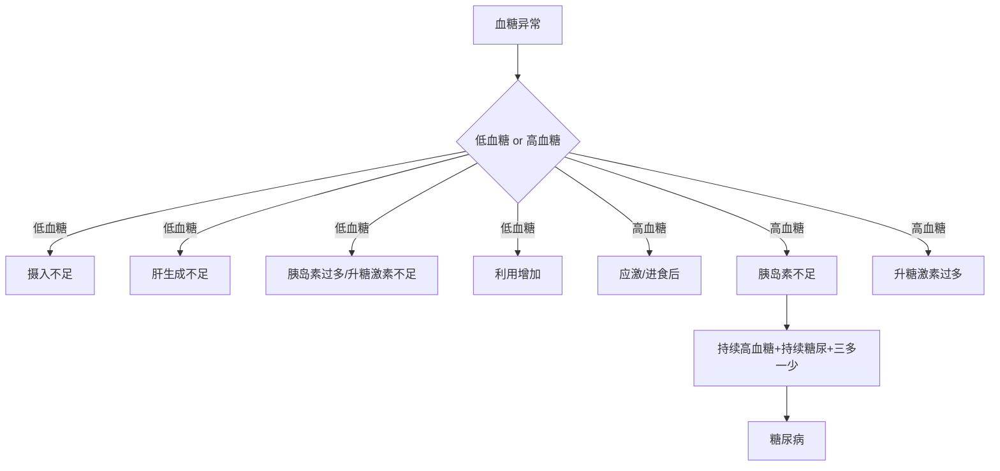

# 血糖与蛋白质指标解读
## 血糖指标解读
### 血糖基础
- 血糖正常水平：**70–120 mg/dL**
- 葡萄糖是机体重要能量底物，对脑组织尤为重要(脑部直接供能物质)
- 血糖水平在体内受到严格调控
###### 葡萄糖来源
1. **肠道吸收**（外源性）
2. **肝糖原分解**（内源性）
3. **糖异生**（内源性）
#### 血糖调控激素
##### 升高血糖的激素
- 胰高血糖素
- 儿茶酚胺(如肾上腺素）
- 皮质醇
- 生长激素
##### 降低血糖的激素
- 胰岛素
##### 总结
血糖稳态本质上取决于两类力量的平衡：
- **升糖力量**：促进糖异生、肝糖原分解、减少外周摄糖
- **降糖力量**：促进葡萄糖进入细胞并利用
### 低血糖
- 定义：**血糖 < 70 mg/dL**
#### 病因分类
##### 摄入或吸收减少
- 严重营养不良
- 严重饥饿
- 严重肠道疾病（少见）
##### 肝脏生成葡萄糖减少
- 门脉短路（PSS）
- 肝衰竭（急性/慢性）
- 糖原贮积病
> 这里联系肝脏是维持血糖稳态的核心器官  
> 所以低血糖可作为[[肝脏功能评估#生化|肝功能下降]]的间接指标之一

##### 内分泌紊乱
- 生糖激素减少
    - 肾上腺功能减退（阿狄森氏病）
- 胰岛素过多
    - 医源性
    - 胰岛素瘤
##### 葡萄糖利用增加
- 败血症
- 极度运动（如猎犬）
- 副肿瘤综合征
- 某些肿瘤
##### 其他
- 幼年动物低血糖
- 木糖醇中毒
- 伪像
#### 临床表现
##### 神经低糖症
由于脑组织缺乏葡萄糖，常见：
- 共济失调
- 癫痫
- 昏迷
- 行为改变
- 嗜睡
- 虚弱
##### 交感-肾上腺刺激
由于反调节激素释放增加，常见：
- 肌肉震颤
- 紧张
- 不安
- 饥饿感
#### 临床判读
##### 急性低血糖
- 临床症状通常较重
- 见于过量给予胰岛素、败血症
##### 慢性低血糖
- 症状可较轻微
- 见于胰岛素瘤
##### 诊断思路
1. 结合病史
2. 结合体格检查
3. **重复测血糖，排除伪像**
### 高血糖
#### 生理性高血糖
- 进食后**2–4 小时**出现轻微高血糖可为正常现象
#### 病理性高血糖
常见原因有：
1. 药物
2. 胰岛素减少
3. 生糖激素增多
4. 内分泌系统疾病
#### 应激性高血糖
- 机制：儿茶酚胺、皮质醇过多所致
- 特点：可能超过肾阈值，出现糖尿
	犬：约 **190 mg/dL**；猫：约 **290 mg/dL**
#### 相关疾病
- 胰高血糖素分泌瘤
- 嗜铬细胞瘤
- 库兴氏综合征
- 肢端肥大症
- 间情期相关糖尿病
- 甲状腺功能亢进
### 糖尿病
- 机制：胰岛素不足导致组织对葡萄糖利用下降。肝糖原分解、糖异生增加。血中葡萄糖积累，出现高血糖。超过肾阈后出现糖尿。糖尿引起渗透性利尿，出现多尿。为防脱水而代偿性多饮。葡萄糖不能进入饱中枢，出现多食。组织细胞“挨饿”，出现体重减轻
- 临床表现：多饮、多尿、多食、体重减轻
- 诊断依据
	1. 安静时高血糖
	2. 持续糖尿
	3. 伴有典型“四联征”：多饮、多尿、多食、体重减轻
##### 分类
- **I 型糖尿病**：胰岛素绝对不足，犬常见
- **II 型糖尿病**：胰岛素相对不足，猫常见
## 框架总结

