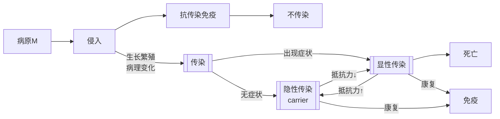

# 传染病总论
> [!info] 什么是传染病
>传染病是由**病原微生物**引起的、具有传染性的群体性疾病
>> 群发性$\neq$传染性：动物中毒病、营养缺乏与代谢病等存在群发性，但不存在病原体
> 
> - 狭义的传染病指微观病原微生物引起的
> - 广义的传染病可扩展到寄生虫
> 但是要区别二者在诊疗和防治上的差异

## 传染
- 定义：病原微生物入侵机体，在机体一定部位(全身或局部)定居繁殖，并产生病理性反应的过程，体现了==病原微生物==与==动物机体==间的博弈斗争
- **易感性**是感染的前提，如不存在易感性，即机体内无病原对应的受体，则病原无法在机体内定殖
根据病原的致病力和机体的免疫抵抗力的强弱斗争，结果可以分为：
1. 显性感染：致病力>抵抗力，病原繁殖扩散，产生病理变化，伴有临床症状出现
2. 隐性感染：致病力$\gtrapprox$抵抗力，病原只局限于某一部位产生病理变化，不表现临床症状
3. 不感染：分为先天获得(遗传决定)和后天获得(主动/被动免疫)两种途径

传染的各流程环节如下：

## 传染病
- 定义：是由==病原微生物==引起的，具有一定==潜伏期和症状==，并具有==传染性==的疾病
传染病存在以下特征(`4`)：
- 由病原微生物引起的
- 具有传染性(P2P)和流行性(Pop.)
- 被感染动物可发生特异性免疫反应，耐受动物获得特异性免疫
- 出现临床症状

## 病原&机体interaction
### 病原的致病作用
毒力：病原微生物的致病力强弱
毒力的评价由两部分组成：
- 侵袭力：病原突破机体的防御屏障，侵入机体并在其中定殖，并扩散蔓延的能力
- 产毒素能力：病原产生的毒素可以分为外毒素(分泌到“胞外”)和内毒素(存在于病原结构，如`LPS`)
病原体在体内的活动是存在因果链条的：$$入侵 \to定位(组织嗜性)\to 损伤 \to 排毒方式 \&传播途径$$
组织嗜性是对==易感性==的微观体现，病原只有找到存在相应受体的靶器官和组织才能大量繁殖，这个靶器官就是病原的*根据地*
常见的传播有两大途径：
1. 呼吸道：刺激呼吸道分泌黏液，以气溶胶或飞沫排出
2. 消化道：破坏肠壁导致腹泻，以粪口传播
### 机体的防御机制
##### 特异性免疫
- [[适应性免疫应答#体液免疫|体液免疫]]产生抗体中和毒素
- [[适应性免疫应答#细胞免疫|细胞免疫]]直接诱导靶细胞凋亡
- 局部免疫依赖[[抗体#IgA|分泌型IgA]]，如分布在消化道或呼吸道的黏膜
##### 非特异性防御
- 结缔组织的纤维屏障
- 白细胞的吞噬作用
- 网状内皮的过滤作用
- 特殊抗体的调理作用：某些天然抗体或补体吸附在病原表面提高非特异性吞噬的效率
## 传染类型
### 来源
- 内源性：病原来自于体内
- 外源性：病原来自于体外
### 种类
- 单纯：只有一种病原致病
- 混合：多个病原致病
- 继发：存在先手顺序，==原病原==破坏机体防御屏障引起==继发病原==感染致病
### 部位
- 局部感染
- 全身感染
又存在以下几个概念：

| **相关感染概念**          | **名词解释**                                                              |
| ------------------- | --------------------------------------------------------------------- |
| **菌血症** **病毒血症** | 病原体只是短暂地进入血液，**不在血液中繁殖**，只是把血液当成去往靶器官的“地铁”。                           |
| **毒血症**             | 病原体本身**留在局部**（不进血液），但它产生的**外毒素**进入了血液，随血流毒害全身。                        |
| **败血症**             | 病原体大量侵入血液，且在血液中**大量繁殖**，产生毒素，导致全身严重的病理变化。                             |
| **脓毒血症**            | 败血症的一种特殊进阶形态。**化脓性细菌**进入血液并在其中繁殖，随后随血流停滞在多个内脏器官，形成多发性的**化脓灶（转移性脓肿）**。 |
### 临床表现
- 顿挫型：出现前驱症状则迅速停滞恢复
- 消散型：病状轻微，局限于一定部位
- 温和型：症状完整但是程度较轻
### 症状典型程度
- 典型：症状和病理变化契合教科书描述 
- 非典型：典型症状缺失，易造成误诊
### 严重性
- 良性：发病率可能高，但致死率低
- 恶性：发病急骤，致死率高
### 病程长短
- 最急性
- 急性
- 亚急性
- 慢性

## 传染病发展阶段
分为四个阶段：
1. 潜伏期：病原存在繁殖但不表现症状
2. 前驱期：出现非特异性症状
3. 明显期：出现该病固有症状
4. 转归期
**传染期=前驱期+明显期+转归期**

> [!important] 防疫决策底层铁律
> 患病了 $\rightarrow$ 观察一个**传染期**。
> 不确定是否患病 $\rightarrow$ 观察一个**最长潜伏期**。

