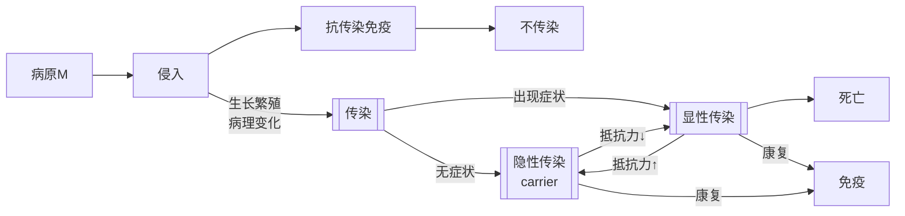

# 传染病总论
> [!info] 什么是传染病
>传染病是由**病原微生物**引起的、具有传染性的群体性疾病
>> 群发性$\neq$传染性：动物中毒病、营养缺乏与代谢病等存在群发性，但不存在病原体
> 
> - 狭义的传染病指微观病原微生物引起的
> - 广义的传染病可扩展到寄生虫
> 但是要区别二者在诊疗和防治上的差异

## 传染
- 定义：病原微生物入侵机体，在机体一定部位(全身或局部)定居繁殖，并产生病理性反应的过程，体现了==病原微生物==与==动物机体==间的博弈斗争
- **易感性**是感染的前提，如不存在易感性，即机体内无病原对应的受体，则病原无法在机体内定殖
根据病原的致病力和机体的免疫抵抗力的强弱斗争，结果可以分为：
1. 显性感染：致病力>抵抗力，病原繁殖扩散，产生病理变化，伴有临床症状出现
2. 隐性感染：致病力$\gtrapprox$抵抗力，病原只局限于某一部位产生病理变化，不表现临床症状
3. 不感染：分为先天获得(遗传决定)和后天获得(主动/被动免疫)两种途径

传染的各流程环节如下：

## 传染病
- 定义：是由==病原微生物==引起的，具有一定==潜伏期和症状==，并具有==传染性==的疾病
传染病存在以下特征(`4`)：
- 由病原微生物引起的
- 具有传染性(P2P)和流行性(Pop.)
- 被感染动物可发生特异性免疫反应，耐受动物获得特异性免疫
- 出现临床症状

## 病原的致病作用
毒力