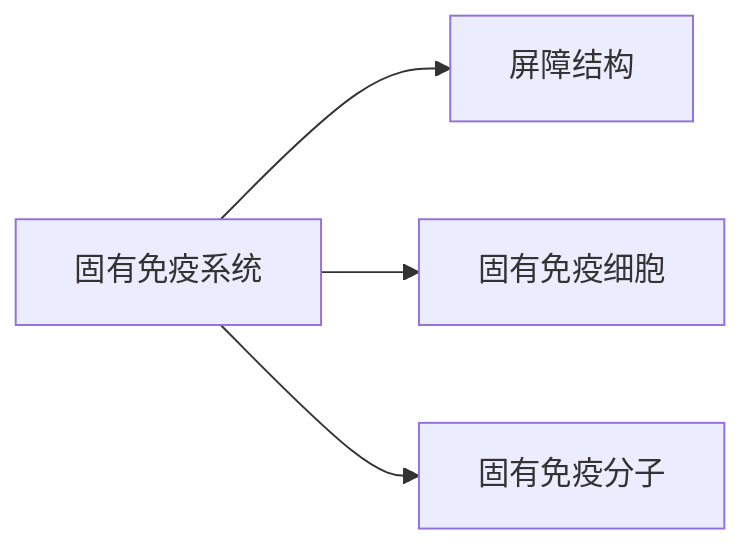

  # 先天性免疫
- 又称固有免疫、天然免疫或非特异性免疫应答
- 由固有免疫系统执行，主要组成如下：

## 解剖学屏障
### 皮肤和黏膜
皮肤和黏膜是**第一道防线**(物理屏障)，又称屏障免疫
主要体现于以下几个作用：
1. 机械阻挡与排除
2. 局部分泌液，分泌物的pH，含有溶菌酶、抗菌肽等活性物质
3. 正常菌体的拮抗作用(微生物屏障)，正常菌体可以限制外来微生物的定居和繁殖同时激活机体产生抗体
### 血脑屏障
- 由软脑膜、毛细血管壁、星状胶质细胞的胶质膜(足板)构成
- 阻止病原和大分子物质进入
### 血胎屏障
妊娠过程中，病原微生物由母体感染胎儿叫做**垂直感染**
## 固有免疫细胞
- 指参与先天性免疫的细胞
- **哨兵细胞**：巨噬细胞、树突状细胞和肥大细胞
### 分类
##### 单核-巨噬细胞
存在表面模式受体和细胞因子受体
在先天性免疫反应和适应性免疫反应中起到重要作用
##### 树突状细胞
- 抗原呈递能力最强的细胞，有效刺激T&B细胞的活化
##### NK细胞
- 极其重要的固有淋巴细胞
- 在感染早期，通过自然杀伤途径、IgG Fc介导的ADCC了、分泌杀伤介质作用于靶细胞
##### 中性粒细胞
内含多种杀菌物质
趋化作用和吞噬能力
存在IgG Fc受体和C3b受体
##### 固有样淋巴细胞
具有抗原受体(TCR or BCR)
主要包括NKT cell、$\gamma \delta T$cell、B1 cell
### 吞噬作用
具有吞噬作用的细胞可以分为两类：小吞噬细胞(中性粒细胞)和大吞噬细胞(单核-巨噬细胞系统)
##### 吞噬过程
1. 趋化
2. 识别和调理
3. 吞入和脱颗粒
4. 杀菌和消化
### 病原识别机制
###### 模式识别受体(PRR)
- 指单核/巨噬细胞和树突状细胞等**固有免疫细胞**表面存在能够直接识别病原体某些特定分子结构的受体
- Toll样受体、NOD样受体、RIG样受体
###### 病原相关分子模式(PAMP)
- 是模式识别受体的配体，为病原体及其产物所共有的、高度保守的特定分子结构
## 固有免疫分子
##### 溶菌酶
来自于吞噬细胞
作用于$Gram^{+}$细胞壁的肽聚糖
##### 抗菌肽
抗菌谱广
##### 干扰素
作用于正常细胞产生抗病毒蛋白
##### 补体
##### C-反应蛋白
由肝脏合成的急性期蛋白
##### 乙型溶素
血小板释放的碱性多肽，作用于$Gram^{+}$