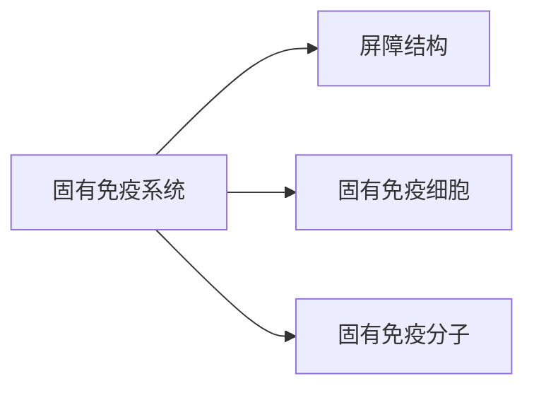

- 又称固有免疫、天然免疫或非特异性免疫应答
- 由固有免疫系统执行，主要组成如下：

# 解剖学屏障
## 皮肤和黏膜
皮肤和黏膜是**第一道防线**(物理屏障)，又称屏障免疫
主要体现于以下几个作用：
1. 机械阻挡与排除
2. 局部分泌液，分泌物的pH，含有溶菌酶、抗菌肽等活性物质
3. 正常菌体的拮抗作用，正常菌体可以限制外来微生物的定居和繁殖同时激活机体产生抗体
## 血脑屏障
由软脑膜、毛细血管壁、星状胶质细胞的胶质膜(足板)构成，阻止病原和大分子物质进入
## 血胎屏障
妊娠过程中，病原微生物由母体感染胎儿叫做**垂直感染**
# 固有免疫细胞
- 指参与先天性免疫的细胞
- **哨兵细胞**：巨噬细胞、树突状细胞和肥大细胞
## 单核-巨噬细胞
表面存在
## 树突状细胞