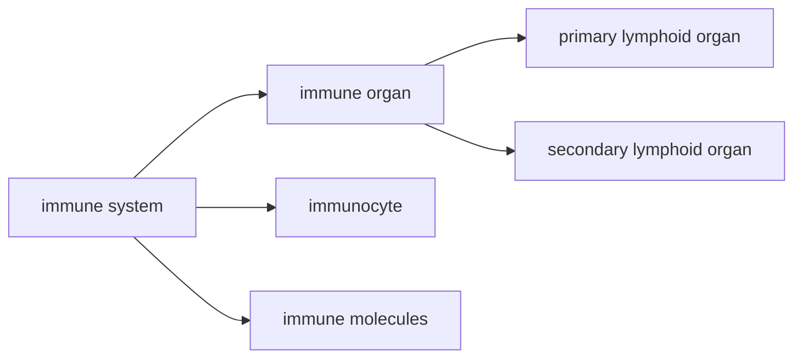

# 免疫系统概述
- 免疫系统是执行免疫功能的结构基础，由免疫器官、免疫组织、免疫细胞和免疫分子组成

# 免疫器官
## 初级淋巴器官
- 又称中枢淋巴器官，是免疫细胞发生、发育、分化和成熟的场所
- 在胚胎发育早期形成，青春期后有的(胸腺、法氏囊)退化为淋巴上皮组织
- 功能：诱导淋巴细胞增殖分化成免疫活性细胞
### 骨髓
- 生长分化流程：多功能造血干细胞$\rightarrow$淋巴样前体细胞$\rightarrow$前体T细胞/前体B细胞
- 对于哺乳动物，前体B细胞在骨髓中进一步分化发育为成熟的B细胞，主要产生的抗体为IgG，IgA
### 胸腺
- 组织学结构：存在被膜，形成小叶的基本结构单位。小叶的外周是皮质，中心是髓质。皮质又有外皮质层和内皮质层之分。胸腺实质由胸腺细胞(T淋巴细胞)和基质细胞(胸腺上皮细胞、树突状细胞、巨噬细胞)构成，髓质内可见一环状结构，称为胸腺小体
> **胸腺哺育细胞**：外皮质层的一种特殊的胸腺上皮细胞
#### 胸腺功能
##### 成熟T细胞
前体T细胞经血液循环进入胸腺进行成熟、分化、筛选
##### 分泌胸腺素
内分泌功能，诱导前体T细胞的分化
- 胸腺素：使前体T细胞分化
- 胸腺体液因子
- 胸腺血清因子
### 法氏囊
- 禽类特有的淋巴结构，是禽类B细胞分化和成熟的场所
- 作为次级淋巴器官，捕获抗原合成抗体
## 次级淋巴器官
是成熟T细胞/B细胞栖居、增殖和接受抗原刺激后产生免疫应答的场所。终身存在。
### 淋巴结
#### 功能
##### 过滤和清除异物
淋巴结髓窦中的巨噬细胞可以对流经淋巴液中的致病菌、有害异物进行吞噬消除
##### 免疫应答的场所
树突状细胞和巨噬细胞捕获和呈递抗原，使得T细胞变为效应T细胞，B细胞变为浆细胞，同时产生相应的记忆细胞
### 脾脏
#### 功能
##### 滤过血液
##### 滞留淋巴细胞
##### 免疫应答场所
#####  产生吞噬细胞增强激素
### 其他淋巴组织
 屏障器官或组织
# 免疫细胞
## 淋巴细胞
- **免疫活性细胞/抗原特异性淋巴细胞**：受到抗原刺激后分化增殖并发生特异性免疫应答的淋巴细胞(主要是T cell & B cell)
淋巴细胞除了包含T cell & B cell，还包括NK细胞、NKT细胞
免疫细胞表面存在表面标志，分为表面抗原和表面受体，命名为分化簇(CD)/分化抗原
	表面抗原和表面抗体的分类是根据结合物质的特性决定的
### T cell
来源于骨髓的多能造血干细胞分化的淋巴样前体细胞，经过$CD4^-CD8^-$双阴性、$CD4^+CD8^+$双阳性、$CD4^-CD8^+$or$CD4^+CD8^-$单阳性筛选后成为成熟的T细胞，又称胸腺依赖细胞
#### T细胞的表面标志
##### TCR(T-cell receptor)
- 组成：由$\alpha$链和$\beta$链经二硫键连接组成的异二聚体，每条链又折叠形成V区和C区，C区与细胞膜相连，V区则为抗原结合部位
- TCR与细胞膜上的CD3分子结合形成TCR复合体
- TCR只能识别抗原呈递细胞表面的MHC分子-抗原肽复合物中的抗原成分
> TCR的抗原识别受MHC分子的制约，称为TCR识别抗原的MHC限制性或MHC约束性
- 少数T细胞的TCR由$\gamma$链和$\delta$链组成，称为$\gamma \delta T cell$,主要分布于黏膜相关淋巴组织，在局部免疫中起作用
##### CD2
即红细胞受体(E receptor)
- 表现为T细胞能与绵羊红细胞结合，形成红细胞花环
> [!note] T细胞存在此表面标志，B细胞无，因此可以作为鉴别和监测T细胞的手段

##### CD3
- ❗仅存在于T细胞表面
- 能与[[#TCR(T-cell receptor)|TCR]]形成复合体，是TCR表达和传导信号所必需的
##### CD4 & CD8
分别称为MHCⅡ类分子和Ⅰ类分子的受体，单一遗传背景的T细胞只表达其中之一，据此分为$CD4^+$和$CD8^+$两大T细胞两大亚群
##### CD28
- T细胞活化的重要共刺激分子
#### T细胞亚群
##### $CD4^+$T细胞
- 分类依据：表型为$CD2^+$、$CD3^+$、$CD4^+$、$CD8^-$的T细胞
- 特点：TCR识别**MHCⅡ**类分子结合呈递的抗原
###### 辅助性T细胞($T_H$)
- 功能：协助免疫细胞发挥功能，分泌效应性T细胞和B细胞接触促进B细胞的分化、活化和抗体产生；促进T细胞的活化、增强杀伤靶细胞的能力
- 存在调节性T细胞($T_{REG}$)，具有免疫抑制效应
###### 迟发型超敏反应性T细胞($T_{DTH}$ or $T_D$)
大多数属于$T_H1$细胞，释放淋巴因子引起炎症反应，清除抗原
##### $CD8^+$T细胞
- 分类依据：表型为$CD2^+$、$CD3^+$、$CD4^-$、$CD8^+$的T细胞
- 特点：TCR识别**MHCⅠ**类分子结合呈递的抗原
- 主要是细胞毒性T细胞($T_c$)，又称杀伤性T细胞，活化为细胞毒性T淋巴细胞(杀伤靶细胞)，具有高度特异性和免疫记忆
### B cell
起源与[[#T cell]]相同，又称骨髓依赖性淋巴细胞
- 活化后分化为浆细胞和记忆性细胞，同时活化的B细胞也可以作为抗原呈递细胞
#### B细胞的表面标志
##### BCR(B-cell receptor)
属于膜免疫球蛋白(mIg)，通过二硫键与$Ig-\alpha / Ig-\beta$的异二聚体形成跨膜蛋白复合体(1+2结合)，称为BCR复合体
- mIg结构上与血清中相似，Fc段镶嵌在细胞膜上，Fab段在细胞外侧，作为鉴别B细胞的主要特征，成熟的B细胞含有mIgM和mIgD
##### B细胞辅助受体
CD21、CD19和CD81能够形成复合体，与BCR交联，对B细胞活化起作用
##### Fc受体(FcR)
为IgG的Fc受体，称为$Fc\gamma R$，有利于对抗原的捕获和结合
##### 补体受体(CR)
- 能与补体成分C3b和C3d结合的受体(CD35 & CD21)，CD21也是[[#B细胞辅助受体]]复合物的成分之一
##### B7
活化的b
## 抗原呈递细胞