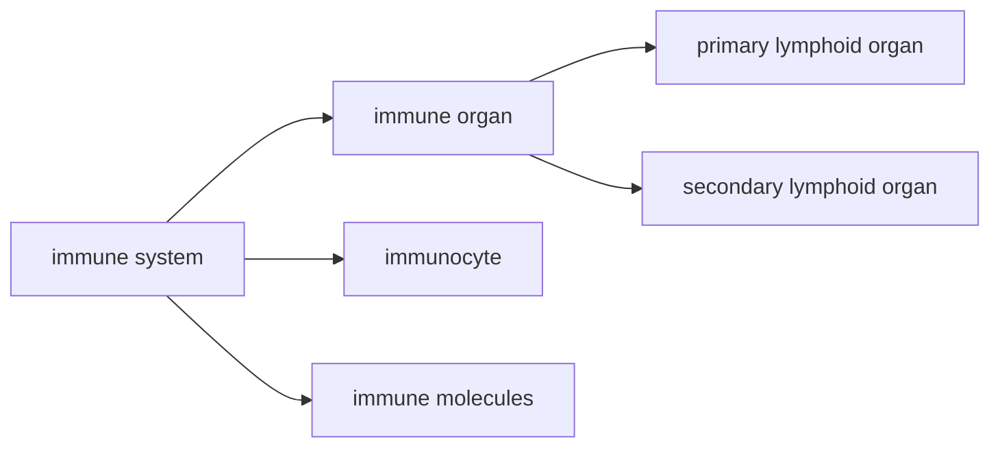

# 免疫系统概述
- 免疫系统是执行免疫功能的结构基础，由免疫器官、免疫组织、免疫细胞和免疫分子组成

# 免疫器官
## 初级淋巴器官
- 又称中枢淋巴器官，是免疫细胞发生、发育、分化和成熟的场所
- 在胚胎发育早期形成，青春期后有的(胸腺、法氏囊)退化为淋巴上皮组织
- 功能：诱导淋巴细胞增殖分化成免疫活性细胞
### 骨髓
- 生长分化流程：多功能造血干细胞$\rightarrow$淋巴样前体细胞$\rightarrow$前体T细胞/前体B细胞

### 胸腺
### 法氏囊
## 次级淋巴器官