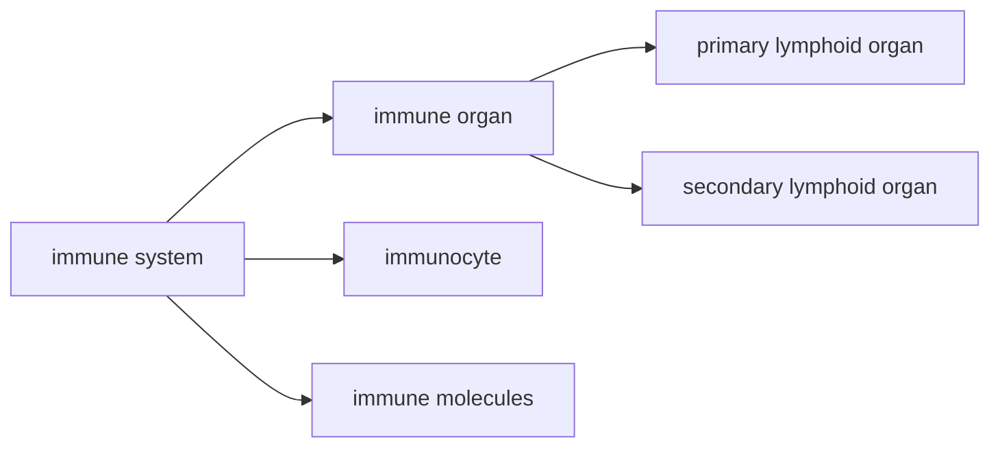

# 免疫系统概述
- 免疫系统是执行免疫功能的结构基础，由免疫器官、免疫组织、免疫细胞和免疫分子组成

# 免疫器官
## 初级淋巴器官
- 又称中枢淋巴器官，是免疫细胞发生、发育、分化和成熟的场所
- 在胚胎发育早期形成，青春期后有的(胸腺、法氏囊)退化为淋巴上皮组织
- 功能：诱导淋巴细胞增殖分化成免疫活性细胞
### 骨髓
- 生长分化流程：多功能造血干细胞$\rightarrow$淋巴样前体细胞$\rightarrow$前体T细胞/前体B细胞
- 对于哺乳动物，前体B细胞在骨髓中进一步分化发育为成熟的B细胞，主要产生的抗体为IgG，IgA
### 胸腺
- 组织学结构：存在被膜，形成小叶的基本结构单位。小叶的外周是皮质，中心是髓质。皮质又有外皮质层和内皮质层之分。胸腺实质由胸腺细胞(T淋巴细胞)和基质细胞(胸腺上皮细胞、树突状细胞、巨噬细胞)构成，髓质内可见一环状结构，称为胸腺小体
> **胸腺哺育细胞**：外皮质层的一种特殊的胸腺上皮细胞
#### 胸腺功能
##### 成熟T细胞
前体T细胞经血液循环进入胸腺进行成熟、分化、筛选
##### 分泌胸腺素
内分泌功能，诱导前体T细胞的分化
- 胸腺素：使前体T细胞分化
- 胸腺体液因子
- 胸腺血清因子
### 法氏囊
- 禽类特有的淋巴结构，是禽类B细胞分化和成熟的场所
- 作为次级淋巴器官，捕获抗原合成抗体
## 次级淋巴器官
是成熟T细胞/B细胞栖居、增殖和接受抗原刺激后产生免疫应答的场所。终身存在。
### 淋巴结
#### 功能
##### 过滤和清除异物
淋巴结髓窦中的巨噬细胞可以对流经淋巴液中的致病菌、有害异物进行吞噬消除
##### 免疫应答的场所
树突状细胞和巨噬细胞捕获和呈递抗原，使得T细胞变为效应T细胞，B细胞变为浆细胞，同时产生相应的记忆细胞
### 脾脏
#### 功能
##### 滤过血液
##### 滞留淋巴细胞
##### 免疫应答场所
#####  产生吞噬细胞增强激素
### 其他淋巴组织
 屏障器官或组织
# 免疫细胞
## 淋巴细胞
- **免疫活性细胞/抗原特异性淋巴细胞**：受到抗原刺激后分化增殖并发生特异性免疫应答的淋巴细胞(主要是T cell & B cell)
免疫细胞表面存在表面标志，分为表面抗原和表面受体，命名为分化簇(CD)
### T cell

## 抗原呈递细胞