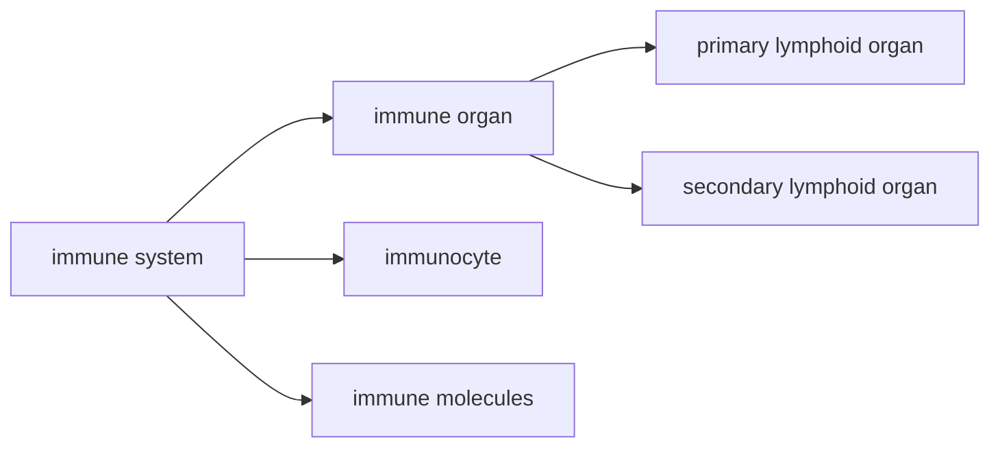

# 免疫系统概述
- 免疫系统是执行免疫功能的结构基础，由免疫器官、免疫组织、免疫细胞和免疫分子组成

```mermaid
graph LR
	A[immune system]-->B[immune organ]
	B-->C[primary lymphoid organ]
	B-->D[secondary lymphoid organ]
	A-->E[immunocyte]
	A-->F[immune molecules]
```