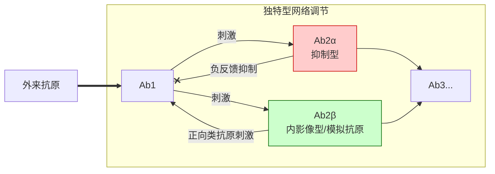
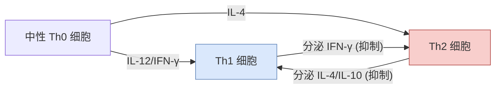

<h1>免疫调节</h1>

## 概述
- **免疫调节**是指在免疫应答过程中，免疫系统的各个组分之间相互作用形成协调、制约的互作网络
- 免疫调节的最终目的是为了维持机体内环境的稳态
- 免疫失调的后果：过低无法及时清除“非己”抗原物质，过高会导致自身免疫疾病
## 抗原的免疫调节
- 抗原是引起适应性免疫应答的物质基础，抗原的类型、剂量、进入途径会决定机体启动免疫应答的类型
### 抗原类型
- 蛋白质抗原([[抗原#对T细胞的依赖性|TD抗原]])$\to$体液/细胞免疫应答，体液免疫产生各类Ig
- 多糖、脂类([[抗原#对T细胞的依赖性|TI抗原]])$\to$体液免疫应答，产生IgM类抗体
### 抗原剂量
- 一定范围内，免疫应答随抗原量增加而增强
- 抗原量过高过低都会引起免疫耐受
### 进入途径
- 皮内、皮下、肌肉注射都能引起较为强烈的免疫应答
## 免疫分子的免疫调节
- 免疫分子主要涉及[[抗体]](包括免疫复合物)、[[细胞因子]]以及[[补体系统|补体]]三类分子的调节
### 抗体与免疫复合物的调节
#### 抗体的调节
抗体是免疫应答的产物，对于体液免疫应答也会有调节作用，表现在两个方面：
##### 正反馈调节
1. 应答初期产生的少量IgG/IgM与抗原形成免疫复合物，结合在APC膜上的FcR上增强其对抗原的摄取、加工和提呈
2. 抗原与抗体结合后，会通过[[补体系统#经典途径|经典途径]]产生`C3d`，`C3d`能够交联[[免疫系统#B细胞的表面标志|B细胞表面的BCR和CD21/CR2]]，实现信号的放大
##### 负反馈调节
免疫应答后期，抗体浓度过高会抑制B细胞继续产生同类抗体：
- 免疫复合物的抗体部分与Fc受体结合，抗原部分与BCR结合，形成的“BCR-抗原-抗体-Fc”交联会产生抑制信号
##### 独特型-抗独特型网络调节
- **独特型**：抗体的V区是识别结合抗原的部位，从某种角度来说，对自身免疫系统来说，V区也是抗原。而独特型是抗原分子上所有抗原决定簇(独特位)的总和
- **网络运作方式**：

- 机制意义:
	1. 自我约束：抑制抗原侵入后抗体的过度产生
	2. 维持稳定：在无外来抗原刺激时，维持抗体浓度
	3. 扩大免疫系统识别的抗原范围
#### 补体调节
补体的调节主要可以体现在以下几个方面：
1. 免疫调理：结合中性粒细胞/巨噬细胞表面受体促进吞噬
2. 促进APC提呈抗原：结合抗原抗体复合物的Fc片段
3. 促进B细胞活化：BCR和CR2同时结合后会释放放大的信号
#### 细胞因子调节

## 免疫细胞的调节
- 参与调节的细胞有T cell、B cell、NK cell和巨噬细胞
### T细胞的免疫调节
##### $T_H$细胞的调节
$T_H0$在`IL-12`