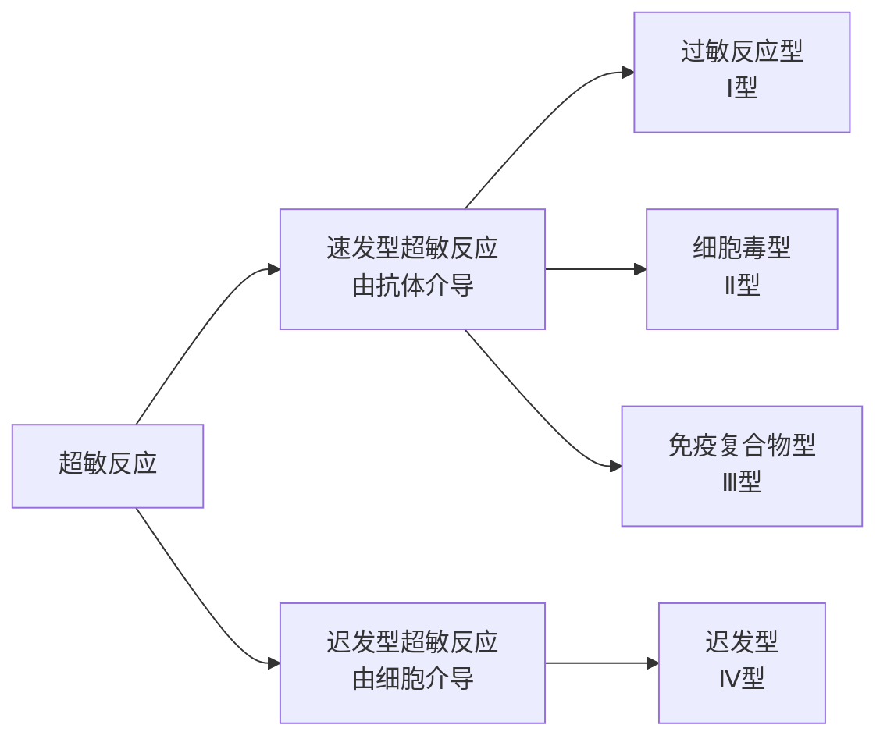

<h1>变态反应</h1>

## 概述
- 又称超敏反应，指免疫系统对再次进入机体内的抗原产生强烈的反应而导致机体损伤和炎症反应

## 过敏型超敏反应
- 指的是机体在再次接受抗原时引起的以**急性炎症**为特征的反应，引起该反应的抗原又可以称为过敏原
### 反应过程
- 初次：过敏原引起机体产生IgE，结合于肥大细胞表面
- 二次：过敏原再次进入机体内，与抗体结合导致肥大细胞释放活性介质引发Ⅰ型超敏反应
### 反应参与成分
##### 过敏原

##### IgE
##### 肥大细胞&嗜碱性粒细胞
##### IgE结合的Fc受体
