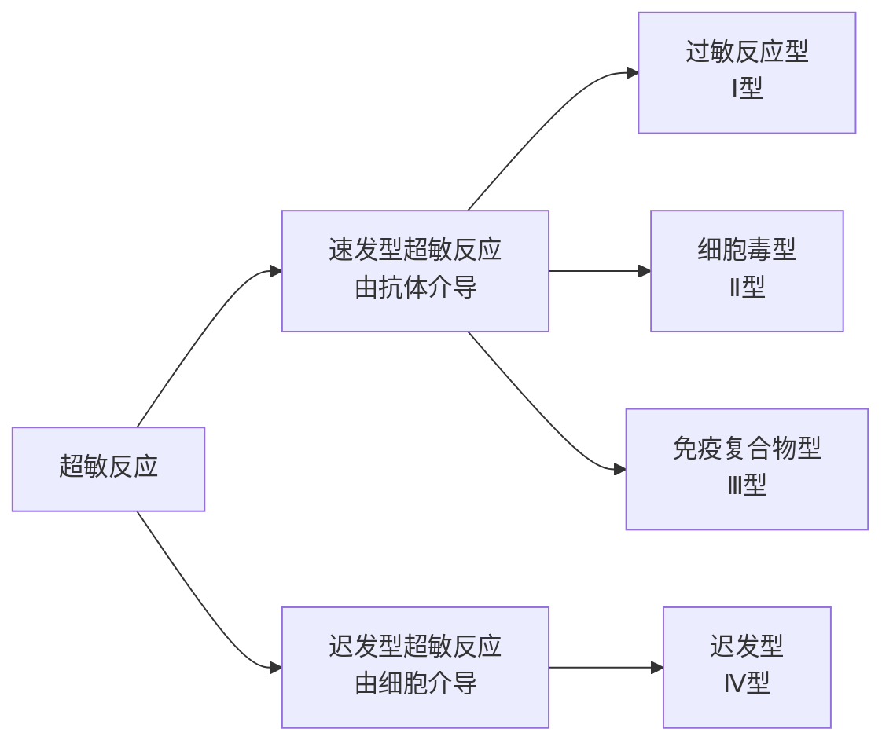

<h1>变态反应</h1>

## 概述
- 又称超敏反应，指免疫系统对再次进入机体内的抗原产生强烈的反应而导致机体损伤和炎症反应

## 过敏型超敏反应
- 指的是机体在再次接受抗原时引起的以**急性炎症**为特征的反应，引起该反应的抗原又可以称为过敏原
### 反应参与成分
##### 过敏原
种类很多，包括异源血清、花粉等
经由呼吸道、消化道、皮肤或组织黏膜进入机体，并在黏膜引起IgE的免疫应答
##### IgE
- 可介导寄生虫免疫反和过敏反应
IgE是一种亲细胞型的抗体，其$C_H4$片段可与肥大细胞、嗜碱性粒细胞胞膜上的相应受体结合
##### 肥大细胞&嗜碱性粒细胞
参与过敏型超敏反应的主要细胞，胞质内含有大量引起炎症反应的活性介质的膜型结合颗粒，被激活时释放细胞因子
##### 结合IgE Fc片段的受体
有两种$Fc \epsilon R$，肥大细胞和嗜碱性粒细胞表达高结合力的Ⅰ型$Fc \epsilon R$
### 反应过程
简单可以概括为以下的机制：
- 初次：过敏原引起机体产生IgE，结合于肥大细胞表面
- 二次：过敏原再次进入机体内，与抗体结合导致肥大细胞释放活性介质引发Ⅰ型超敏反应
反应过程可以分为三个阶段：
##### IgE的产生
过敏原初次进入机体内，APC呈递和$T_H2$作用下引起B细胞产生IgE
##### 活性细胞的致敏
IgE与肥大细胞或嗜碱性粒细胞表面的$Fc\epsilon R$结合，此时机体进入致敏阶段
##### 过敏反应
当过敏原再次进入机体内，与活性细胞表面的IgE结合，当
## 细胞毒型超敏反应