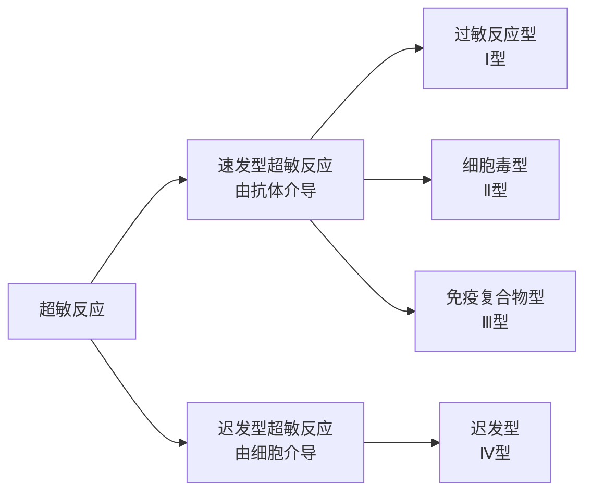

<h1>变态反应</h1>

## 概述
- 又称超敏反应，指免疫系统对再次进入机体内的抗原产生强烈的反应而导致机体损伤和炎症反应

## 过敏型超敏反应
- 指的是机体在再次接受抗原时引起的以**急性炎症**为特征的反应，引起该反应的抗原又可以称为过敏原
### 反应参与成分
##### 过敏原
种类很多，包括异源血清、花粉等
经由呼吸道、消化道、皮肤或组织黏膜进入机体，并在黏膜引起IgE的免疫应答
##### IgE
- 可介导寄生虫免疫反和过敏反应
IgE是一种亲细胞型的抗体，其$C_H4$片段可与肥大细胞、嗜碱性粒细胞胞膜上的相应受体结合
##### 肥大细胞&嗜碱性粒细胞
参与过敏型超敏反应的主要细胞，胞质内含有大量引起炎症反应的活性介质的膜型结合颗粒，被激活时释放细胞因子
##### 结合IgE Fc片段的受体
有两种$Fc \epsilon R$，肥大细胞和嗜碱性粒细胞表达高结合力的Ⅰ型$Fc \epsilon R$
### 反应过程
简单可以概括为以下的机制：
- 初次：过敏原引起机体产生`IgE`，结合于肥大细胞表面
- 二次：过敏原再次进入机体内，与抗体结合导致肥大细胞释放活性介质引发Ⅰ型超敏反应
反应过程可以分为三个阶段：
##### `IgE`的产生
过敏原初次进入机体内，APC呈递和$T_H2$作用下引起B细胞产生`IgE`
##### 活性细胞的致敏
`IgE`与肥大细胞或嗜碱性粒细胞表面的$Fc\epsilon R$结合，此时机体进入致敏阶段
##### 过敏反应
当过敏原再次进入机体内，与活性细胞表面的`IgE`结合，处于待命状态
>如果`IgE`与二次进入的过敏原结合后立马就启动全身的肥大细胞发生脱颗粒，则导致致命的过敏性休克。这在进化上是不允许的。过敏原往往是多价的

机体通过`IgE`的“交联机制”，即一个抗原抓住了多个`IgE`，才能激活细胞膜的下游信号通路，触发脱颗粒释放组胺，以及后续的膜磷脂代谢，包括释放白三烯，前列腺素
### 代表反应
- 急性全身型过敏反应
- 局部的过敏反应
## 细胞毒型超敏反应
- 特点：又称为抗体依赖性细胞毒型超敏反应
### 反应过程
- 为什么会称作“抗体依赖性”：该反应启动依赖`IgG`或`IgM`
##### 反应启动
该反应的开始是由于抗体的`Fab`片段与细胞表面的抗原结合，`Fc`片段招募补体或是巨噬细胞
##### 反应核心路径
抗体与细胞抗原结合后后续依赖[[补体系统]]发挥作用，此处补体系统发挥了双重作用：
- 直接溶解
	参考[[补体系统#经典途径|经典途径]]，抗体尾部`Fc`片段结合`C1q`，激活经典途径，最终形成`MAC`，导致细胞膜的溶解反应
- 调理吞噬
	补体激活过程中产生的`C3b`片段或抗体本身的`Fc`片段，包裹在靶细胞表面，吞噬细胞表面受体可以识别这些片段，启动对靶细胞的吞噬作用

> **当靶细胞太大吞噬细胞无法完整吞下去该怎么办**
> 吞噬细胞会释放溶酶体酶、活性氧等破坏性物质直接到细胞间隙中，对组织细胞也会造成一定程度损伤
### 代表反应
##### 输血反应
当输入的血液与受血者的血型不匹配的时候，`IgM`会立刻识别结合输入红细胞的抗原，接着启动补体系统导致血管内红细胞的溶解，引起休克甚至死亡
##### 新生畜溶血性贫血
- 原因：母畜和胎儿的血清不符
- 过程：母畜对胎儿的红细胞产生抗体，抗体通过初乳/胎盘进入新生畜的体内，导致出现溶血性出血
##### 自身免疫溶血性贫血
自身抗体或红细胞表面沉积的免疫复合物导致的溶血性贫血，可以分类为：
1. 热反应型：$37 ^\circ C$发生，由`RhD`系统介导增强肝脏的吞噬细胞的吞噬功能
2. 冷反应型：<$37 ^\circ C$发生，抗体滴度高
3. 药物引起的抗血细胞成分反应：小分子药物作为半抗原与血细胞膜蛋白(大分子)结合形成[[抗原#完全抗原|完全抗原]]，被免疫系统侦测清理
## 免疫复合物型超敏反应
- 特点：==中等大小==的免疫复合物沉积
> 太大了容易直接被吞噬，太小了在血液循环中经肾脏过滤

### 反应机理&过程
##### 反应机制
- **正常过程**：血液中存在的可溶性抗原与抗体结合形成复合物，后被吞噬细胞清理
- Ⅲ型超敏反应中结合形成复合物后，如果补体(特别是C3)缺乏或者吞噬细胞负荷过度，复合物会在血液中沉积。 肥大细胞和嗜碱性粒细胞分泌组胺等扩血管物质增大血管壁间隙供复合物穿过，复合物倾向于沉积于高血压部位(肾小球毛细血管、动脉分支)
##### 反应过程
- 形成复合物
- 沉积
- 组织损伤：免疫复合物沉积后，会激活补体系统产生`C3a`、`C5a`，招募中性粒细胞吞噬复合物，伴有溶酶体酶的释放，导致血管壁损伤和基底膜的坏死
### 代表反应
##### Arthus反应
- 指的是对于动物在同一部位反复注射某种抗原，导致注射部位出现红肿、出血
##### 过敏性肺炎
- 肺部反复吸入了抗原物质，形成免疫复合物沉积在肺
##### 血清病
一次性在体内大量注射抗毒素物质，在全身出现复合物的沉积
##### 肾小球肺炎
血液中的免疫复合物在皮肤和肾脏中沉积
## 迟发型过敏反应
- 有细胞(主要是T细胞)介导，在较长时间才发生的过敏反应，故又称为迟发型变态反应
- **特点**：依靠T细胞与抗原作用，引起单核-巨噬细胞浸润和组织损伤的炎症反应，本质上是**细胞免疫**
### 反应机理
##### 第一阶段：埋下伏笔
1. **抗原进入：** 抗原（细菌、化学物质等）首次进入机体
2. **T细胞识别：** 初始 T 细胞（CD4+ 或 CD8+）识别抗原
3. **形成“致敏T细胞”：** T 细胞分化、增殖，变成了**致敏 T 细胞**（也就是有了记忆的特种兵）。
    - _此时：_ 这一步虽然没有症状，但“弹药”已经装填好了。

##### 第二阶段：全面进攻
当“再次接触”抗原时，致敏 T 细胞迅速被激活，并兵分两路进行破坏：
CD4+ T 细胞是Ⅳ型反应的主力军，主要靠**释放细胞因子**来摇人和加buff。
1. 释放细胞因子：
    图中列出了一长串的“生化武器”，每个都有特定作用：
    - **IL-2**：让 T 细胞自己赶紧繁殖，扩大兵力（T细胞增殖分化）。
    - **IFN-$\gamma$ / TNF-$\beta$**：这是最强的召集令和兴奋剂，能极大增强巨噬细胞的杀伤力。
    - **MIF (巨噬细胞移动抑制因子)**：让巨噬细胞“来了就别走”，把它们困在局部战场。
    - **MAF (巨噬细胞活化因子)** / **MCF (巨噬细胞趋化因子)**：把巨噬细胞吸引过来并让它们狂暴化。
2. **后果：**
    - **单核巨噬细胞浸润**：这是最典型的特征。大量巨噬细胞涌入组织。
    - **局部渗出、水肿**：炎症反应导致组织肿胀。
    - **组织损伤**：狂暴的巨噬细胞释放酶，无差别破坏周围组织。
CD8+ T 细胞的“精准刺杀” 
- **CD8+ T 细胞（CTL）：** 它们不怎么释放细胞因子，而是直接扑向**靶细胞**（比如被病毒感染的细胞或结合了半抗原的皮肤细胞）。
- **后果：** **直接杀伤靶细胞**。它通过释放穿孔素，让靶细胞直接裂解或凋亡。
##### 第三阶段：战后现场
最终结果都是导致：
**“以单核细胞及淋巴细胞浸润和组织损伤为主要特征的炎症反应。”**
### 代表反应
##### Jones-Mote反应
- 嗜碱性粒细胞在皮下直接浸润出现肿胀
##### 接触性超敏反应
接触部位的免疫反应在再次接触抗原会再次引起细胞免疫
##### 肉芽肿
- 微生物持续存在刺激巨噬细胞引起的[[第四章 炎症#肉芽肿性炎|肉芽肿性炎]]

## 总结
以下是个表格来总结上述的四种变态反应

| 特征       | **Ⅰ型 (速发型)**                   | **Ⅱ型 (细胞毒型)**                     | **Ⅲ型 (免疫复合型)**                      | **Ⅳ型 (迟发型)**                       |
| :------- | :----------------------------- | :-------------------------------- | :---------------------------------- | :--------------------------------- |
| **别名**   | 过敏反应                           | 细胞溶解型                             | 免疫复合物型                              | 细胞介导型                              |
| **参与抗体** | **IgE**                        | **IgG, IgM**                      | **IgG, IgM**                        | **无 (None)**                       |
| **抗原性质** | 可溶性抗原                          | **细胞表面**固有的或吸附的抗原                 | **可溶性**抗原                           | 胞内寄生菌 / 化学半抗原                      |
| **效应细胞** | **肥大细胞**、嗜碱性粒细胞                | 吞噬细胞、NK细胞                         | **中性粒细胞**、血小板                       | **T细胞** (Th1, CTL)、**巨噬细胞**        |
| **补体参与** | 无                              | **有** (溶解/调理)                     | **有** (趋化/过敏毒素)                     | 无                                  |
| **反应速度** | **极快** (15~30分钟)               | 较快 (几分钟~几小时)                      | 中等 (3~8小时)                          | **慢** (24~72小时)                    |
| **损伤机制** | IgE交联 $\to$ 脱颗粒 $\to$ **组胺**释放 | 抗体结合 $\to$ **补体溶解 / 调理吞噬 / ADCC** | 复合物沉积 $\to$ 补体激活 $\to$ **中性粒细胞酶释放** | T细胞释放**细胞因子** $\to$ 巨噬细胞浸润 / CTL杀伤 |
| **典型病例** | 荨麻疹、过敏性休克、青霉素过敏(速发)            | **输血反应**、**新生畜溶血**、药物溶血性贫血        | **血清病**、**肾小球肾炎**、Arthus反应、蓝眼病      | **结核菌素试验**、**接触性皮炎**、肉芽肿           |
| **核心逻辑** | **误伤平民** (防卫过当)                | **定点清除** (标记处决)                   | **由于清扫不及时导致的血管堵塞**                  | **人海战术** (T细胞指挥围攻)                 |
