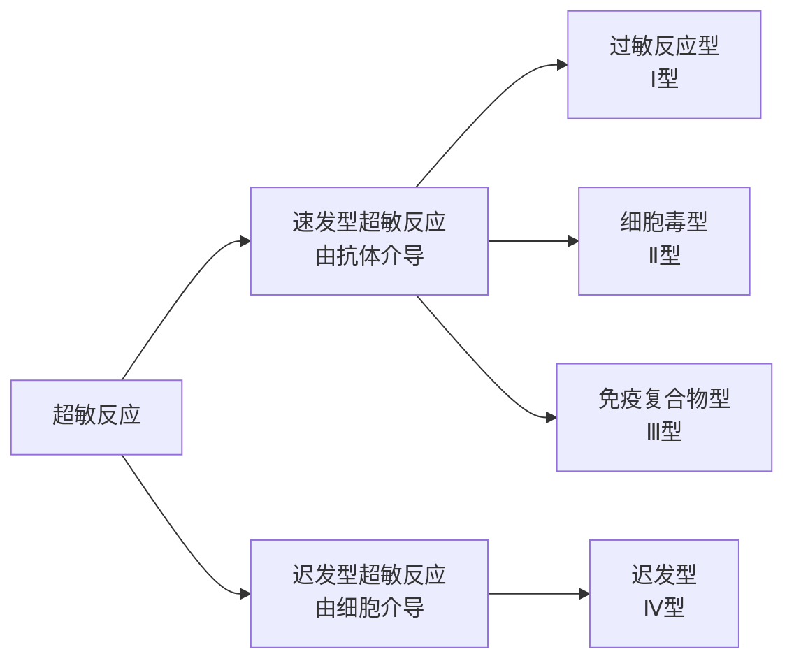

<h1>变态反应</h1>

## 概述
- 又称超敏反应，指免疫系统对再次进入机体内的抗原产生强烈的反应而导致机体损伤和炎症反应

## 过敏型超敏反应
- 指的是机体在再次接受抗原时引起的以**急性炎症**为特征的反应，引起该反应的抗原又可以称为过敏原
### 反应参与成分
##### 过敏原
种类很多，包括异源血清、花粉等
经由呼吸道、消化道、皮肤或组织黏膜进入机体，并在黏膜引起IgE的免疫应答
##### IgE
- 可介导寄生虫免疫反和过敏反应
IgE是一种亲细胞型的抗体，其$C_H4$片段可与肥大细胞、嗜碱性粒细胞胞膜上的相应受体结合
##### 肥大细胞&嗜碱性粒细胞
参与过敏型超敏反应的主要细胞，胞质内含有大量引起炎症反应的活性介质的膜型结合颗粒，被激活时释放细胞因子
##### 结合IgE Fc片段的受体
有两种$Fc \epsilon R$，肥大细胞和嗜碱性粒细胞表达高结合力的Ⅰ型$Fc \epsilon R$
### 反应过程
简单可以概括为以下的机制：
- 初次：过敏原引起机体产生IgE，结合于肥大细胞表面
- 二次：过敏原再次进入机体内，与抗体结合导致肥大细胞释放活性介质引发Ⅰ型超敏反应
反应过程可以分为三个阶段：
##### IgE的产生
过敏原初次进入机体内，APC呈递和$T_H2$作用下引起B细胞产生IgE
##### 活性细胞的致敏
IgE与肥大细胞或嗜碱性粒细胞表面的$Fc\epsilon R$结合，此时机体进入致敏阶段
##### 过敏反应
当过敏原再次进入机体内，与活性细胞表面的IgE结合，处于待命状态
>如果IgE与二次进入的过敏原结合后立马就启动全身的肥大细胞发生脱颗粒，则导致致命的过敏性休克。这在进化上是不允许的。过敏原往往是多价的

机体通过IgE的“交联机制”，即一个抗原抓住了多个IgE，才能激活细胞膜的下游信号通路，触发脱颗粒释放组胺，以及后续的膜磷脂代谢，包括释放白三烯，前列腺素
### 代表反应
- 急性全身型过敏反应
- 局部的过敏反应
## 细胞毒型超敏反应
- 又称为抗体依赖性细胞毒型超敏反应
### 反应过程
- 为什么会称作“抗体依赖性”：该反应启动依赖IgG或IgM
##### 反应启动
该反应的开始是由于抗体的Fab片段与细胞表面的抗原结合，Fc片段招募补体或是巨噬细胞
##### 反应核心路径
抗体与细胞抗原结合后后续依赖[[补体系统]]发挥作用，此处补体系统发挥了双重作用：
- 直接溶解
	参考[[补体系统#经典途径|经典途径]]，抗体尾部Fc片段结合C1q，激活经典途径，最终形成MAC，导致细胞膜的溶解反应
- 调理吞噬
	补体激活过程中产生的C3b片段或抗体本身的Fc片段，包裹在靶细胞表面，吞噬细胞表面受体可以识别这些片段，启动对靶细胞的吞噬作用

> **当靶细胞太大吞噬细胞无法完整吞下去该怎么办**
> 吞噬细胞会释放溶酶体酶、活性氧等破坏性物质直接到细胞间隙中，对组织细胞也会造成一定程度损伤
### 代表反应
##### 输血反应
当输入的血液与受血者的血型不匹配的时候，IgM会立刻识别结合输入红细胞的抗原，接着启动补体系统导致血管内红细胞的溶解，引起休克甚至死亡
##### 新生畜溶血症

## 免疫复合物型超敏反应
