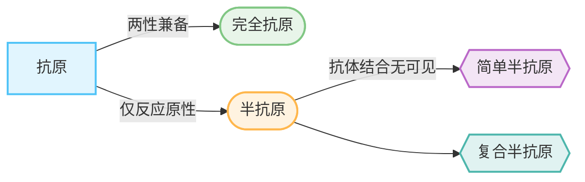

# 基本概念
##### 抗原
- 定义：能够刺激机体免疫系统产生特异性免疫应答，并能与相应免疫应答产物发生特异性结合的物质
##### 免疫原性
- 定义：抗原刺激机体产生抗体和效应淋巴细胞的特性
##### 反应原性/免疫反应性
- 定义：抗原与相应的抗体或效应淋巴细胞发生特异性结合的特性
##### 抗原性
- 定义：抗原所具备的两种特性，即[[#免疫原性]]与[[#反应原性/免疫反应性|反应原性]]的统称
---
根据上述的抗原性差异可以对抗原进行分类
##### 完全抗原
- 定义：既有免疫原性又有反应原性
- 例：大多数蛋白质、细菌、病毒等
##### 半抗原/不完全抗原
- 定义：只具有反应原性而缺乏免疫原性
- 例：多为简单的小分子，如多糖、类脂、一些药物、激素
根据某些具体现象再进行分类：
1. 简单半抗原
既不单独刺激机体产生抗体，与相应抗体结合后也不能出现肉眼可见反应
- **本质原因**：分子量极小，抗原决定簇数量少
	例：苯甲酸、抗生素
2. 复合半抗原
不能单独刺激机体产生抗体，本质原因上与简单半抗原相反，能与抗体结合会出现肉眼可见的反应
	例：荚膜多糖、LPS
### Conclusion

# 免疫原性影响因素
在[[#基本概念]]中我们了解到区别完全抗原与半抗原的依据是该物质是否存在[[#免疫原性]]，接下来就对免疫原性的影响因素进行介绍：
## 抗原分子的特性
### 异源性
又称为异物性或异质性
免疫应答的本质就是机体识别异物和排斥异物的应答
因此异物性物质又可以分为：
1. 异种物质
	亲缘关系越远，种系差异越大，免疫原性越强
2. 同种异体物质
	同种物质由于不同个体间的遗传差异，结构上也会表现出差异，从而具有一定的抗原性
3. 自身抗原
	正常情况下，机体在胚胎发育阶段对自身成分的免疫活性细胞已被清除，形成了**对自体的免疫耐受**，但在==自身组织蛋白结构异常、免疫系统识别紊乱、隐蔽自身组织成分重新显现==的情况下，会引发自身免疫性疾病
### 理化性状
#### 分子大小
一定范围内，分子粒径越大，其免疫原性越强
> 大分子物质更容易被抗原呈递细胞摄取，且形成胶体稳定结构
#### 化学组成与分子结构
蛋白质通常是良好的免疫原
脂类一般无抗原性
  > 结构组成与构想越复杂，免疫原性越强
#### 分子构象与易接近性
易接近性指抗原分子的特殊化学基团与抗原受体结合的难易程度
#### 物理状态
颗粒型抗原比可溶性抗原的抗原性更强
### 完整性
保持完整结构才能维持其抗原性
## 宿主
取决于受体动物的基因型、年龄、性别、健康状态
## 免疫方法
免疫抗原的剂量、接种途径、次数、佐剂种类
# 抗原表位
- **抗原决定簇/抗原决定基**：抗原分子表面具有特殊立体结构和免疫活性的化学基团
- 抗原决定簇通常位于抗原分子的表面，又称抗原表位，抗原表位体现出抗原的特异性
## 表位特征
### 表位大小
表位的大小通常是恒定的
### 表位数量
- **抗原价**：抗原分子还有表位的数量
	按数量分：单价抗原和多价抗原
	按特异性分：单特异性表位和多特异性表位
- **抗原的功能价**：位于抗原分子表面、能与免疫活性细胞接近并对免疫应答起决定性作用的表位
- **非功能价**：隐藏在抗原分子内部，需要通过一定途径(理化因素、酶解)才能暴露出来
### 分类
#### 构象表位
又称不连续表位，由分子基团间特定的空间构象决定
可被B细胞或抗体识别
#### 线性表位
又称连续表位和顺序表位，由蛋白质的一级结构决定
被B抗原受体和T抗原受体识别
#### B细胞表位
指的可以被BCR和抗体识别结合的表位，包括[[#构象表位]]和[[#线性表位]]
因为存在一定的空间构型，多是不需经过抗原呈递细胞处理呈递
#### T细胞表位
被MHC分子呈递后被TCR识别结合的表位，无构象无关，均为[[#线性表位]]
### 半抗原-载体
小分子的[[#半抗原/不完全抗原|半抗原]]不具有免疫原性
- 定义：半抗原与大分子载体结合后，能够具有免疫原性的现象。
> 半抗原实质上是B细胞表位，而载体可认为是T细胞表位的载体
- **载体效应**：半抗原与载体结合进行首次免疫产生抗体后，二次免疫时半抗原只有与首次免疫的免疫载体结合才能再次激活免疫应答反应的现象
> [!important] 完全抗原可以认为是半抗原和载体的复合物   细胞免疫取决于载体，体液免疫取决于半抗原

# 抗体的交叉性
- 定义：不同种类的抗原之间可能存在相似/共同的抗原结构、表位的现象。
# 抗原的分类
### 根据化学性质
蛋白质、多糖、糖蛋白、LPS等
### 根据抗原来源
- 异种抗原
- 同种异型抗原
- 自身抗原
- 异嗜性抗原：无亲缘性关系，存在于生物间的共同抗原，存在广泛的交叉反应性
### 对T细胞的依赖性
- 胸腺依赖性抗原
- 非胸腺依赖性抗原

| **比较项目**    | **TD抗原 (TD-Ag)**               | **TI抗原 (TI-Ag)**     |
| ----------- | ------------------------------ | -------------------- |
| **化学本质**    | 绝大多数是**蛋白质**                   | 多为**多糖**、脂多糖 (LPS)   |
| **结构特点**    | 结构复杂，有多种不同的抗原决定簇               | 结构简单，有**重复**排列的抗原决定簇 |
| **T细胞辅助**   | **必须** (需要Th细胞辅助)              | **不需要** (或仅需极少辅助)    |
| **MHC限制性**  | **有** (T细胞识别抗原受MHC限制)          | **无**                |
| **免疫球蛋白类别** | 产生**IgG, IgA, IgE**等 (发生了类别转换) | 主要产生**IgM** (极少类别转换) |
| **免疫记忆**    | **有** (产生记忆B细胞)                | **无** (或极弱)          |
| **抗体亲和力**   | **高** (发生了亲和力成熟)               | **低**                |
| **诱导免疫类型**  | 体液免疫 + 细胞免疫                    | 仅体液免疫                |
### 根据抗原加工和提成的方式
- 外源性抗原
- 内源性抗原
# 免疫佐剂和免疫调节剂
- **免疫佐剂**：非特异性免疫调节剂，与抗原混合或先于抗原注入体内非特异性增强免疫应答或改变免疫应答类型的物质
## 佐剂的种类
- 铝盐类
- 油乳剂
- 微生物及其代谢产物
- 免疫刺激复合物
- 蜂胶