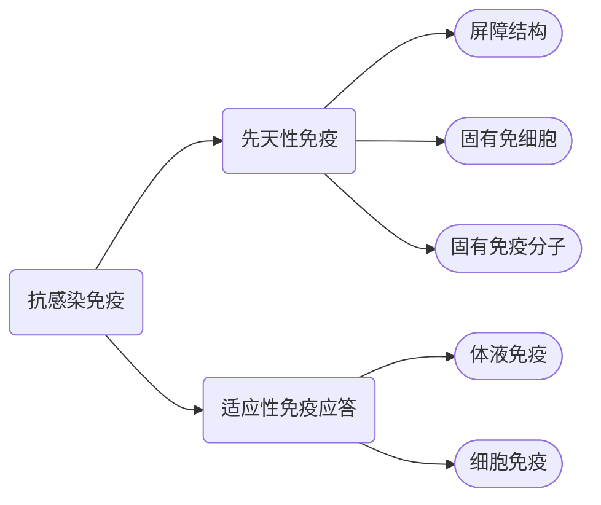

<h1>抗感染免疫</h1>

## 概述
- **抗感染免疫**是指动物机体抵抗病原体的能力
- **感染**过程实际上是机体与病原体之间互作的过程，免疫系统作为机体内抵抗病原体的一种途径
### 抗感染免疫的组成

## 抗细菌免疫
### 细菌感染
细菌致病力的强弱利用**毒力**来描述
评价毒力可以从两个角度出发：
##### 侵袭力
- 指的是病原菌突破宿主的身体防线，在宿主体内定殖、扩散的能力
- **定殖**：主要发生在宿主的黏膜上，细菌通过*抵抗宿主体内粘液分泌或是机械摆动*实现在宿主体内存留并开始繁殖
- **扩散**：细菌通过分泌水解酶类物质来使得组织基质变松散，利于病菌通过，这些酶类包括透明质酸酶(金葡菌、链球菌)、链激酶(溶血性链球菌，激活纤维蛋白酶)、链道酶(链球菌)、蛋白水解酶、胶原酶和弹性蛋白酶
##### 毒素
- 可以分为外毒素和内毒素
###### 外毒素
- 病原细菌在生长过程分泌到胞外的毒素或是细菌溶解后释放
- 化学本质是**蛋白质**
###### 内毒素
- 是$Gram^{-}$的细胞壁物质
- 主要成分是脂多糖(LPS)
- 毒性相对较弱，但可以引起[[第四章 炎症|炎症反应]]

|           | 外毒素       | 内毒素             |
| :-------- | :-------- | :-------------- |
| **产生菌**   | 革兰氏阳性菌为主  | 革兰氏阴性菌          |
| **化学成分**  | 蛋白质       | 脂多糖 (LPS)       |
| **释放时间**  | 一般随时分泌    | 菌体死亡裂解后释放       |
| **致病特异性** | 不同外毒素各不相同 | 不同病原菌的内毒素作用基本相同 |
| **毒性**    | 强         | 弱               |
| **抗原性**   | 完全抗原，抗原性强 | 不完全抗原，抗原性弱      |
| **制成类毒素** | 能         | 不能              |
| **热稳定性**  | 差         | 耐热性强            |