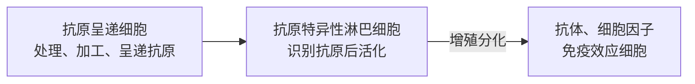
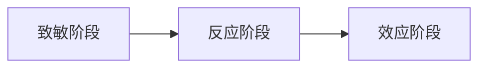

# Concpets Preparations
动物机体的免疫包括先天性免疫和适应性免疫
###### 适应性免疫应答
- 机体受到抗原物质的刺激后，免疫细胞对抗原分子进行识别并产生一系列免疫连锁反应和特定的生物学效应，最终建立对病原微生物的**特异性**免疫力的过程
- 过程：

##### 参与适应性免疫应答的细胞
- 抗原呈递细胞：树突状细胞、巨噬细胞
- 体液免疫：B淋巴细胞
- 细胞免疫：T淋巴细胞
- 感染细胞：加工提呈内源性抗原
##### 适应性免疫应答的场所
淋巴结、脾脏、黏膜相关淋巴组织
- 胸腺依赖区：T细胞分化增殖区域
- 淋巴滤泡：B细胞分化增殖区域
##### 免疫应答的特点
1. 特异性：争对某一特定的抗原
2. 耐受性：对自身组织细胞不产生免疫应答
3. 记忆性：特异性免疫应答后保留免疫记忆
4. 免疫期的概念：保持对某一特定抗原存在特异性免疫反应的持续时间
# 基本过程
人为划分为3个阶段：

## 致敏阶段
抗原呈递细胞摄取、捕获、加工、呈递抗原+T cell/ B cell对抗原的识别
## 反应阶段
T细胞&B细胞活化后增殖分化的阶段，产生效应性淋巴细胞和效应分子的过程：
- $T_H \rightarrow$效应性淋巴细胞，产生细胞因子
- T cell $\rightarrow$细胞毒性T细胞(TCL)
- B cell$\rightarrow$浆细胞
- part of T cell & B cell $\rightarrow T_M \& B_M$
## 效应阶段
增殖分化后的T细胞和B细胞发挥作用清除抗原物质的过程
# 抗原的加工和呈递
- 抗原加工：抗原呈递细胞(APC)通过胞吞等作用捕获、摄取抗原，消化降级为抗原肽的过程
- 抗原呈递：降解产生的抗原肽与MHC分子结合并运送到APC细胞表明，供免疫细胞识别的过程
### 分子基础
呈递是通过APC表达的MHC分子实现的，存在两类：Ⅰ类和Ⅱ类；
###### MHCⅠ类分子
内源性抗原处理后结合形成相应的复合体，呈递给$CD8^+$的细胞毒性T细胞
###### MHCⅡ类分子
$\alpha$链和$\beta$链组成的糖蛋白，肽链间通过非共价键结合，存在一个肽结合凹槽(裂隙)供处理后得到的抗原肽结合形成抗原-MHCⅡ类分子复合体，提呈给$CD4^+$的$T_H$细胞
> [!note] T细胞的激活
> T细胞发挥作用需要两个信号的激活：
> 1. 抗原-MHCⅡ复合体与TCR的结合
> 2. B7分子(CD80/CD86)与T细胞的CD28结合

对于三种抗原提呈细胞就会有：
- 树突状细胞：能够持续表达MHCⅡ和B7，因而抗原提呈能力最强，能够有效激活$T_H$
- 巨噬细胞：存在静止期(两种都不表达)，只有当吞噬或受到$IFN-\gamma$等细胞因子刺激后才能上调表达量
- B细胞：静止期(只表达MHCⅡ)，能活化记忆细胞和效应性细胞，活化后上调表达量
## 抗原提呈细胞的分类
根据[[#分子基础]]中提到的对于MHC分子类型进行分类：
#### 表达MHCⅡ类分子的抗原提呈细胞
- 如：树突状细胞、巨噬细胞、B细胞等专职APC，应对外源性抗原的处理和提呈$CD4^+$的$T_H$
#### 表达MHCⅠ类分子的抗原提呈细胞
- 所有的有核细胞均可以表达，感染后可将处理提呈供$CD8^+$的细胞毒性T细胞识别
## 外源性抗原的加工和提呈
- 外源性抗原：蛋白质、灭活细菌、毒素、病毒
根据上一节中提到的[[免疫系统#抗原提呈细胞|抗原提呈细胞]]，有3种主要摄取过程：
- 树突状细胞：利用Fc和补体受体吸附
- 巨噬细胞：Fc受体和C3b受体捕获、胞吞作用
- B细胞：受体介导的内吞作用
## 内源性抗原的加工和提呈
- 内源性抗原：细胞内部合成的蛋白，包括错误蛋白、病毒蛋白、肿瘤抗原，存在“泛素化”标签
### 加工过程
- 依赖蛋白酶体(20S蛋白酶体、免疫蛋白酶体)将带有泛素标签的蛋白降解成抗原肽
- 依赖TAP转运体(由TAP1和TAP2两个亚基组成)将“合格”的抗原肽泵入内质网腔
- 抗原肽进入内质网腔后与MHCⅠ分子结合形成复合体
## 交叉提呈与非肽抗原提呈
除了上述介绍的蛋白质抗原的摄取、加工处理、提呈过程外，这里探讨**例外**
### 交叉提呈
APC摄取后的抗原从吞噬泡中“逃逸”，被蛋白酶体捕获，后续过程同[[#内源性抗原的加工和提呈]]
### 非肽抗原提呈
对于糖脂和脂类，其提呈分子为CD1或MR1等非典型MHCⅠ(结构上接近MHCⅠ)，提呈目标是非传统T细胞(NKT、$\gamma \delta T$)
# T细胞和B细胞对抗原的识别
## T细胞对抗原的识别
由上可知：
- 识别外源性抗原的是$CD4^+$的$T_H$
- 识别内源性抗原的是$CD8^+$的CTL
T细胞进行识别依靠的TCR，与MHC复合体(Ⅰ类orⅡ类)结合识别，称为MHC的限制性
T细胞识别的是线性表位
### 辅助线T细胞对外源性抗原的识别
- CD3与TCR结合形成复合物，TCR识别抗原后，CD3将信号传递到胞内
- CD4作为MHCⅡ类分子的受体，有巩固作用
- 免疫黏附分子的作用
### CTL对内源性抗原的识别
- CTL是依靠TCR来识别MHCⅠ类复合物，然后直接介导杀死细胞，参见[[免疫系统#杀伤途径|杀伤途径]]
- 免疫黏附分子的作用
### T细胞对超抗原的识别
- 超抗原：极低浓度就可以引起免疫效应的抗原
- 直接以完整抗原形式与MHCⅡ类分子结合后与TCR结合
## B细胞对抗原的识别
- BCR识别抗原不需要APC处理，无MHC的限制性
- 存在多种物质的抗原识别表位
### 对TI抗原的识别
##### TI-Ⅰ抗原
- 如LPS
- 低浓度可以被B细胞聚拢识别(BCR)，引起活化产生抗体
- 高浓度与B细胞天然免疫受体(TLR-4/MD2/CD14)结合，引起多克隆B细胞活化
##### TI-Ⅱ抗原
- 如荚膜多糖、多聚鞭毛素
- 存在高度线性排列、的决定簇
### 对TD抗原的识别