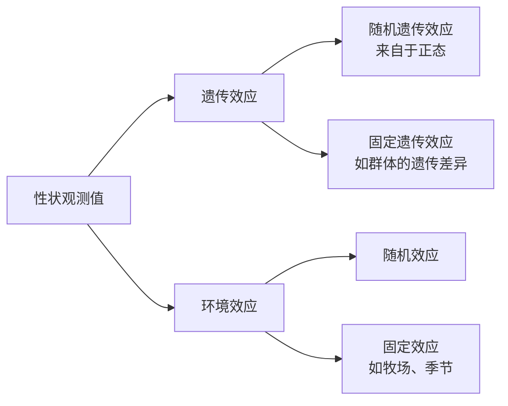

> [!important] 个体遗传的效果评定作为选种的基础

## 后裔测定
- 是选种最可靠的方法
- 多用于公畜，公畜后代数量产生多
- 测定不能度量的性状、限性性状(产奶量)、遗传力低性状(样本量多)
##### 优势
1. 后裔个体数量多
2. 验证性选种方法
##### 缺点
1. 测定时间所需时间长：后裔的生长时间长
2. 成本高
3. 为了保留更好的遗传个体，留种率增大
#### 测定注意事项
1. 减少母畜的影响
2. 排除环境影响
3. 后代数量要尽可能多
### 主要方法
##### 母女对比法
根据女儿的平均性状水平与其母亲平均水平性状的差异来比较：
- **改良**：女儿>母亲
- **中庸**：女儿$\approx$母亲
- **恶化**：女儿>母亲
##### 公牛指数法
女儿的产奶量等于其父母产奶量的平均数：$$
\begin{aligned}
D&=\frac{1}{2}(F+M) \\
F &= 2D-M
\end{aligned}$$
##### 不同公畜后代间比较法
###### 同期同龄女儿比较法
一头公牛在m个场与x头母牛交配
1. 得到该公牛女儿平均产奶量与同场其他公牛同期同龄女儿平均产奶量差值，即$$d_n=P_n-\bar{P_n}$$
2. 计算有效女儿数：$$\frac{1}{W_n}=\frac{1}{N_{1n}}+\frac{1}{N_{2n}}$$而后计算各场次的加权平均数：$$DW=\frac{\sum_{n=1}^{m}W_nd_n}{\sum_{n=1}^{m}W_n}$$
3. 计算育种值：$$\hat{A}=bDW+\bar{P}$$其中：$$b=\frac{0.25h^2\sum W_n}{1+(\sum W_n -1)0.25h^2}$$样本量够大的时候认为$b \approx 1$，计算相对育种值$$RBV=\frac{DW+\bar{P}}{\bar{P}} \times 100\%=\frac{\hat{A}}{\bar{P}} \times 100\%$$以此来比较该种畜和平均水平的差异
###### 最佳线性无偏预测法(best linear unbiased prediction, BLUP)
既能估计固定遗传效应，又能预测随机遗传效应

- 被测公牛来自于同一总体
- 公畜后代在群体的分布是随机的
$$Y_{ijkl}=\mu+h_i+g_j+s_{jk}+\epsilon_{ijkl}$$
其中：
- $h_i$是环境固定效应
- $g_j$是不同公牛组的固定遗传效应
- $s_{jk}$是公牛个体的随机效应
- $\epsilon_{ijkl}$是观察的随机误差
把群体固定效应和公牛个体的随机效应合称传递力，育种值等于2倍传递力
## 系谱测定
进行同代比较
信息入手早
## 同胞测定
- 全同胞：同父同母
- 半同胞：同父异母/同母异父
- 混合家系：一公畜家系
用于测定限性性状，难以测量的性状
## 个体本身测定
- 育种值(breeding value, BV)：==个体加性效应值==能够稳定遗传，并用于性状改进，即加性遗传效应
- 估计育种值(estimated breeding value, EBV)
- 估计传递力(estimated transmitting ability, ETA)，符合$$ETA=\frac{EBV}{2}$$
- 相对育种值(relative breeding value, RBV):$$RBV=(1+\frac{\hat{A}}{\bar{P}} )\times 100\%$$
- 综合育种值(total breeding value, TBV): $$H=\sum_{i=1}^{n}w_ia_i=w'a$$
##### 育种值估计公式
利用线性回归进行估计，以表型值P作为自变量，育种值A为应变量进行估计：$$\begin{aligned}
\hat{A}&=b_{AP}(P-\bar{P})+\bar{A}\\
\hat{A}&=b_{AP}(P-\bar{P})+\bar{P}; for\ a \ group,existing \ \bar{A}=\bar{P}
\end{aligned}$$
对于回归系数$b_{AP}$，我们有：$$
\begin{aligned}
b_{AP}  &= \frac{Cov(A,P)}{\sigma_P^2} \\
&= \frac{Cov(A,A+R)}{\sigma_P^2} \\
&= \frac{Cov(A,A)+Cov(A,R)}{\sigma_P^2} \\
&= \frac{\sigma_A^2}{\sigma_P^2}=h^2 \\
\end{aligned}
$$实际测定中由于测定的数据来源方式不同(单个体单次/多次，家系测平均值)，会对$h^2$进行加权计算
### 单性状育种值的估计方法
##### 本身记录资料
###### 一次记录
根据公式直接计算：$$\hat{A}=h^2(P-\bar{P})+\bar{P}$$此时估计育种值的排序与表型值的排序是一致的，只是在数值上进行了变化
###### 多次记录
需要对$b_{AP}$重新进行估计，即$$\hat{A}=(\bar{P_n}-\bar{P})h_{(n)}^2+\bar{P}$$
首先，我们需要引入一个重复力$r_e$来衡量哪些环境因素是通过多次测量无法消除掉的，即$$r_e=\frac{V_G+V_{Eg}}{V_P}$$
推导过程如下：$$
\begin{aligned}
P&=G+E \\
P&=G+E_g+E_s \\
P_n &=\frac{1}{n} \sum(G+E_g+E_s) \\
P_n &= G+E_g+\frac{\sum E_s}{n} \\
V_{P(n)} &= V_G + V_{Eg} + \frac{V_{Es}}{n} \\
Introducing \ r_e ,V_{P(n)} &= \frac{1+(n-1)r_e}{n}V_P
\end{aligned}
$$
上述计算中，由于$E_s$是随机效应，其估计均值的方差为$\frac{\sigma^2}{n}$
又因为遗传力的计算有：$$
\begin{aligned}
h_{(n)}^2&=\frac{V_A}{V_{P(n)}} \\
&=\frac{n}{1+(n-1)r_e}h^2
\end{aligned}
$$
所以，n越大会放大遗传力，但是$r_e$的存在限制了放大的程度
##### 祖先记录资料
###### 根据双亲一次记录估计育种值
双亲遗传的效应取平均
###### 单亲一次

##### 同胞记录资料
##### 后裔记录资料
