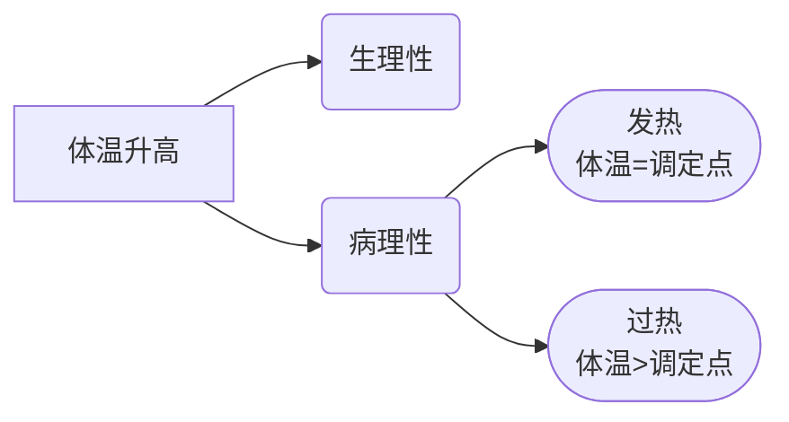
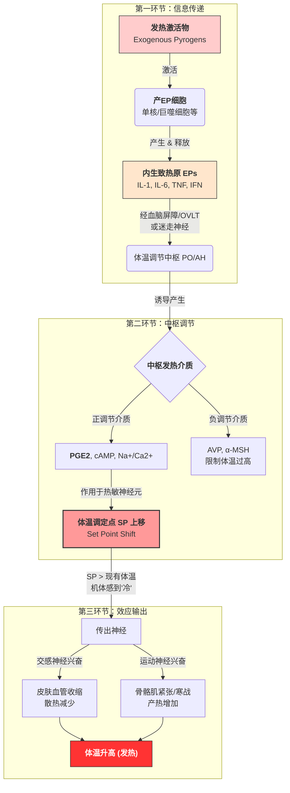

<center><h1>发热</h1></center>
## 概述


> [!note] 发热与过热的异同
> 同：体温数值均高于正常范围
> 异：下丘脑体温调节中枢的调定点是否改变


## 发热
- 在**致热源**的作用下导致体温调节中枢的调定点升高，最终使得体温升高(>0.5$^\circ C$)
### 原因&机制


##### 发热激活物
- 激活产内生性致热源的细胞产生和释放内生性致热源
- 可以分为微生物源与非微生物源，如：内毒素(LPS)、抗原抗体复合物
##### 内生性致热源
- 在[[#发热激活物]]的作用下发生，能引起机体体温升高的物质，即[[细胞因子]]
- 来源于肿瘤细胞、巨噬细胞
- 主要是`IL-1`(受体在视前区-下丘脑前部分布最多)，包括TNF和IFN
#### 机制说明
体温调节中枢存在正/负调节中枢：
##### 正调节介质
- 视前区-下丘脑前部
- 热敏神经元
- 冷敏神经元
##### 负调节介质
- 中部杏仁核
- 弓状核
- 腹中隔
#### 传递途径
内生性致热源作为“信使”分子，传递体温上升的信号，传递的途径主要包括：
1. 通过BBB
2. 刺激迷走神经
3. 下丘脑终板血管器
	想象是一个多孔的毛细血管，化学介质可以通过
#### 中枢分泌发热介质
体温调节中枢分泌**中枢发热介质**引起体温调定点的升高，中枢发热介质包括：
##### 正调节介质
- NO
- 前列腺素E2(PEG2)
- 促皮质激素释放激素
- cAMP
- 中枢$Na^+ / Ca^{2+}$
##### 负调节介质
机体自带的发热“刹车系统”，限制体温调节点的过度上移：
- 精氨酸加压素(AVP)：也称抗利尿激素(ADH)
- 黑素细胞刺激素($\alpha$-MSH)：增强散热
- 膜联蛋白A1：抑制CRH的作用
## 体温时相变化
### 发热时相变化
热相存在三个时期：
1. 体温上升期：产热>散热
2. 高热持续期：产热=散热
3. 体温下降期：产热<散热
```chart
type: line
labels: [1, 2, 3, 4, 5]
series:
  - title: Temperature
    data: [37.5, 39.2, 39.1, 39.4, 37.6 ]
tension: 0.12
width: 80%
labelColors: false
fill: false
beginAtZero: false
bestFit: false
bestFitTitle: undefined
bestFitNumber: 0
```

##### 体温上升期
产热来源存在有：
1. 寒战通过引起骨骼肌收缩增加散热
2. 棕色脂肪组织分解
3. 机体代谢率增加
散热降低可通过`蓝斑-交感-肾上腺髓质`系统释放儿茶酚胺类物质引起血管收缩，减少血流量从而降低散热
##### 体温下降期
当发热信号消失，引起的调定点复原，会激活热敏神经元，抑制冷敏神经元
### 热型

| **热型名称** | **英文名称**           | **核心特点 (体温曲线特征)**                                                                     | **典型疾病 (举例)**                 |
| -------- | ------------------ | ------------------------------------------------------------------------------------- | ----------------------------- |
| **稽留热**  | Continuous fever   | **“高而稳”**<br>1. 持续高热（39.0~40.0℃以上）。<br>2. 昼夜温差<1℃。<br>3. 持续数天或数周。                     | 大叶性肺炎、伤寒、斑疹伤寒、犬瘟热等。           |
| **弛张热**  | Remittent fever    | **“高而不稳，降不到底”**<br>1. 持续高热。<br>2. 昼夜温差>1℃<br>3. 最低体温仍**高于正常**水平。                      | 败血症、化脓性感染、支气管肺炎、风湿热、重症肺结核。    |
| **间歇热**  | Intermittent fever | **“有热有冷，骤起骤降”**<br>1. 高热期与无热期（正常体温）交替出现<br>2. 体温骤升至高峰，持续数小时后骤降至正常<br>3. 无热期可持续 1 天或数天 | **疟疾**（最典型）、肾盂肾炎、胆道感染。        |
| **回归热**  | Recurrent fever    | **“周期性轮替”**<br>1. 高热期与无热期交替出现。<br>2. 但周期较长：高热持续数天，无热持续数天，以此规律反复交替。                    | 回归热（螺旋体感染）、何杰金氏病（周期性发热）。      |
| **波状热**  | Undulant fever     | **“缓升缓降，状如波浪”**<br>1. 体温逐渐上升达 39℃ 以上，持续数天后又逐渐下降至正常。<br>2. 如此反复多次，曲线呈波浪状。              | **布鲁氏菌病**（最典型）、恶性淋巴瘤。         |
| **消耗热**  | Hectic fever       | **“极度波动，大起大落”**<br>1. 实际上是严重的弛张热。<br>2. 昼夜温差极大（常 >2~3℃）。<br>3. 伴有大量出汗、消瘦。             | 严重的败血症、重症活动性肺结核（由毒素严重消耗机体得名）。 |
## 发热的功能和代谢变化
### 代谢变化
- 体温升高，代谢基础率提高
- 各种代谢物质的变化
- 对各个系统也有影响，如中枢兴奋性提高、循环加快、消化抑制、呼吸加快、泌尿抑制