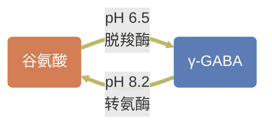

正常生理状态下机体内的酸碱浓度保持相对恒定，即**酸碱平衡**
- normal: 7.35-7.45
当酸碱失衡后，机体内存在调节机制：
	化学缓冲：碳酸盐、磷酸盐、蛋白盐
	生理缓冲：呼吸机制、肾脏排酸
某些病理情况下，体内的调节机制无法应对失调的酸碱，即引起**酸碱平衡紊乱**
## 机体调节
### 血液缓冲系统
血液的缓冲依赖于缓冲对体系：
##### 碳酸盐缓冲体系
碳酸及其盐是血液中重要的缓冲对物质
- 血浆缓冲对：$NaHCO_3/H_2CO_3$
- 红细胞缓冲对：$KHCO_3/H_2CO_3$
只能缓解碱和固定酸，不能缓冲挥发酸
根据电离常数会有：$$\begin{aligned}
pH&=pK_a+lg\frac{[HCO_3^-]}{[H_2CO_3]} \\
&=pK_a+\frac{lg[HCO_3^-]}{0.03 \times PaCO_2} \\
& \propto \frac{[HCO_3^-]}{PaCO_2}
\end{aligned}$$其中，$[HCO_3^-]$受代谢控制，$PaCO_2$受呼吸控制，当某一环节的控制，就引起相应的酸碱失衡
##### 非碳酸盐缓冲体系
缓冲$H_2CO_3$
- 血红蛋白缓冲对
- 血浆蛋白缓冲对
- 磷酸盐缓冲对
### 肺的调节
通过对呼吸运动的调节来控制$CO_2$的排出来控制pH的相对恒定，因此只对挥发性酸有效
参考生理学的知识，$CO_2$对呼吸的调节可以分为：
##### 中枢调节
$PaCO_2$提高会引起脑脊液中的$[H^+]$升高会兴奋延髓的呼吸中枢的化学感受器，提高肺泡通气量从而加快$CO_2$的排出
- **$CO_2$麻醉**：当$PaCO_2$超过一定指标时，会引起呼吸中枢抑制的现象
##### 外周调节
依赖主动脉弓和颈动脉窦的化学感受器相应动脉血分压的变化来调节呼吸运动
### 肾的调节
肾的调节作用较为缓慢，但维持时间长
##### 肾小管对碳酸氢钠的重吸收
###### 近曲小管
上皮细胞中存在碳酸酐酶，参与两个过程：
1. 催化胞内分解反应：$H_2CO_3 \rightarrow HCO_3^- + H^+$
2. 催化近曲小管内分解反应：$H_2CO_3 \rightarrow H_2O + CO_2$
胞内产生的$H^+$经膜上$H^+$-$Na^+$交换体排至近曲小管内，与经肾小球滤过的$HCO_3^-$重新结合生成碳酸再分解产生$CO_2$被上皮吸收
> [!note] 重吸收的$NaHCO_3$是由上皮重新生成的，并非最初为血液经肾小球滤过的

上皮内的$NaHCO_3$通过$Na^+$-$HCO_3^-$共转运体进入血液
###### 远端肾单位
依赖两种细胞：
- 主细胞：$Na^+$的重吸收
- 闰细胞：$HCO_3^-$的重吸收，与$Cl^-$交换
##### 磷酸盐的酸化

##### 铵根的排出
排氢、钾保钠
### 细胞调节
H-Na H-K交换
## 酸碱平衡的评级指标
### 血液pH值
- 参考范围：7.24~7.54
- 不能揭示病因
###  二氧化碳动脉分压($PaCO_2$)
动脉二氧化碳分压，可测定呼吸性酸碱平衡紊乱
### Actual bicarbonate & Standard bicarbonate
生理过程：实际碳酸氢盐=标准碳酸氢盐
比较过程：
- AB>SB，表明$CO_2$在体内潴留，多见于呼吸性酸中毒或代偿性碱中毒
- AB<SB，表明$CO_2$排出机体过多，多见于呼吸性碱中毒或代偿性酸中毒
- AB=SB
### 缓冲碱
- 指的是所有参与缓冲作用的阴离子总和
比较过程：
- BB<norm，代谢性酸中毒
- BB>norm，代谢性碱中毒
### 剩余碱
- 指的是滴定1L全血/血浆至pH7.4所需要的酸或碱的量，表示为细胞外液剩余碱或全血剩余碱
比较过程：
- BE正值增大：代谢性碱中毒/慢性呼吸性酸中毒
- BE负值增大：代谢性酸中毒
>[! important] **阴离子隙**(AG)：$$\begin{aligned} AG &= (Na^+ + K^+)-(Cl^- + HCO_3^-) \\ &=\text{未测阴离子}-\text{未测阳离子} \end{aligned}$$

AG升高：
未检测阴离子升高 代谢性酸中毒
未检测阳离子降低 低钙、镁血症
AG降低
## 单纯性酸碱平衡紊乱
### 代谢性酸中毒
碱性物质丢失
固定酸大量生成
原因：
固定酸生成增多
	酸性物质产生过多
	酸摄入过多
	肾脏排酸功能障碍
碱性物质丧失过多
	腹泻，慢性肾功能不全
高钾血症
	血液中K升高促使K-H交换增加
分类：
AG增高型
血氯正常，固定酸酸根含量增加
AG正常型
$HCO_3^-$浓度降低同时伴有血氯代偿性增加
大量输注生理盐水
代偿反应
依赖[[#机体调节]]
导致机体神经系统抑制($\gamma -GABA$)

氢离子升高：竞争钙离子结合肌钙蛋白降低收缩力
引起高钾血症 心律失常乃至心力衰竭
引起毛细血管前括约肌对儿茶酚胺类物质反应性降低
引起高通气，称为Kussmaul呼吸
引起骨盐溶解
治疗：
补充碳酸氢钠，量小，慢
纠酸补钾
### 呼吸性酸中毒
血液中$H_2CO_3$增加
$CO_2$排出障碍、吸入过多
肾脏排酸(慢性中明显)
伴有血钾提高，心室颤动
$CO_2$扩散通过血脑屏障，引起脑细胞酸中毒
改善通气 一般不用补碱
### 代谢性碱中毒
固定酸减少、碱性物质摄入增多
酸性物质丢失：消化道、肾脏(利尿剂，低氯性碱中毒)
纠酸过度
低钾血症 反酸尿 排钾降低 排氢增加
盐水反应性碱中毒
脱水、有效循环血量减少
盐水抵抗性碱中毒
原发性醛固酮提高
严重低钾血症
血量减少，继发性醛固酮提高
结合钙增加，心率失常 肌肉麻痹
盐水反应性：补盐水
盐水提抗性：纠正醛固酮 利用碳酸酐酶抑制剂
### 呼吸性碱中毒
气温过高 呼吸中枢兴奋 空气稀薄

