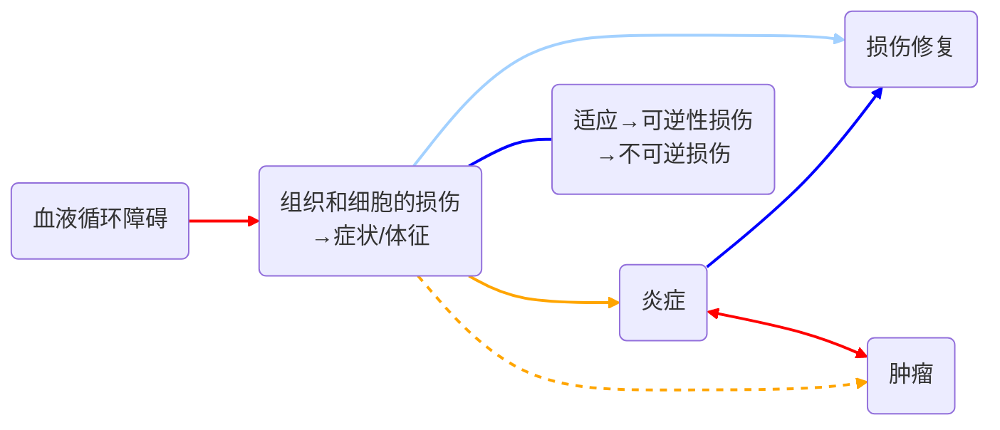

# 一、关于疾病的相关概念

## 1. 机体的不同状态

- 健康（health）：个体在生长、繁殖和行为模式上符合该群体的正常生命活动特征。  
- 疾病（disease）：正常生命活动因整个机体或机体中的某些器官的状态发生改变而被扰乱。
## 2. 疾病发生的要素

- 病因(etiology)：引起某一疾病==**必不可少**==、决定疾病特异性的致病因素。  
- 发生条件：性别、年龄、营养状况、免疫状态、气候、自然环境等。
## 3. 疾病发生的表现

当疾病发生的时候，机体会表现出体内器官或组织在代谢、功能和形态结构上的改变。通过下述几个名词来描述这些变化：
- 症状（symptom）：行为、体况、外观、精神、食欲和排泄等发生
的改变
	*可以通过观察得到*
- 体征（sign）：通过各种检查方法在患病机体发现的客观存在
的异常
	*通过仪器监测得到*
- 综合征（syndrome）：疾病过程中出现的一组复合的并存在内在联系的症状和体征的总和
	*体征更加系统化检定，more persuasive 作为判断个体状态的依据*
---
# 二、疾病的发生

一般疾病发生的底层逻辑如下：

- 疾病的发生发展是损伤与抗损伤力量的动态平衡过程。

---
## 三、死亡的定义与过程

## 1. 死亡的新观点
- 机体作为一个整体的功能永久性停止。
- 标志：脑死亡（brain death）。
## 2. 脑死亡的特征
- 脑干以上神经抑制导致呼吸和心跳停止。
- 脑死亡后一定时间内通过人工措施仍可维持除脑以外的躯体器官的暂时“存活”。
## 3. 死亡的病理过程
- 脑干以上神经处于深度抑制和功能丧失状态。
- 各重要器官的新陈代谢相继停止，功能和形态改变不可逆。

---
# 自学部分内容
- [ ]  淋巴系统的病理变化
- [ ]  脾的炎症与非炎症性病变
- [ ]  肠炎的类型及病理特征
- [ ]  肝炎的类型及病理特征
- [ ]  支气管肺炎的类型及病变特征
- [ ]  间质性肺炎的病变特征
- [ ]  中毒性肝病的病变特征
- [ ]  肝硬化的病理特征、临床联系及诊断
- [ ]  肾炎的类型及特征
- [ ]  骨营养不良性疾病的发病原因及特征

