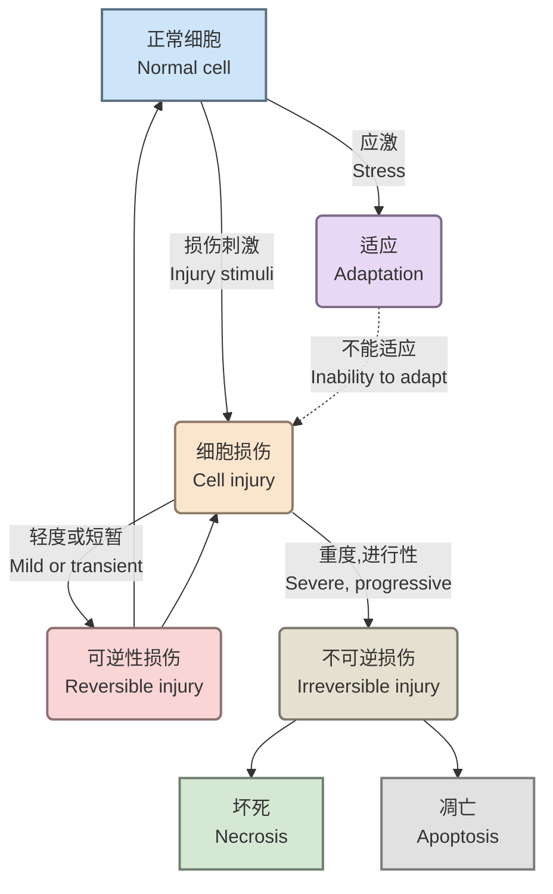

# 一、适应与损伤概述

细胞和组织的适应是指机体在内外环境变化下，通过结构或功能的调整以维持稳态的过程。适应可分为生理性与病理性，而损伤则涉及细胞结构破坏或功能丧失。[[病理解剖学/总论#二、疾病的发生|病理的基本逻辑]]

## **适应的类型**

1. 生理性适应（physiological adaption）
	- 内源性激素
	- 化学介质
2. 病理性适应（pathological adaption）
	- 病理性应激
	- 结构和功能的调整
	- 避免损伤

---
# 二、几种适应的方式

## 1. 萎缩（Atrophy）

1. **定义**
    - 已发育成熟的器官、组织或细胞体积缩小，功能减退。
2. **类型与原因**
    参考[[#**适应的类型**|适应的类型]]，有以下的分类形式
    - **生理性萎缩**：
        - 与年龄有关，如胸腺的萎缩
    - **病理性萎缩**：
        - 全身性萎缩
            - 长期营养缺乏
            - 慢性消化道疾病
            - 慢性消耗性疾病
            - 各种组织萎缩的顺序：脂肪组织→肌肉→肝、肾、脾、淋巴器官→心、脑
        - 局部性萎缩
- 
	**组织学变化**：实质细胞数量/体积减小
3. **一些例子**
    - 脂褐素沉积与慢性消耗性萎缩相关
    - 自噬与凋亡异常可能导致细胞器未被彻底消化

---
## 二、肥大（Hypertrophy）

1. **定义**
    - 实质细胞体积增大，导致组织或器官体积增大。
    - 功能增强（如心脏因负荷增加而肥大）。
2. **分类**
    - **真性肥大**：细胞体积增大，如儿童杜兴肌营养不良（DMD）和贝克肌营养不良（BMD）的肌肉组织因肌纤维萎缩被脂肪填充，但此描述可能需结合其他条目进一步确认。
    - **假性肥大**：实质细胞体积缩小或数量减少，纤维或脂肪组织增生导致体积增大（如慢性消耗性萎缩相关病变）
---
