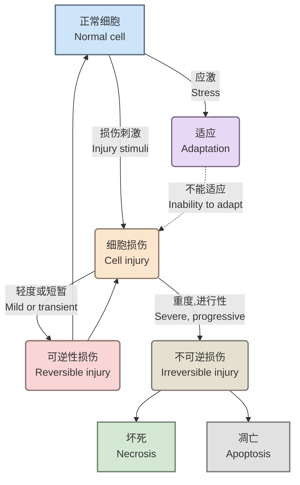
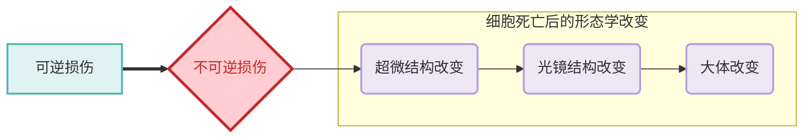

# 一、适应与损伤概述

细胞和组织的适应是指机体在内外环境变化下，通过结构或功能的调整以维持稳态的过程。适应可分为生理性与病理性，而损伤则涉及细胞结构破坏或功能丧失。[[病理解剖学/总论#二、疾病的发生|病理的基本逻辑]]

## **适应的类型**

1. 生理性适应（physiological adaption）
	- 内源性激素
	- 化学介质
2. 病理性适应（pathological adaption）
	- 病理性应激
	- 结构和功能的调整
	- 避免损伤

---
# 二、几种细胞的适应性反应

## 1. 萎缩（Atrophy）

1. **定义**
    - 已发育成熟的器官、组织或细胞体积缩小，功能减退。
2. **类型与原因**
    参考[[#**适应的类型**|适应的类型]]，有以下的分类形式
    - **生理性萎缩**：
        - 与年龄有关，如胸腺的萎缩
    - **病理性萎缩**：
        - 全身性萎缩
            - 长期营养缺乏
            - 慢性消化道疾病，由消化道器官疾病导致消化道正常的运动、消化和吸收功能发生障碍
            - 慢性消耗性疾病，消耗大量营养物质和影响机体的代谢
            - 各种组织萎缩的顺序：脂肪组织→肌肉→肝、肾、脾、淋巴器官→心、脑
        - 局部性萎缩
	        - 营养不良性萎缩
		        - 局部营养不良
		        - 全身营养不良
	        - 压迫性萎缩（compression）
	        - 失用性萎缩（disuse atropy）
	        - 去神经性萎缩（denervation）
	        - 内分泌性萎缩（loss of hormonal stimulation）
		- **组织学变化**：实质细胞数量/体积减小
3. **一些例子**
    - 脂褐素沉积与慢性消耗性萎缩相关
    - 自噬与凋亡异常可能导致细胞器未被彻底消化

---
## 2、肥大（Hypertrophy）

### 肥大类别
#### 本质分类
1. **真性肥大**
    - 实质细胞体积增大，导致组织或器官体积增大。
    - 功能增强（如心脏因负荷增加而肥大）。仅仅因==细胞体积增大==而引起的变化，血液循环压力导致不同心室出现肥大，属于是[[第一章 细胞和组织的适应与损伤#参考 第一章 细胞和组织的适应与损伤 **适应的类型** 适应的类型|病理性肥大]]
2. **假性肥大（*pseudohypertrophy*）**
	- 如儿童杜兴肌营养不良（DMD）和贝克肌营养不良（BMD），以及肌肉组织因肌纤维萎缩被脂肪填充
    - 实质细胞体积缩小或数量减少，出现萎缩，纤维或脂肪组织增生导致体积增大，降低器官的基本功能（如慢性消耗性萎缩相关病变）
#### 参考[[第一章 细胞和组织的适应与损伤#**适应的类型**|适应的类型]]
1. 生理性肥大：适应机体生理功能需要而发生的肥大
2. 病理性肥大：又称代偿性肥大，由于病因而造成的机能负担增加或是补偿器官机能不足，存在局限性，长时间内不改善导致体征失衡

---
## 3、增生
**定义**：组织或器官内细胞数量增多导致的组织或器官体积增大
形态学上和肥大很难区分
### 分类
1. 生理性增生
	- 代偿性增生：缺氧导致红细胞数量增加
	- 内分泌性增生：激素等引起的，如泌乳前腺上皮增加 
	- [ ] 乳腺增生的原因
2. 病理性增生
	- 激素、生长因子增多
		**例** 甲状腺增生：甲状腺激素合成不足或TSH过度刺激引起的代偿性增生
		- 碘缺乏
			甲状腺激素分泌不足，TRH促使垂体分泌过量TSH，刺激甲状腺滤泡上皮细胞使其增生、肥大
		- 甲状腺素分泌不足（反应性增生）
			甲状腺炎症或切除导致$T_3, T_4$的合成下降，通过调控轴引起的甲状腺增生，常见于桥本氏甲状腺炎
		- 自身免疫性疾病
			自身抗体刺激甲状腺组织增生
			- *Graves*病：模拟TSH的作用，持续激活甲状腺滤泡上皮细胞
			- 桥本氏甲状腺炎：抗体攻击甲状腺细胞，引起炎症，促进甲状腺增生
		- 碘深入过多
			长期摄入过量碘，干扰了正常的甲状腺激素的合成，导致碘源性甲亢或甲状腺功能减退
			无论是甲亢还是甲减，TSH均会分泌异常，导致甲状腺增生
	- 慢性炎症：肠粘膜上皮增生，下层腺体的增生→有可能转变成肿瘤

---
## 4、化生
**定义**：已经成熟分化的细胞在结构和功能上转变为另一种细胞，使得对某种刺激敏感的细胞被对该刺激耐性的细胞取代（如食管的复层鳞状上皮→胃上皮，气管假复层纤毛上皮→复层鳞状上皮，成纤维细胞→骨/软骨），==非同源细胞无法“转变”==
### 1. 发生原因
- VA缺乏：食道上皮
- 慢性炎症：支气管炎&慢性子宫颈炎
- 化学物质刺激
- 慢性机械性刺激：膀胱结石，变移上皮鳞状化生
- 致瘤因素：唾液腺肿瘤，腺上皮化生为软骨样组织
### 2. 特点及机制
- 只发生于分裂增值活跃的细胞
	⭐基因发生了重编程，干细胞、储存的幼稚细胞分化从而取代
- 与分化一样，是从特异性高→特异性低
- 主要集中于上皮组织和间叶组织（结缔组织）的化生
### 3.意义
1. 局部抵御外界刺激能力增强
2. 可能有癌变的良性病变

---
## 5、自噬
在自噬基因的调控下，利用溶酶体降解自身成分（碳水、错误折叠蛋白、坏掉的细胞器、病原体）
### 1. 诱导因素
#### 细胞内应激因素
细胞内感染、线粒体损伤、内质网应激、蛋白错误折叠或凝聚
#### 细胞外应激因素
营养缺乏、营养因子缺乏、低氧、高温
### 2. 调控机制
很复杂

---
# 三、细胞和组织损伤
受到超过适应能力的刺激后表现出来的变化，泛称为损伤
## 1. 发生机制
- ATP耗竭
- 线粒体损伤
- 细胞膜通透性改变
- 生物学过程障碍，尤其是蛋白合成
- DNA损伤
## 2. 形态改变的过程
如下图：

## 3. 几种类型
### 变性
- **概念**：细胞内或间质中异常物质形成，或正常物质含量增多。实质细胞的变性是可逆的，一些组织或细胞发生退行性变化时，也成为变性，神经细胞的退行性变化称为神经细胞变性
- 分类：
	1. 细胞肿胀
		表现：胞浆内出现微细颗粒（肿胀的线粒体/内质网）或大小不等的水泡，器官肿胀，边缘变钝、无光泽
		分类：
		- 水泡变性：多见于被覆上皮、肝细胞、肾小管上皮细胞和心肌细胞
		- 颗粒变性：多见于肝细胞、肾小管上皮细胞和心肌细胞，由颗粒变性发展而来，由于胞内水分增加导致在胞质中形成大小不等的水泡
		![[Pasted image 20251002103508.png|肝水样变性]]![[Pasted image 20251002105707.png|肾小管上皮水样变性]]
		原因：缺氧、中毒、感染、发热
		机制：线粒体内氧化磷酸化障碍→ATP减少→膜钠泵功能降低→细胞膜渗透性增加→$Na^+$、$H_2O$进入细胞引起线粒体、内质网、高尔基体的肿胀（即颗粒）
	2. 脂肪变性
		表现：甘油三酯在非脂肪细胞内积累，细胞内脂滴增多，类似于脂肪细胞一样，肝体积增大，切面有明显油腻感
		范围：肝细胞、心肌细胞、肾小管上皮细胞、骨骼肌细胞
		![[Pasted image 20251002110343.png|脂肪肝，HE染色]]
		原因：缺氧、中毒、营养不良
		机制：
		- **例**：肝脂变
			机制：游离的脂肪酸被肝脏吸收后有以下几个途径：
				氧化成酮体；磷脂；胆固醇酯
				与$\alpha$-磷酸甘油缩合形成甘油三酯
		- **例**：心肌脂肪变性