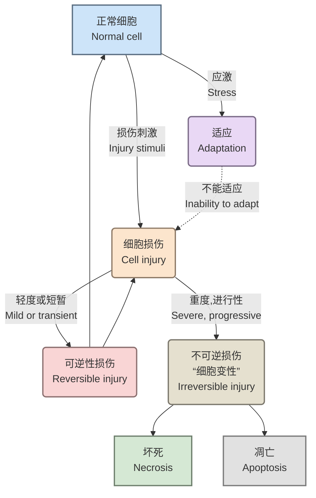
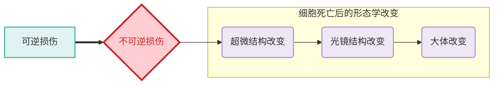
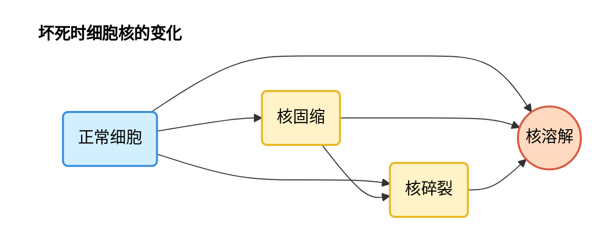

# 一、适应与损伤概述
细胞和组织的适应是指机体在内外环境变化下，通过结构或功能的调整以维持稳态的过程。适应可分为生理性与病理性，而损伤则涉及细胞结构破坏或功能丧失。[[病理解剖学/总论#二、疾病的发生|病理的基本逻辑]]

---
# 二、几种细胞的适应性反应
- **适应**：在环境条件发生改变时，细胞在数量、大小、表型、代谢或功能发生的==可逆性变化==
- **类型**：
1. 生理性适应（physiological adaption）
	- 内源性激素$\rightarrow$乳腺增大、子宫肥大
	- 化学介质
2. 病理性适应（pathological adaption）
	- 病理性应激
	- 结构和功能的调整
	- 避免损伤
## 1. 萎缩
1. **定义**：已发育成熟的器官、组织或细胞体积缩小，功能减退。
2. **类型与原因**
    参考[[#**适应的类型**|适应的类型]]，有以下的分类形式
    - **生理性萎缩**：
        - 与年龄有关，如胸腺的萎缩
    - **病理性萎缩**：
        - 全身性萎缩
            - 长期营养缺乏
            - 慢性消化道疾病，由消化道器官疾病导致消化道正常的运动、消化和吸收功能发生障碍
            - 慢性消耗性疾病，消耗大量营养物质和影响机体的代谢
            - 各种组织萎缩的顺序：脂肪组织→肌肉→肝、肾、脾、淋巴器官→心、脑
        - 局部性萎缩
	        - 营养不良性萎缩
		        - 局部营养不良
		        - 全身营养不良：长期营养不良，引起全身器官萎缩，称为**恶病质**
	        - 压迫性萎缩（compression）
	        - 失用性萎缩（disuse atropy）
	        - 去神经性萎缩（denervation）
	        - 内分泌性萎缩（loss of hormonal stimulation）
3. **萎缩的病理变化**
	萎缩的器官发生实质细胞数量/体积减小，细胞器如线粒体、内质网发生退化
    - 脂褐素沉积与慢性消耗性萎缩相关
	    萎缩的心肌和肝细胞会出现棕黄色、具有折光性的颗粒，称为脂褐素，本质上是溶酶体中富含磷脂的细胞器碎片。
	    - **褐色萎缩**：当萎缩器官内存在大量脂褐素沉淀时，使得整个器官呈现棕褐色的萎缩类型
    - 自噬与凋亡异常可能导致细胞器未被彻底消化

---
## 2、肥大
### 肥大类别
#### 本质分类
1. **真性肥大**
    - 实质细胞体积增大，导致组织或器官体积增大。
    - 功能增强（如心脏因负荷增加而肥大）。仅仅因==细胞体积增大==而引起的变化，血液循环压力导致不同心室出现肥大，属于是[[第一章 细胞和组织的适应与损伤#参考 第一章 细胞和组织的适应与损伤 **适应的类型** 适应的类型|病理性肥大]]
2. **假性肥大（*pseudohypertrophy*）**
	- 如儿童杜兴肌营养不良（DMD）和贝克肌营养不良（BMD），以及肌肉组织因肌纤维萎缩被脂肪填充
    - 实质细胞体积缩小或数量减少，出现萎缩，纤维或脂肪组织增生导致体积增大，降低器官的基本功能（如慢性消耗性萎缩相关病变）
#### 参考[[第一章 细胞和组织的适应与损伤#**适应的类型**|适应的类型]]可以继续细分为：
1. 生理性肥大：适应机体生理功能需要而发生的肥大
2. 病理性肥大：又称代偿性肥大，由于病因而造成的机能负担增加或是补偿器官机能不足，存在局限性，长时间内不改善导致体征失衡
平滑肌既可以发生[[#2、肥大|肥大]]，也可以发生[[#3、增生|增生]]
---
## 3、增生
**定义**：组织或器官内细胞数量增多导致的组织或器官体积增大
形态学上和肥大很难区分
### 分类
1. 生理性增生
	- 代偿性增生：缺氧导致红细胞数量增加
	- 内分泌性增生：激素等引起的，如泌乳前腺上皮增加 
	- [x] 乳腺增生的原因[[乳腺增生|查看此处]]
2. 病理性增生
	- 激素、生长因子增多
		**例** 甲状腺增生：甲状腺激素合成不足或TSH过度刺激引起的代偿性增生
		- 碘缺乏
			甲状腺激素分泌不足，TRH促使垂体分泌过量TSH，刺激甲状腺滤泡上皮细胞使其增生、肥大
		- 甲状腺素分泌不足（反应性增生）
			甲状腺炎症或切除导致$T_3, T_4$的合成下降，通过调控轴引起的甲状腺增生，常见于桥本氏甲状腺炎
		- 自身免疫性疾病
			自身抗体刺激甲状腺组织增生
			- *Graves*病：模拟TSH的作用，持续激活甲状腺滤泡上皮细胞
			- 桥本氏甲状腺炎：抗体攻击甲状腺细胞，引起炎症，促进甲状腺增生
		- 碘摄入过多
			长期摄入过量碘，干扰了正常的甲状腺激素的合成，导致碘源性甲亢或甲状腺功能减退
			无论是甲亢还是甲减，TSH均会分泌异常，导致甲状腺增生
	- 慢性炎症：肠粘膜上皮增生，下层腺体的增生→有可能转变成肿瘤

---
## 4、化生
**定义**：已经成熟分化的细胞在结构和功能上转变为另一种细胞，使得对某种刺激敏感的细胞被对该刺激耐性的细胞取代（如食管的复层鳞状上皮→胃上皮，气管假复层纤毛上皮→复层鳞状上皮，成纤维细胞→骨/软骨），==非同源细胞无法“转变”==
### 1. 发生原因
- VA缺乏：食道上皮
- 慢性炎症：支气管炎&慢性子宫颈炎
- 化学物质刺激
- 慢性机械性刺激：膀胱结石，变移上皮鳞状化生
- 致瘤因素：唾液腺肿瘤，腺上皮化生为软骨样组织
### 2. 特点及机制
- 只发生于分裂增值活跃的细胞
	⭐基因发生了重编程，干细胞、储存的幼稚细胞分化从而取代
- 与分化一样，是从特异性高→特异性低
- 主要集中于上皮组织和间叶组织（结缔组织）的化生
### 3.意义
1. 局部抵御外界刺激能力增强
2. 可能有癌变的良性病变
#### 上皮-间充质转化
指的是上皮细胞通过特定程序转换为间充质细胞的生物学过程
间充质细胞可分化为结缔组织

---
## 5、自噬
在==自噬基因==的调控下，利用==溶酶体==降解自身成分（碳水、错误折叠蛋白、坏掉的细胞器、病原体）
### 1. 诱导因素
#### 细胞内应激因素
细胞内感染、线粒体损伤、内质网应激、蛋白错误折叠或凝聚
#### 细胞外应激因素
营养缺乏、营养因子缺乏、低氧、高温
### 2. 调控机制
很复杂

---
# 三、细胞和组织损伤
受到超过适应能力的刺激后表现出来的变化，泛称为损伤
## 1. 发生机制
- ATP耗竭：低氧和中毒
- 线粒体损伤 
- 细胞膜通透性改变
- 生物学过程障碍，尤其是蛋白合成
- DNA损伤
## 2. 形态改变的过程
如下图：

## 3. 类型
### 变性
- **概念**：细胞内或间质中异常物质形成，或正常物质含量增多。实质细胞的变性是可逆的，一些组织或细胞发生退行性变化时，也成为变性，神经细胞的退行性变化称为神经细胞变性
#### 分类：
##### 细胞肿胀
- 表现：胞浆内出现微细颗粒（肿胀的线粒体/内质网）或大小不等的水泡，器官肿胀，边缘变钝、无光泽
- 原因：缺氧、中毒、感染、发热
- 病理变化：
- 机制：线粒体内氧化磷酸化障碍→ATP减少→膜钠泵功能降低→细胞膜渗透性增加→$Na^+$、$H_2O$进入细胞引起线粒体、内质网、高尔基体的肿胀（即颗粒）
- 分类：
	- 水泡变性：多见于被覆上皮、肝细胞、肾小管上皮细胞和心肌细胞
	
	- 颗粒变性：多见于肝细胞、肾小管上皮细胞和心肌细胞，由颗粒变性发展而来，由于胞内水分增加导致在胞质中形成大小不等的水泡![[Pasted image 20251002103508.png|肝水样变性，可见肝窦变小]]![[Pasted image 20251002105707.png|肾小管上皮水样变性]]
##### 脂肪变性
- 表现：甘油三酯在非脂肪细胞内积累，细胞内脂滴增多，类似于脂肪细胞一样，肝体积增大，切面有明显油腻感
- 范围：肝细胞、心肌细胞、肾小管上皮细胞、骨骼肌细胞
![[Pasted image 20251002110343.png|脂肪肝，HE染色]]
- 原因：缺氧、中毒、营养不良
- 机制：
	- **例**：肝脂变
		机制：游离的脂肪酸被肝脏吸收后有以下几个途径：
			氧化成酮体；磷脂；胆固醇酯
			与$\alpha$-磷酸甘油缩合形成甘油三酯→形成脂蛋白分泌
			分解代谢
			高脂饮食或营养不良时，体内的脂肪酸含量增加，引起过量脂肪酸进入肝
			缺氧时肝细胞内乳酸大量转换成脂肪酸
			-氧化脂肪酸障碍引起脂肪酸堆积
	- **例**：心肌脂肪变性
		- 局灶性（虎斑心）：多见于左心室心内膜下乳头肌，与正常心肌相间形成黄红色斑纹
		![[Pasted image 20251002134846.png|心肌脂肪变性，HE ×400，胞浆被脂肪填充]]
		- 弥漫性：两侧心室心肌弥漫淡黄色，多由于严重缺氧和中毒
		 - 心肌脂肪浸润：心外膜下过多脂肪向心肌入伸
		![[Pasted image 20251002113732.png|弥漫性心肌脂肪变性，肌束间被脂肪细胞填充]]
	- **例**：肾脂肪变性
		上皮细胞胞浆内被脂肪填充，细胞核被挤压至一侧，肾小管管腔变小
		![[Pasted image 20251002135401.png|肾脂肪变性]]
##### 透明变性
又称玻璃样变性，在间质或细胞内出现均质、半透明的玻璃样物质，被伊红或酸性复红染色后为==鲜红色==，不同原因产生的透明蛋白化学成分不同
- 分类：
	- 结缔组织透明变性
		**机制**：原胶原蛋白分子间交联增加，胶原纤维融合，糖蛋白积聚
		表现为组织变硬，失去弹性，显微镜下为半透明均质无结构物质
		可见于瘢痕组织、肾小球、动脉粥样硬化的纤维瘢块
		![[Pasted image 20251002141526.png|结缔组织透明变性，HE×400，被伊红染的即为胶原纤维]]
	- 血管壁透明变性
		多见于小动脉管壁，光镜下观察小动脉管壁变厚，管腔变窄甚至闭塞
		机制：小动脉持续痉挛→内膜通透性提高→血浆蛋白经内皮渗入内皮细胞下凝固形成无结构透明玻璃样物质
		![[656f04c8dcac10225296b39f6a11efab.png|血管壁透明变性，HE×400]]
	- 细胞内透明变性
		又称为透明滴状变，主要见于肾小管上皮细胞和浆细胞
		机制：
			以肾小管为例，肾小球肾炎时，肾小球毛细血管的渗透性提高，血浆蛋白大量滤除进入肾小管，近曲小管上皮细胞胞吞后在胞质内形成玻璃样滴状物。滴状物HE染色时被红染
			![[Pasted image 20251002155138.png|肾小管发生透明滴状变，HE×400，可见红色滴状物于肾小管内与肾小管上皮细胞]]
			对于浆细胞，多发生因慢性炎症，镜检可见胞浆内出现圆形或椭圆形、红染、均质的玻璃样小题，也称拉塞尔小体（Russel body）。电镜下可知是免疫球蛋白大量充满而肿胀的粗面内质网
			![[Pasted image 20251002162452.png|如图中箭头所示]]
##### 淀粉样变性
是指器官的网状纤维、小血管壁与细胞之间出现淀粉样物质沉着，即错误折叠的蛋白质堆积
- 机制上存在两种类型：
1. 继发性：多见于慢性炎症，血清中出现高水平的$\alpha_1$球蛋白，也成为血清淀粉样蛋白A（SSA），SSA被巨噬细胞水解为淀粉样相关蛋白A（AA），AA沉积于组织的网状纤维引起
2. 原发性：可见于恶性浆细胞瘤，肿瘤性浆细胞可合成大量免疫球蛋白轻链及其片段，称为淀粉样轻链蛋白的前体，而后经血液循环发生与继发性相似的过程![[Pasted image 20251002163352.png|如图肝细胞索之间存在大量均质淡红色淀粉样物质，肝细胞索受压收缩]]
##### 黏液样变
指结缔组织中出现类黏液（由结缔组织产生的蛋白质和粘多糖形成的复合物）的积聚
可以通过阿辛蓝染色可区分黏液样变和黏液
![[Pasted image 20251002164752.png|成纤维细胞间有大量黏液样物质沉积]]
### 病理性物质沉积
- **概念**：
- 分类：
1. 糖原累积症
正常情况下，糖原贮存在肝脏和肌肉内，肾上腺皮质功能亢进时会引起肝脏糖原累计，代谢性肌病会引起肌肉糖原累计
又称糖皮质激素性肝病，会引起肝细胞空泡化
⭐区别于脂肪变性：
- 空泡在肝脏中分布不均匀
- 空泡与脂滴不同
- 通过PAS染色鉴定（通过检测$-CHO$来检测糖类物质）
<figure>
	
	<figcaption style="text-align: center; margin-top: 12px; font-style: italic; font-weight: bold">糖皮质激素性肝病</figcaption>
</figure>
2.  病理性钙盐沉积
指的时磷酸钙或碳酸钙在软组织中沉积，常规只有牙和骨中才有钙盐沉积
- 分类：
	1. 营养性不良钙化
		指固体性钙盐沉积在变性、坏死组织或病理产物中的钙化，如[[第三章 局部血液循环障碍#梗死|梗死]]引起的钙盐沉积 
	2. 转移性钙化、
		由于全身性钙、磷代谢障碍，血$Ca^{2+}$含量$\uparrow$，在基膜和弹性纤维上沉积导致钙化
		致病原因：
		1. 肾病 引起磷酸盐滞留从而导致钙磷比例失衡
		2. VD中毒 增强胃肠对$Ca^{2+}$的吸收，提升血钙浓度
		3. 甲状旁腺功能亢进 PTH过度分泌，促使骨释放大量$Ca^{2+}$
	3. 异位性骨化
		指的是骨组织在骨外形成，不同于病理性钙化
### 坏死
- 概念：局部组织或细胞的死亡称为坏死。可由组织、细胞的变性等可逆性损伤逐渐发展而来，属于渐进性坏死。是不可逆损伤的过程
- 病理变化：
	- 细胞核的变化
		核的变化是细胞坏死的主要形态学标志，包括核浓缩、核碎裂和核溶解3种形式

#### 类型：
##### 凝固性坏死
坏死组织由于蛋白质凝固、水分减少而呈灰白色比较坚实的凝固物
坏死区周围常有出血带与健康组织形成分界，组织结构与轮廓仍保持完整
局部急性缺血[[第三章 局部血液循环障碍#梗死|梗死]]引起的肾脏贫血性梗死是典型的凝固性坏死
肌肉的凝固性坏死叫做**蜡样坏死**
![[Pasted image 20251003104046.png|可以观察到梗死区肾小管轮廓仍存在，但是胞核已观察不到]]
##### 干酪性坏死
属于特殊的[[#凝固性坏死]]，主要见于==结核杆菌==引起的坏死，特征是坏死组织崩解彻底，眼观灰黄色，如干酪状，光镜下观察组织固有结构被破坏，轮廓消失
![[Pasted image 20251003105047.png|牛肺结核，图中红染区域即为干酪性坏死区]]
<figure>
	
	<figcaption style="text-align: center; margin-top: 12px; font-style: italic; font-weight: bold">干酪样坏死</figcaption>
</figure>

##### 液化性坏死
特征为坏死组织溶解为液体，常发生于富含==磷脂==和==蛋白水解酶==的脑和脊髓
##### 坏疽
组织坏死后，受到外界环境影响或腐败菌感染所引起的变化，坏疽组织眼观呈褐色，这是由于腐败菌分解坏死组织产生的$H_2S$与血红蛋白分解产生的$Fe$结合形成$FeS$。
- 分类：
	- 干性坏疽
		多发生于体表皮肤，与健康组织有明显分界线。主要由于坏死组织暴露在外界，水分蒸发快，坏死组织的自溶解被抑制
	- 湿性坏疽
		发生于与外界相通的器官，如肺、肠、子宫，腐败菌在此生长条件良好，分解蛋白质产生吲哚、粪臭素等，故常发出恶臭且分界线不明显
	- 气性坏疽
		是湿性坏疽的一种特殊形式，多见于深部开放性创伤，合并感染产气荚膜梭菌等厌氧菌时，细菌分解坏死组织产生大量的气体，使坏死组织内形成蜂窝状的气泡
##### 脂肪坏死
是脂肪组织的分解变质变化
- 分类：
	- 营养性脂肪坏死
		多见于慢性消耗性疾病
	- 酶促性脂肪坏死
		主要见于胰腺炎
	- 创伤性脂肪坏死
##### 纤维素样坏死
### 细胞凋亡

