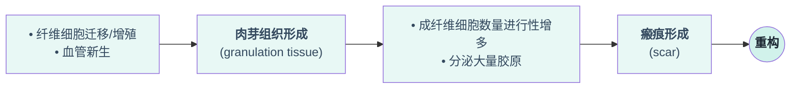

在[[第一章 细胞和组织的适应与损伤|第一章]]中我们了解了细胞面对损伤性刺激时作出的[[第一章 细胞和组织的适应与损伤#二、几种细胞的适应性反应|适应性反应]]和[[第一章 细胞和组织的适应与损伤#三、细胞和组织损伤|损伤反应]]，在本章中将聚焦于细胞面对损伤时的修复反应
- 修复：组织损伤后结构和功能的恢复过程
# 修复的类型
## 再生性修复
- 定义：残存细胞/干细胞发生分裂增殖，取代受损细胞，组织结构和功能**完全恢复**
再生性修复存在两个前提性条件：
- 生长因子的存在
- 细胞外基质(ECM)的完整性
此处有一些关于细胞再生的概念
### 细胞再生
#### 组织细胞的分类
根据细胞再生的能力可以将组织细胞分为：
- 不稳定细胞：可以不断进行分裂，如骨髓中的造血细胞和上皮细胞
- 稳定细胞：细胞增值不明显，但在收到刺激后可恢复分裂活性，如内皮细胞、成纤维细胞和平滑肌细胞。除肝脏外，其他有稳定细胞构成的器官损伤后很难发生在再生性修复
- 永久性细胞：无细胞增殖活性，如心肌细胞和神经细胞，以及骨骼肌细胞。因此心脏等的修复往往是瘢痕修复。
除了心、脑组织，大多数组织内存在三种细胞
##### 干细胞
干细胞存在两个特性：
- 自我更新：经过一次复制周期，产生与增殖前**性质相同**的细胞
- 不对称性复制：一次复制周期产生的两个子细胞中，一个分化成成熟细胞，另一个仍保持未分化干细胞的自我更新能力
干细胞可以分为两类：胚胎干细胞和成体干细胞
在不稳定组织的细胞中，干细胞参与的再生较为明显
#### 生长因子
生长因子可以通过内分泌、自分泌、旁分泌等途径运送到靶细胞并激活细胞的信号通路开始细胞增殖。
靶细胞激活细胞内相关反应的参考生化中提到的相关通路
#### 细胞外基质(ECM)
- 定义：多种蛋白构成的包装在细胞周围的复杂网状结构
- 来源：间充质细胞/成纤维细胞合成
- 分布：成纤维细胞、上皮与血管和平滑肌细胞之间
- 成分：纤维性/非纤维性胶原、纤粘蛋白、弹性蛋白、蛋白多糖、透明质酸（[[第一章 细胞和组织的适应与损伤#黏液样变|黏液样变]]中也可见）
- 生理作用：
	1. 构成组织的重要成分
	2. 为细胞锚定和细胞运动提供机械支持
	3. 为细胞增殖提供生长因子，调控细胞增殖
	4. 为细胞再生提供支架
	5. 建立组织微环境
---
## 纤维素性修复
- 定义：构成组织的细胞不具有再生能力，受损细胞被纤维结缔组织所取代，最终形成瘢痕。

### 纤维修复的过程
#### 肉芽组织的形成
- 肉芽组织：由大量新生毛细血管和成纤维细胞构成的幼稚结缔组织，并伴有巨噬细胞为主的炎性细胞浸润。
	大体观察可见鲜红色、颗粒状、柔软湿润、形似鲜嫩的肉芽

- 作用：
	1. 抗感染，保护创面
	2. 填补创口或其他组织损伤，接合断裂组织
	3. 机化或包裹血栓、血凝块、炎性渗出物、坏死组织及其他异物
		- **机化**：指坏死组织、血栓、脓液或异物等不能完全溶解吸收或分离排出，由新生的肉芽组织吸收取代的过程
#### 瘢痕的形成
这一过程肉芽组织逐渐转变为瘢痕，具体的组织细胞和结构变化如下：
	炎性细胞减少至消失
	毛细血管部分闭塞，部分重建为小动静脉参与微循环
	成纤维细胞产生胶原细胞，变成成熟的纤维细胞
	
- 作用：瘢痕的形成可以保持组织器官的完整性，维持其坚固性
- 不利：
	1. 瘢痕收缩会引起器官的变性或功能障碍
	2. 发生[[第一章 细胞和组织的适应与损伤#透明变性|玻璃样变]]，引起器官硬化
	3. 胶原合成不足或瘢痕组织受到较大而持久的外力作用导致瘢痕膨出
	4. 胶原过度沉积而形成的瘤状隆起硬块叫做瘢痕疙瘩
	5. 肉芽组织过量形成并向皮肤表面凸起叫做赘肉

## 皮肤创伤愈合
### 过程
1. 炎症反应（早期或晚期）
2. 肉芽组织形成和再上皮化
3. 创口收缩、细胞外基质沉淀和重构

### 分类
#### 一期愈合
是最简单的愈合方式，该方式对应损伤程度较低，细胞及基质的缺损较少，无感染，因此对合比较严密
#### 二期愈合
与一期愈合的情况相比更加严重，因此需要更多肉芽组织填充创伤口，因而形成的瘢痕会更大

## 影响组织修复的因素
### 一、年龄
显然，年龄越小，组织再生能力强，修复速度快
### 二、感染与异物
坏死组织、异物及消毒剂会妨碍创伤的愈合
### 三、营养状况
营养缺乏会影响伤口的愈合
### 四、糖皮质激素
糖皮质激素具有抗感染的作用，可降低组织纤维化程度
### 五、局部机械压力
压力升高hu
### 六、局部血液循环
### 七、组织类型和损伤程度
### 八、损伤部位