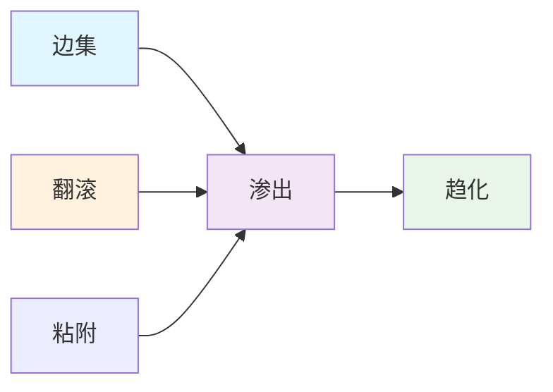
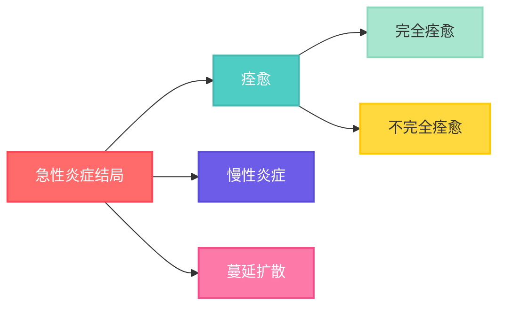

## 定义
- 机体对致炎因素引起的局部损伤所产生的具有防御意义的应答反应，旨在清除**致炎因子**和**坏死组织**

- 潜在危害：
1. 自身免疫反应
2. 超敏反应
3. 毁容性疤痕、内脏粘连

## 表现
### 分类
#### 急性炎症
- 红：局部充血$\rightarrow$局部淤血
- 肿：炎性渗出
- 热：局部代谢增强
- 痛：水肿引起的牵拉反应，炎性介质(组胺)、钠钾离子刺激神经末梢
- 机能障碍：综合表现
#### 慢性炎症
- 持续时间更长
- 炎症反应的现象不明显，因此组织损伤更加严重
### 全身性反应
#### 发热
- 机制：下丘脑体温调节中枢体温调定点上移$\rightarrow$产热增加、散热减少
#### 急性期蛋白反应
炎症发生时，急性期蛋白才发生表达，由肝脏合成，如：
##### C-反应蛋白
##### 血清样淀粉蛋白A
此蛋白错误折叠堆积会引起[[第一章 细胞和组织的适应与损伤#淀粉样变性|淀粉样变性]]
##### 纤维蛋白原
#### 白细胞数量增加
#### 其他反应
如脉搏加快，血压升高
#### 休克
败血症、脓血症情况下引起
## 病理性变化
### 变质
损伤性过程，指的是炎症局部组织细胞发生的变性和坏死
### 渗出
抗损伤过程
### 增生
常见于修复阶段，如实质细胞的增生，成纤维的增生形成肉芽组织
## 急性炎症
### 成因
凡是能引起组织细胞损伤的因素都能够引起炎症，==炎症作为疾病发生的基础==
	👣扭伤的炎症成因：非感染性炎症
### 发生机制
#### 构成
##### 血管扩张
引起的局部血流量增加，对应[[#急性炎症|急性炎症表现]]中的红、热
##### 血浆液体和蛋白渗出
致炎因子的逸出刺激神经末梢引起疼痛，血管内物质的渗出(纤维蛋白)也会引起水肿
##### 白细胞游出和聚集
白细胞通过阿米巴样运动传出血管内皮
#### 过程讲解
##### 血管反应
1. 血液动力学改变
	**血管收缩**：由肾上腺素引起，持续时间比较较短
	**血管扩张**：At first, 小动脉$\rightarrow$then, 毛细血管网
		缩血管物质：NO、组胺
	**血管通透性提高**：引起血浆成分的逸出
	**淤血**：血浆成分逸出$\rightarrow$血液黏度提高$\rightarrow$白细胞游出执行免疫功能
2. 血浆成分改变
	- **早期渗出—漏出液**
		蛋白含量低 SG<1.012
	- **后期渗出—炎性渗出液**
		蛋白含量高
		- 作用：渗出炎性因子、纤维蛋白(限制病原扩散)、抗体和补体
		但可能压迫组织器官，引起细菌扩散、粘连
3. 血管通透性改变的机制
	了解即可
	小静脉内皮收缩，内皮损伤，延迟性血管泄露，白细胞介导内皮损伤 穿胞作用 新生毛细血管的高渗透性
##### 细胞反应：白细胞的渗出和吞噬
过程简要如下：

1. 白细胞边集、翻滚、粘附
	边集 沿着内皮翻滚 并粘附下来
2. 渗出
	穿出内皮细胞
3. 趋化
	白细胞向致炎因子浓度高的地方移动
##### 白细胞渗出的时间顺序
1. 6-24h，中性粒细胞
2. 24-48h，单核/巨噬细胞
	病毒感染：淋巴细胞浸润
	超敏反应：嗜酸性粒细胞浸润
##### 炎性介质
启动和调控炎症反应
- 急性炎症反应的介质：补体的活化产物 血管活性胺 脂质产物 细胞因子
### 类型
##### 浆液性炎
- 以浆液渗出(漏出液，蛋白、白细胞含量低，H·E染色不明显)为其特征
浆液来源于浆液腺或血浆，常发生于浆膜、皮下疏松结缔组织
	该炎症程度较轻，易消退
<figure>
	
	<figcaption style="text-align: center; margin-top: 12px; font-style: italic; font-weight: bold">浆液性肺炎</figcaption>
</figure>
- 致病原因：急性过敏、皮肤热损伤、感光过敏(联系症状**水泡**)
存在积液、水泡
##### 卡他性炎
又名浆液性卡他性炎。“卡他”，源自于希腊语catarrh，意为向下滴流
- 黏膜表面有大量黏液渗出，主要发生存在大量杯状细胞和黏液腺的组织(消化道和呼吸道)
如：鼻炎、肠炎、急性卡他性支气管炎
##### 纤维素性炎
- 指渗出物中含有大量纤维素(纤维蛋白)，镜检可观察到呈条索状，区别于[[#浆液性炎]]类似的水肿渗出
- 常发生于浆膜(心包)、黏膜和肺组织等部位，清亮、轻度透明的黏液覆盖黏膜表面
- 分类：
1. 浆膜的纤维素性炎
	多见于胸膜、腹膜和心包膜
	- 发生纤维素性心包炎，心包的脏层和壁层上的纤维素呈现毛状，称为**“绒毛心”**
	- 区别于纤维黏连，纤维蛋白被结缔组织所替代
<figure>
	
	<figcaption style="text-align: center; margin-top: 12px; font-style: italic; font-weight: bold">“绒毛心”</figcaption>
</figure>
2. 黏膜的纤维素性炎
	又称假膜性炎
	根据假膜剥离的难易程度可以分为浮膜性炎和固膜性炎(纤维素性坏死性炎)
3. 肺的纤维素性炎
	称为纤维素性炎或大叶性肺炎
	特点为肺泡腔内出现大量纤维素性渗出物，血管反应明显，伴有淤血
<figure>
	
	<figcaption style="text-align: center; margin-top: 10px; font-style: italic; font-weight: bold">纤维素性肺炎</figcaption>
</figure>
##### 化脓性炎
- 以**中性粒细胞**大量渗出并伴有组织坏死和脓液为特征
	- 脓液：呈灰黄色或黄绿色
	- 化脓菌感染：金黄色葡萄球菌、链球菌、绿脓杆菌
	- 组织细胞呈现[[第一章 细胞和组织的适应与损伤#液化性坏死|液化性坏死]]
- 分类：
1. 表面化脓和积脓
发生部位：皮肤、黏膜、浆膜
2. 蜂窝织炎
发生于疏松结缔组织的弥漫性化脓性炎症，如皮下组织、肌膜和肌间
致病菌：溶血性链球菌(分泌透明质酸酶和链激酶，降解结缔组织)
❗不限制进行蔓延，无明显边界
<figure>
	
	<figcaption style="text-align: center; margin-top: 12px; font-style: italic; font-weight: bold">蜂窝织炎(家禽)</figcaption>
</figure>
3. 脓肿
发生于组织或器官内的局限性化脓性炎症，主要由金黄色葡萄球菌引起
	化脓性细菌可以引起组织持续性损伤，从而持续性引起中性粒细胞的作用，因此区别于一般炎症的[[#白细胞渗出的时间顺序|中性粒细胞渗出时间]]
<figure>
	
	<figcaption style="text-align: center; margin-top: 12px; font-style: italic; font-weight: bold">化脓性肾炎</figcaption>
</figure>
##### 出血性炎
以红细胞渗出为主，病毒性或细菌性感染，免疫器官常见，血管损伤严重，引起血管反应，发生炎症
<figure>
	
	<figcaption style="text-align: center; margin-top: 12px; font-style: italic; font-weight: bold">出血性淋巴结炎</figcaption>
</figure>
##### 溃疡
器官组织表面的坏死组织脱落后形成的缺损，浅的称为糜烂，深的称为溃疡
- 发生于黏膜面或皮肤
通过结缔组织形成瘢痕进行修复
<figure>
	
	<figcaption style="text-align: center; margin-top: 12px; font-style: italic; font-weight: bold">食管溃疡</figcaption>
</figure>
### 结局

#### 痊愈
##### 完全痊愈
- 血管通透性恢复
- 水肿液和渗出蛋白进入淋巴循环被重新吸收或通过胞吞作用进入巨噬细胞
- 中性粒细胞凋亡被巨噬细胞清除
- 坏死组织细胞碎片被巨噬细胞吞噬
- 巨噬细胞会在组织中存留(M1)，分泌促血管生成的因子(M2)，促进组织修复
⭐巨噬细胞在痊愈中发挥核心作用
##### 纤维素性修复
详情可参见[[第二章 损伤的修复#纤维素性修复|纤维素性修复]]，指结缔组织取代坏死组织
#### 慢性炎症
#### 蔓延扩散