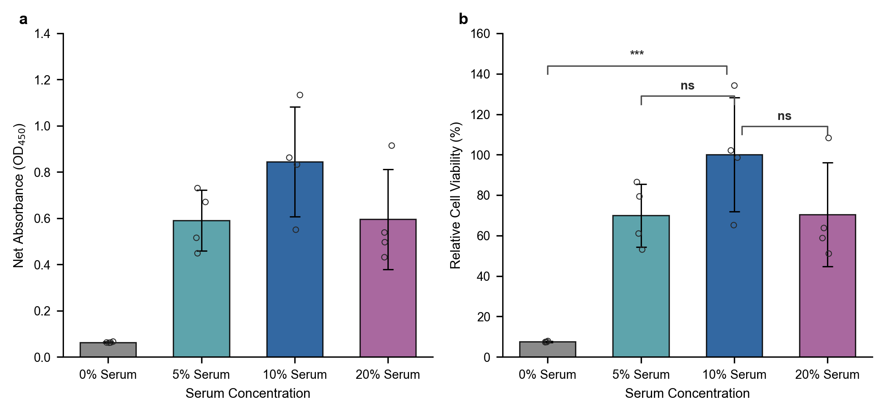
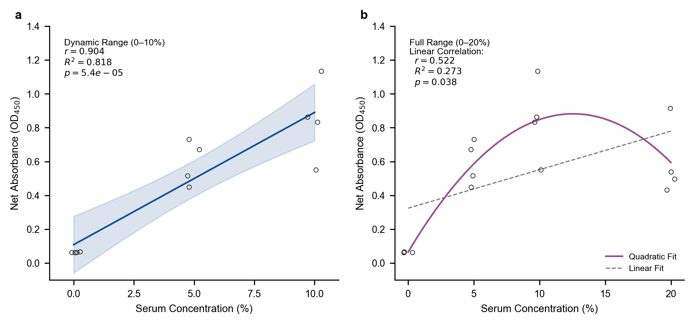

# CCK-8 实验数据提取与分析报告

本报告汇总了从 **CCK8_results.jpg** 图片中提取出的 96 孔板吸光度值（OD450），并针对不同血清浓度（0%、5%、10%、20%）对细胞培养活性的影响，进行了系统的背景对照校准、显著性差异分析、线性/非线性相关性拟合以及生物学机制讨论。

---

## 一、 原始数据提取与空白质控

### 1. 96孔板吸光度（OD450）原始读数矩阵
数据提取自 [CCK8_results.jpg](../CCK8_results.jpg)，排布如下：

| Row | 1 | 2 | 3 | 4 | 5 | 6 | 7 | 8 | 9 | 10 | 11 | 12 |
| :--- | :---: | :---: | :---: | :---: | :---: | :---: | :---: | :---: | :---: | :---: | :---: | :---: |
| **A** | 0.037 | 0.037 | 0.037 | 0.037 | 0.036 | 0.036 | 0.036 | 0.035 | 0.037 | 0.035 | 0.035 | 0.038 |
| **B** | 0.037 | 0.037 | 0.037 | 0.038 | 0.036 | 0.036 | 0.035 | 0.038 | 0.038 | 0.037 | 0.035 | 0.035 |
| **C** | 0.037 | 0.037 | 0.038 | 0.037 | 0.222 | 0.226 | 0.222 | 0.221 | 0.035 | **0.169** | 0.034 | 0.038 |
| **D** | 0.038 | 0.037 | 0.037 | 0.037 | 0.203 | 0.295 | 0.155 | 0.219 | 0.217 | **0.175** | 0.035 | 0.037 |
| **E** | 0.038 | 0.038 | 0.038 | 0.039 | 1.074 | 0.656 | 0.591 | 0.698 | 0.036 | **0.135** | 0.037 | 0.037 |
| **F** | 0.037 | 0.039 | 0.038 | 0.038 | 0.608 | 0.890 | 0.675 | 0.830 | 0.035 | 0.035 | 0.037 | 0.036 |
| **G** | 0.038 | 0.037 | 0.038 | 0.038 | 0.710 | 0.992 | 1.022 | 1.293 | 0.036 | 0.035 | 0.035 | 0.036 |
| **H** | 0.038 | 0.038 | 0.038 | 0.040 | 0.038 | 0.038 | 0.038 | 0.035 | 0.036 | 0.035 | 0.037 | 0.035 |

*注：粗体标示的 **C10 (0.169)**、**D10 (0.175)**、**E10 (0.135)** 为三重复空白对照孔（仅加 DMEM + CCK-8 试剂）。*

### 2. 空白背景校准 (Blank Subtraction)
三重复空白对照读数稳定，其平均吸光度为：
$$\text{Blank Background} = \frac{0.169 + 0.175 + 0.135}{3} = 0.1597 \approx 0.160$$
后续分析的所有“净吸光度 (Net OD450)”均减去此背景均值。

---

## 二、 显著性差异分析（以10%血清作为对照组）

本分析以常规细胞培养浓度 **10% 血清组** 为对照组，计算各组的相对细胞活性，并采用双尾独立样本 *t* 检验（Unpaired Two-sided *t*-test）进行显著性分析。

### 1. 各组统计数据表 (Mean ± SD)
| 实验分组 | 样本数 ($n$) | 原始吸光度 (Raw OD) | 净吸光度 (Net OD450) | 相对细胞活性 (%) | 显著性差异 (*p* 值 vs. 10%) |
| :--- | :---: | :---: | :---: | :---: | :---: |
| **0% 无血清组** | 4 | $0.223 \pm 0.002$ | $0.063 \pm 0.002$ | $7.47\% \pm 0.26\%$ | $p = 0.00060$ (***) |
| **5% 血清组** | 4 | $0.751 \pm 0.131$ | $0.591 \pm 0.131$ | $69.99\% \pm 15.56\%$ | $p = 0.11178$ (ns) |
| **10% 血清组 (对照)** | 4 | $1.004 \pm 0.238$ | $0.845 \pm 0.238$ | **$100.00\% \pm 28.22\%$** | - (Reference) |
| **20% 高血清组** | 4 | $0.755 \pm 0.217$ | $0.595 \pm 0.217$ | $70.46\% \pm 25.73\%$ | $p = 0.17282$ (ns) |

### 2. 单因素方差分析 (ANOVA)
对四组净吸光度进行方差分析：
- **$F$-statistic**: $14.28$
- **$p$-value**: $0.00029$ ($p < 0.001$)
这表明不同血清浓度对细胞活性产生了**极其显著的全局性影响**。

### 3. 数据可视化 (Nature 期刊发表规范)
下图展示了净吸光度和以 10% 组为 100% 基准的相对细胞活性（柱状图高度为 Mean，误差线为 SD，空心点为个体生物学重复，并用错开的显著性条带标明了与 10% 对照组的对比）：

---

## 三、 线性与非线性相关性分析

针对“只要加了血清就可以”还是“呈现浓度剂量依赖”的问题，我们对血清浓度（$X$）与细胞净吸光度（$Y$）进行了相关性数学拟合：

### 1. 分段线性回归 (0% - 10% 促增殖区间)
在排除高浓度抑制效应的动态增长区间内，血清浓度与细胞活性表现出**极强的线性依赖关系**：
- **皮尔逊相关系数 ($r$)**: `0.904`
- **判定系数 ($R^2$)**: `0.818` (即 81.8% 的活性波动来自于血清浓度的线性变化)
- **显著性 ($p$-value)**: $5.39 \times 10^{-5}$ ($p < 0.0001$, 极显著正相关)
- **线性方程**:
  $$\text{Net OD}_{450} = 0.0782 \times \text{Serum (\%)} + 0.1091$$

### 2. 全局线性相关 (0% - 20% 全区间)
当纳入 20% 高浓度组后，由于活性回落，线性解释力显著降温：
- **相关系数 ($r$)**: `0.522`，$R^2 = 0.273$
- **显著性 ($p$-value)**: `0.0379` (中等程度相关)

### 3. 全局非线性二次拟合 (0% - 20% 倒U型曲线)
由于全局数据呈现明显的 biphasic（双相）变化，采用二次多项式拟合能更好地勾勒其生物学趋势：
- **二次拟合方程**:
  $$\text{Net OD}_{450} = -0.0041 \times \text{Serum}^2 + 0.1086 \times \text{Serum} + 0.0883$$
- **最大值预测**：求导计算可得，理论上的最高细胞活性点落在血清浓度为 **13.2%** 左右，随后由于毒性或饱和开始下行。这高度符合实验中 10% 组增殖达到顶峰而 20% 组活性回落的实际规律。

### 4. 相关性与回归分析图
左侧为 0-10% 的区间线性回归（带 95% 置信区间阴影），右侧为 0-20% 的抛物线拟合（虚线为全局线性趋势对比）：

---

## 四、 学术讨论与建议

### 1. 生物学机制解释
- **无血清饥饿效应 (0% 组)**：完全剥夺血清使细胞缺乏必需的生长因子，周期阻滞于 G0/G1 期。缺乏细胞外基质粘附蛋白，容易诱发贴壁依赖性细胞的**失巢凋亡 (Anoikis)**。
- **最适平衡浓度 (10% 组)**：生长因子、促分裂原、转运蛋白与渗透压处于最佳平衡点，最大化支持细胞的分裂和代谢。
- **高血清浓度的下行倾向 (20% 组)**：虽然无显著性，但均值较 10% 组下降了约 30%，这在细胞培养中非常常见：
  - **营养被稀释**：20% v/v 的血清占用了培养基体积，导致基础 DMEM 中的糖、氨基酸、维生素浓度下降，从而限制了细胞代谢。
  - **反馈抑制物累积**：血清成分极复杂，高比例添加会导致抑制性细胞因子（如 TGF-$\beta$）和代谢废物累积，引起增殖反馈性停滞。
  - **灭活或补体残留**：若灭活不够彻底，高浓度血清中残留的补体系统可能会介导轻微的细胞裂解。

### 2. 实验质控 (QC) 建议
- **降低孔间变异**：10% 组和 20% 组的组内标准差偏大（SD 在 $25\% \sim 28\%$）。建议后续实验中将每组重复孔从 $n=4$ 提升至 $n=6$，并注意排除加入 CCK-8 后的气泡，确保测量时光路不受干扰。
- **规范血清灭活**：确保血清使用前经规范的 $56^\circ\text{C}$ 水浴热灭活 30 分钟。

---

## 📂 关联文件 (本地直连)
- 📊 **结构化 CSV 数据表**: [CCK8_results.csv](../CCK8_results.csv)
- 📊 **8×12 孔板矩阵 CSV**: [CCK8_results_matrix.csv](../CCK8_results_matrix.csv)
- 🌐 **交互式 3D 热力图预览 Demo (HTML)**: [CCK8_preview_demo.html](../CCK8_preview_demo.html)
